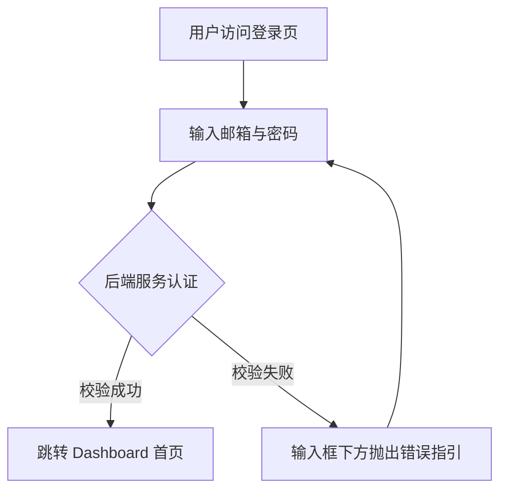

# 产品需求文档 (PRD) v2.0

**项目名称**: [项目名称]
**功能名称**: [功能/需求名称]
**文档状态**: 草稿 (Draft) | 评审中 (Review) | 已通过 (Approved)
**版本号**: 1.0
**负责人**: [作者名字或 Agent]
**创建日期**: [YYYY-MM-DD]

---

## 1. 执行摘要 (Executive Summary)
<!-- 上下文压缩：在 50 字以内说明"为什么做"和"做了什么"。 -->
<!-- ⚠️ CRITICAL: 这是"电梯演讲"，必须控制在 50 字以内。 -->

[简明扼要地描述要解决的问题以及所提出的解决方案，请聚焦于核心价值。]

---

## 2. 背景与上下文 (Background & Context)
<!-- 提供充分的业务和背景知识，帮助后续架构和系统设计阶段更好地理解上下文。 -->

### 2.1 问题陈述 (Problem Statement)
- **当前痛点**: [用户当前面临的具体问题]
- **影响范围**: [受影响的用户群体/业务范围]
- **业务影响**: [对业务的实际影响，例如收入损失、用户流失、效率低下等]

### 2.2 核心机会 (Opportunity)
[如果成功解决这个问题，能带来什么积极价值？请尽量定量描述。]

### 2.3 竞品与参考 (Reference & Competitors) — 可选
<!-- 了解市场已有的解决方案，避免在成熟领域重新发明轮子。 -->
- **竞品 A**: [特点、优缺点]
- **竞品 B**: [特点、优缺点]
- **我们的护城河**: [与竞品的差异化优势/独特价值]

---

## 3. 目标与范围 (Goals & Non-Goals)

### 3.1 目标 (Goals)
<!-- ⚠️ CRITICAL: 必须使用 SMART 原则 (明确、可衡量、可实现、相关性强、有时限) -->

- **[G1]**: [可衡量的业务目标，如: 用户登录转化率提升至 95% 以上]
- **[G2]**: [可衡量的技术目标，如: 列表页 P95 加载时间 < 1.5s]

### 3.2 非目标 (Non-Goals)
<!-- 明确"不做"什么，这是防止需求蔓延（Scope Creep）的关键。 -->

- **[NG1]**: [由于范围限制暂不考虑的功能，如: 第三方 OAuth 快捷登录]
- **[NG2]**: [属于未来版本规划范围的事项，如: 强制多因素认证 (MFA)]

---

## 4. 用户故事与需求清单 (User Stories)
<!-- 格式要求: 作为一个 [角色]，我想要 [动作]，以便于 [价值/收益]。 -->
<!-- ⚠️ CRITICAL: 每个 User Story 必须有唯一 ID [REQ-XXX]，这是整个系统防腐和追溯的核心。 -->
<!-- ⚠️ CRITICAL: 必须按用户价值优先级排序 (P0 核心路径 → P1 重要体验 → P2 锦上添花)。 -->
<!-- ⚠️ CRITICAL: 每个 User Story 必须具备独立可测性——完成后可以脱离其他 Story 独立演示。 -->

### US-001: [任务标题] [REQ-001] (优先级: P0)

*   **故事描述**: 作为一个 [角色]，我想要 [功能/动作]，以便于 [获得的好处]。
*   **用户价值**: [一句话说明该 Story 对于最终目标的核心价值]
*   **独立可测性**: [该任务完成后，测试/产品可以在不依赖其他功能的情况下如何验证？]
*   **涉及系统**: [列出将会涉及的系统 ID，如: `frontend-system`, `backend-api` — 必须与 `02_ARCHITECTURE` 中的名字对齐]
*   **验收标准 (Acceptance Criteria)**:
    *   [ ] **Given** [初始上下文], **When** [触发动作], **Then** [预期结果].
    *   [ ] **异常处理**: 当 [发生何种异常] 时，系统必须 [具体的回退或提示行为].
*   **边界与极限情况**:
    *   [边界条件1 — 如: 超大数据量、断网重连、权限骤变等极端情况如何处理]
    *   [边界条件2]

### US-002: [任务标题] [REQ-002] (优先级: P1)

*   **故事描述**: ...
*   **用户价值**: ...
*   **独立可测性**: ...
*   **涉及系统**: ...
*   **验收标准 (Acceptance Criteria)**:
    *   [ ] ...
*   **边界与极限情况**:
    *   ...

<!-- 根据需求规模继续添加 User Stories... -->

---

## 5. 用户体验与设计 (User Experience) — 可选
<!-- 提供关键的用户交互设计指引，为前端/客户端的设计系统建立边界。 -->

### 5.1 关键用户旅程 (Key User Flows)
<!-- 【推荐】使用 Mermaid 流程图直观表达主体业务流程。 -->

### 5.2 交互规范 (Design Guidelines)
- **视觉风格**: [现代化、极简、严肃专业等]
- **响应模式**: [对页面加载骨架屏、按钮 Loading 状态等的要求]
- **平台兼容**: [仅限 Web 端，是否需要兼顾移动/平板自适应？]

---

## 6. 约束与限制 (Constraint Analysis)
<!-- 约束决定了技术选型的天花板。来自于 /scout 报告或立项时的不可抗力。 -->

### 6.1 技术约束 (Technical Constraints)
*   **遗留系统**: [例如: 必须兼容老版本的 MySQL 5.7 表结构]
*   **性能底线**: [例如: API 响应时间 P95 < 200ms]
*   **扩展性预期**: [例如: 设计上需要支撑 10 万并发在线]

### 6.2 安全与合规 (Security & Compliance)
*   **数据安全**: [例如: 日志中绝对不可包含明文 PII 信息]
*   **网络要求**: [例如: 强制全站 HTTPS / API 仅内网可访]
*   **合规审核**: [例如: 满足当地数据出境要求 / 通过特定等保审核]

### 6.3 时间与资源 (Time & Resources)
*   **交付死线**: [硬性 Deadline，如: 2026-03-01 必须全量上线]
*   **其他限制**: [如依赖外部供应商接口的对接进度等]

---

## 7. 成功指标 (Success Metrics) — 可选
<!-- 如何在功能上线后衡量我们的成功？ -->

| 核心指标 (Metric) | 目标值 (Target) | 测量方式 (Measurement Method) |
| ----------------- | --------------- | ----------------------------- |
| 业务: 注册转化率  | > 45%           | 数据看板/漏斗分析             |
| 性能: 接口成功率  | > 99.9%         | APM 监控告警                  |

---

## 8. 完成标准 (Definition of Done)
<!-- 所有任务合并到主分支发布前，必须 100% 勾选的检查清单。 -->

*   [ ] 所有的验收标准 (AC) 全部测试通过。
*   [ ] 包含足够的自动化单元测试 (行覆盖率 > 80%) 并且 CI 绿灯。
*   [ ] 集成测试/E2E 关键路径全部顺畅。
*   [ ] 代码 Lint 及格式化审查均无警告。
*   [ ] 已更新相关技术文档 (如 OpenAPI 接口文档、Wiki 知识库)。
*   [ ] 性能与安全隐患已经过 Review (若有前述相关的约束要求)。
*   [ ] 产品验收环节 (UAT) 已通过。

---

## 9. 附录 (Appendix) — 可选

### 9.1 术语表 (Glossary)
- **[首字母缩写/术语 1]**: [明确定义，避免跨团队沟通歧义]
- **[术语 2]**: [定义]

### 9.2 参考资料 (References)
- [URL 1]
- [URL 2]

---

<!-- ⚠️ CRITICAL 使用指南 -->
<!-- 
**PRD 撰写原则 (精益规格要求)**:
1. **去冗存精**: 抵制长篇大论，整个文档建议控制在阅读时间 10 分钟以内。
2. **执行摘要 < 50字**: 用最少的话讲明白核心价值。
3. **独立性**: User Story 粒度必须控制在"可单独交付验证"的级别。
4. **追溯链 (Traceability)**: [REQ-XXX] 编号是神圣不可侵犯的，将贯穿架构、任务和代码。

**章节使用指南**:
- **必需章节**: 1, 2.1, 3, 4, 6, 8
- **可选章节**: 2.3 (竞品分析), 5 (UX设计), 7 (成功指标), 9 (附录)
- **小型功能/迭代**: 可大胆删除 2.3, 5, 7, 9，保留骨架即可。
-->
