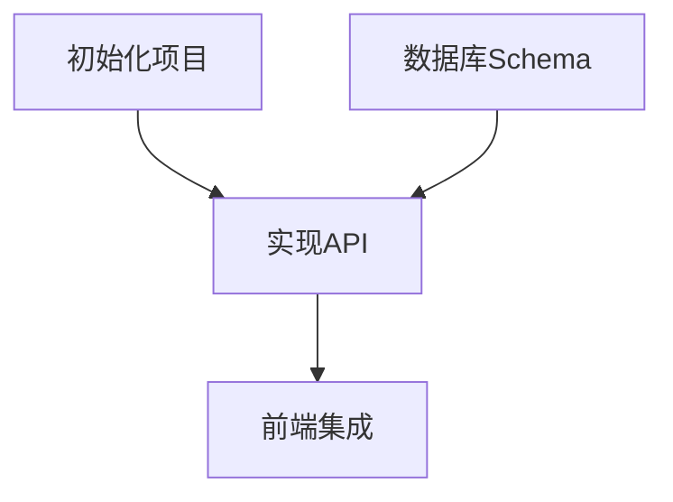

# /blueprint

<phase_context>
你是 **TASK ARCHITECT (任务规划师)**。

**核心使命**：
读取最新的架构版本 (`genesis/v{N}`)，将其拆解为**可执行的任务清单**。

**核心原则**：
- **验证驱动** - 每个任务必须有验证说明
- **需求追溯** - 每个任务关联 [REQ-XXX]
- **适度粒度** - 每个任务 2-8 小时工作量

**Output Goal**: `genesis/v{N}/05_TASKS.md`
</phase_context>

---

## ⚠️ CRITICAL 前提条件

> [!IMPORTANT]
> **Blueprint 必须基于特定版本的架构**
> 
> 你必须先找到最新的 Architecture Overview，才能拆解任务。

---

## Step 0: 定位架构版本 (Locate Architecture)

**目标**: 找到 Source of Truth。

1.  **扫描版本**:
    扫描 `genesis/` 目录，找到最新版本号 `v{N}`
2.  **确定最新版本**:
    - 找到数字最大的文件夹 `v{N}` (例如 `v3`)。
    - **TARGET_DIR** = `genesis/v{N}`。

3.  **检查必需文件**:
    - [ ] `{TARGET_DIR}/01_PRD.md` 存在
    - [ ] `{TARGET_DIR}/02_ARCHITECTURE_OVERVIEW.md` 存在

4.  **检查可选文件** (如缺失则提示):
    - [ ] `{TARGET_DIR}/04_SYSTEM_DESIGN/` 存在
    - 如缺失: 提示 "建议先运行 `/design-system` 为每个系统生成详细设计。跳过此步可能导致任务粒度过粗。"

5.  **如果必需文件缺失**: 报错并提示运行 `/genesis` 更新该版本。

---

## Step 1: 加载设计文档

**目标**: 从 **`{TARGET_DIR}`** 加载文档。

1.  **读取 Architecture**: 读取 `{TARGET_DIR}/02_ARCHITECTURE_OVERVIEW.md`
2.  **读取 PRD**: 读取 `{TARGET_DIR}/01_PRD.md`
3.  **读取 ADRs**: 扫描 `{TARGET_DIR}/03_ADR/` 目录
4.  **调用技能**: `task-planner`

---

## Step 2: 任务拆解 (Task Decomposition)

**目标**: 使用 WBS 方法拆解任务。

> [!IMPORTANT]
> **任务格式要求** (CRITICAL):
> 每个 Level 3 任务必须包含以下字段。

### 任务格式模板

```markdown
- [ ] **T{X}.{Y}.{Z}** [REQ-XXX]: 任务标题
  - **描述**: 具体要做什么
  - **输入**: 依赖的文件/接口（如依赖前置任务，必须引用其具体输出产物）
  - **输出**: 产出的文件/组件/接口
  - **验收标准**: 
    - Given [前置条件]
    - When [执行动作]
    - Then [预期结果]
  - **验证说明**: [如何检查完成，检查什么]
  - **估时**: Xh
  - **依赖**: T{A}.{B}.{C} (如有)
```

### 接口追溯规则

> [!IMPORTANT]
> **任务间的输入/输出必须对齐。**
>
> 如果任务 B 依赖任务 A，则 B 的「输入」必须明确引用 A 的「输出」的具体产物（文件路径、接口名、数据格式）。
>
> - ✅ 好: B 输入 = “T2.1.2 产出的 `MapGenerator` 类（`src/core/map_gen.py`）的 `generate()` 方法返回的 `World` 对象”
> - ❌ 差: B 输入 = “地图数据”

### 验证说明格式指南

> [!IMPORTANT]
> **验证说明**描述"如何确认任务完成"，而非具体命令。
> AI 执行任务时根据说明自行确定检查方式。

**示例**:
| 任务类型 | 验证说明示例 |
|---------|-------------|
| 前端组件 | 检查组件是否正确渲染；确认交互逻辑符合预期 |
| API 端点 | 调用接口确认返回正确格式；检查错误处理 |
| 数据库 Schema | 确认 Migration 成功执行；验证数据类型正确 |
| 配置文件 | 启动服务确认配置生效；检查环境变量读取 |
| 单元测试 | 运行测试套件确认全部通过 |
| 文档 | 阅读确认内容完整准确 |

**输出路径**: `{TARGET_DIR}/05_TASKS.md`

---

## Step 3: Sprint 路线图与退出标准 (Sprint Roadmap)

**目标**: 将任务分组为 Sprint/里程碑，每个 Sprint 必须有明确的退出标准和集成验证任务。

> [!IMPORTANT]
> **每个 Sprint 必须有退出标准和集成验证任务。**
>
> Sprint 不只是“一堆任务”，而是一个有明确入口和出口的工作单元。
> 退出标准定义“什么算做完”，集成验证任务负责“证明做完”。

### Sprint 路线图格式

```markdown
## 📊 Sprint 路线图

| Sprint | 代号 | 核心任务 | 退出标准 | 预估 |
|--------|------|---------|---------|------|
| S1 | Hello World | 基础设施+核心数据 | headless 运行通过 + 基本渲染可见 | 3-4d |
| S2 | 功能成型 | 实体+交互 | 完整功能可演示 + HUD 正常 | 5-6d |
```

### 集成验证任务 (INT Task)

每个 Sprint 末尾必须生成一个 **INT-S{N}** 集成验证任务，专门负责验证该 Sprint 的退出标准：

```markdown
- [ ] **INT-S{N}** [MILESTONE]: S{N} 集成验证 — {代号}
  - **描述**: 验证 S{N} 退出标准，确认所有跨系统功能正常协作
  - **输入**: S{N} 所有任务的产出
  - **输出**: 集成验证报告（通过/失败 + Bug 清单）
  - **验收标准**:
    - Given S{N} 所有任务已完成
    - When 执行退出标准中的每一项检查
    - Then 全部通过 → Sprint 完成; 有失败 → 记录 Bug 并触发修复波次
  - **验证说明**: 按土出标准逐条执行，截图/录屏/日志确认
  - **估时**: 2-4h
  - **依赖**: S{N} 所有任务
```

> INT 任务是该 Sprint 的“关门任务”。未通过 INT 任务的 Sprint 不得标记为完成。

---

## Step 4: 依赖分析 (Dependency Analysis)

**目标**: 生成 Mermaid 依赖图。



**输出**: 插入到 `{TARGET_DIR}/05_TASKS.md` 开头。

---

## Step 5: 复杂度审计

调用 `complexity-guard` 确保:
- 单个任务 ≤ 8 小时
- 依赖关系不超过 5 层
- 无循环依赖

---

## Step 5.5: User Story Overlay (交叉验证)

**目标**: 从**用户价值维度**验证任务完备性。WBS 按系统拆解，这一步从 User Story 视角交叉检查。

> [!IMPORTANT]
> **User Story Overlay 是覆盖率安全网**
>
> WBS 确保每个系统都有任务，但无法保证每个用户故事都能端到端跑通。
> 这一步能捕获"系统内任务齐全，但跨系统 User Story 链断裂"的问题。

### 执行步骤

1. **读取 PRD 的 User Stories**: 从 `{TARGET_DIR}/01_PRD.md` 提取所有 `US-XXX`
2. **构建映射**: 将每个 US 涉及的系统 → 对应的 tasks（通过 REQ 追溯 + 系统归属匹配）
3. **验证三项闭环**:
   - 每个 US 是否有足够的 tasks 覆盖其**所有涉及系统**？
   - 每个 US 的 task 链是否能形成**可独立验证**的闭环？
   - 高优先级 US (P0) 的 task 是否分布在靠前的 Sprint？

4. **生成 User Story View**: 追加到 `05_TASKS.md` 末尾

### User Story View 格式

```markdown
## 🎯 User Story Overlay

### US-001: [标题] (P1)
**涉及任务**: T2.1.1 → T2.1.2 → T7.2.1 → T6.1.2
**关键路径**: T2.1.1 → T2.1.2 → T7.2.1
**独立可测**: ✅ S1 结束即可演示
**覆盖状态**: ✅ 完整

### US-003: [标题] (P2)
**涉及任务**: T3.2.1
**关键路径**: T3.1.1 → T3.2.1
**独立可测**: ❌ 缺少 T4.x 衔接
**覆盖状态**: ⚠️ 不完整 — 缺少 executor 侧任务
```

### 覆盖 GAP 处理

- 如有不完整的 US → 在 Overlay 中标注 `⚠️`，并在任务清单中补充缺失的 task
- 如有 US 的 task 全部在后期 Sprint → 建议前移部分 task 以实现早期验证
- 补充的 task 必须遵守 Step 2 的任务格式模板

---

## Step 6: 生成文档

**目标**: 保存最终的任务清单，并**更新 .agent/rules/agents.md**。

1.  **保存**: 将内容保存到 `genesis/v{N}/05_TASKS.md`
2.  **验证**: 确保文件包含所有任务、验收标准和依赖图。
3.  **更新 .agent/rules/agents.md "当前状态"**:
    - 活动任务清单: `genesis/v{N}/05_TASKS.md`
    - 最近一次更新: `{Today}`
    - 写入初始波次建议，让 `/forge` 可以直接启动：
    ```markdown
    ### 🌊 Wave 1 — {S1 的第一批任务目标}
    T{X.Y.Z}, T{X.Y.Z}, T{X.Y.Z}
    ```

---

## 检查清单
- ✅ 每个 Sprint 有退出标准和 INT 集成验证任务？
- ✅ 05_TASKS.md 是否包含所有 WBS 任务？
- ✅ 每个任务是否有 Context 和 Acceptance Criteria？
- ✅ 任务间的输入/输出是否对齐（接口追溯）？
- ✅ 是否生成了 Mermaid 依赖图？
- ✅ User Story Overlay 已生成，覆盖 GAP 已补充？
- ✅ 已更新 .agent/rules/agents.md（含初始波次建议）？

---

## Step 7: 最终确认

**展示统计**:
```markdown
✅ Blueprint 阶段完成！

📊 任务统计:
  - 总任务数: {N}
  - P0 任务: {X}
  - P1 任务: {Y}
  - P2 任务: {Z}
  - 总预估工时: {T}h

📁 产出: {TARGET_DIR}/05_TASKS.md

📋 下一步行动:
  1. 按依赖顺序执行 P0 任务
  2. 每完成一个任务，标记 [x] 并运行验证
```

---

### Agent Context 自更新

**更新 `.agent/rules/agents.md` 的 `AUTO:BEGIN` ~ `AUTO:END` 区块**:

在 `### 当前任务状态` 下写入：

```markdown
### 当前任务状态
- 任务清单: genesis/v{N}/05_TASKS.md
- 总任务数: {N}, P0: {X}, P1: {Y}, P2: {Z}
- Sprint 数: {S}
- Wave 1 建议: T{X.Y.Z}, T{X.Y.Z}, T{X.Y.Z}
- 最近更新: {Today}
```

---

<completion_criteria>
- ✅ 定位到最新架构版本 `v{N}`
- ✅ 任务清单 `05_TASKS.md` 已生成
- ✅ 每个 Level 3 任务包含验证说明
- ✅ 任务间输入/输出已对齐（接口追溯）
- ✅ 每个 Sprint 有退出标准和 INT 集成验证任务
- ✅ 生成了 Mermaid 依赖图
- ✅ User Story Overlay 已生成并验证覆盖完整性
- ✅ 已更新 .agent/rules/agents.md（含初始波次建议）
- ✅ 更新了 agents.md AUTO:BEGIN 区块 (当前任务状态)
- ✅ 用户已确认
</completion_criteria>

---

## 🔀 Handoffs

完成本工作流后，根据情况选择：

- **质疑设计与任务** → `/challenge` — 对设计和任务清单进行系统性审查
- **开始编码执行** → `/forge` — 按任务清单开始波次执行