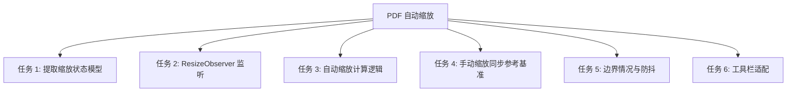
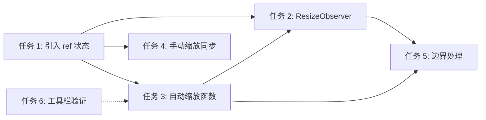

# 功能规划：PDF 自动缩放（随侧栏展开/收起比例调整）

**规划时间**：2026-03-16
**预估工作量**：6 任务点

---

## 1. 功能概述

### 1.1 目标

当左侧边栏（280px）或右侧面板（360px）展开/收起时，PDF 缩放比例自动按比例调整，使 PDF 在可视区域内的填充感保持不变。避免用户每次切换面板后手动调节缩放。

### 1.2 范围

**包含**：
- 监听主区域容器宽度变化（侧栏、右面板、窗口 resize）
- 按比例公式自动计算新缩放值：`newScale = userSetScale * (currentWidth / referenceWidth)`
- 用户手动调缩放时更新参考基准
- 边界值钳位（ZOOM_MIN ~ ZOOM_MAX）
- 动画过渡期间的防抖/节流处理

**不包含**：
- 纵向缩放（仅关注宽度变化）
- "适应页面宽度"自动模式（fit-width，可作为 Phase 2）
- 后端修改
- useDocumentStore.zoomLevel 的双向同步（当前 zoomLevel 未被使用，维持现状）

### 1.3 技术约束

- 不引入新依赖，使用浏览器原生 `ResizeObserver`
- 保持 KISS 原则，状态全部在 PdfViewer 组件内管理
- framer-motion spring 动画（stiffness: 300, damping: 30）导致宽度渐变，需在动画结束后再计算或使用节流
- 代码注释用中文

---

## 2. WBS 任务分解

### 2.1 分解结构图



### 2.2 任务清单

#### 任务 1：引入缩放参考基准状态（1 点）

**文件**: `src/components/pdf-viewer/PdfViewer.tsx`

- [ ] **任务 1.1**：新增两个 `useRef` 存储缩放参考数据
  - **输入**：无
  - **输出**：`userSetScaleRef` 和 `referenceWidthRef` 两个 ref
  - **关键步骤**：
    1. 在 PdfViewer 组件顶部新增：
       ```typescript
       // 用户最后一次手动设置的缩放值（作为自动缩放的基准）
       const userSetScaleRef = useRef(ZOOM_DEFAULT);
       // 用户最后一次手动调缩放时的容器宽度（作为比例计算的分母）
       const referenceWidthRef = useRef<number | null>(null);
       ```
    2. 使用 `useRef` 而非 `useState`，避免触发不必要的重渲染
    3. `referenceWidthRef` 初始为 `null`，表示尚未建立参考基准（首次 ResizeObserver 回调时初始化）

---

#### 任务 2：添加 ResizeObserver 监听主区域容器宽度（1 点）

**文件**: `src/components/pdf-viewer/PdfViewer.tsx`

- [ ] **任务 2.1**：创建 ResizeObserver useEffect
  - **输入**：`containerRef`（已存在，指向 PDF 渲染区域的外层 div）
  - **输出**：容器宽度变化时触发自动缩放计算
  - **关键步骤**：
    1. 新增 `useEffect`，在 `containerRef.current` 上挂载 `ResizeObserver`
    2. 观察目标：`containerRef.current`（即 `className="flex-1 overflow-hidden relative"` 的 div，第 958-960 行）
    3. 回调中获取 `entry.contentRect.width` 作为 `currentWidth`
    4. 若 `referenceWidthRef.current === null`，初始化参考宽度并返回（不调整缩放）
    5. 若有参考宽度，调用自动缩放计算函数（任务 3）
    6. cleanup 时 `observer.disconnect()`
    7. 依赖数组：`[]`（只挂载一次）

  - **实现代码骨架**：
    ```typescript
    // 监听容器宽度变化，自动调整缩放比例
    useEffect(() => {
      const container = containerRef.current;
      if (!container) return;

      const observer = new ResizeObserver((entries) => {
        const entry = entries[0];
        if (!entry) return;
        const currentWidth = entry.contentRect.width;
        if (currentWidth <= 0) return;

        // 首次回调：初始化参考宽度，不调整缩放
        if (referenceWidthRef.current === null) {
          referenceWidthRef.current = currentWidth;
          return;
        }

        // 计算并应用新缩放（任务 3）
        applyAutoZoom(currentWidth);
      });

      observer.observe(container);
      return () => observer.disconnect();
    }, []);
    ```

---

#### 任务 3：实现自动缩放计算函数（1 点）

**文件**: `src/components/pdf-viewer/PdfViewer.tsx`

- [ ] **任务 3.1**：创建 `applyAutoZoom` 函数
  - **输入**：`currentWidth: number`（当前容器宽度）
  - **输出**：调用 `setScale()` 设置新缩放值
  - **关键步骤**：
    1. 用 `useCallback` 包裹（或直接在 useEffect 内定义，因为只在 ResizeObserver 中使用）
    2. 核心公式：`newScale = userSetScaleRef.current * (currentWidth / referenceWidthRef.current)`
    3. 钳位：`Math.max(ZOOM_MIN, Math.min(ZOOM_MAX, newScale))`
    4. 忽略微小变化：`if (Math.abs(newScale - currentScale) < 0.005) return;`（避免浮点抖动）
    5. 调用 `setScale(clampedNewScale)`

  - **实现代码**：
    ```typescript
    const applyAutoZoom = (currentWidth: number) => {
      const refWidth = referenceWidthRef.current;
      if (!refWidth || refWidth <= 0) return;

      const ratio = currentWidth / refWidth;
      const newScale = userSetScaleRef.current * ratio;
      const clamped = Math.max(ZOOM_MIN, Math.min(ZOOM_MAX, newScale));

      setScale((prev) => {
        if (Math.abs(clamped - prev) < 0.005) return prev;
        return clamped;
      });
    };
    ```

  - **注意**：`applyAutoZoom` 读取 ref 值，不依赖 state，无闭包陈旧问题

---

#### 任务 4：手动缩放时更新参考基准（1 点）

**文件**: `src/components/pdf-viewer/PdfViewer.tsx`

- [ ] **任务 4.1**：修改 `handleZoomIn`、`handleZoomOut`、`handleZoomReset` 三个函数
  - **输入**：用户点击 +/- 按钮或重置
  - **输出**：同步更新 `userSetScaleRef` 和 `referenceWidthRef`
  - **关键步骤**：
    1. 在每个手动缩放函数中，计算新 scale 后同步更新 ref：
       ```typescript
       const updateZoomReference = (newScale: number) => {
         userSetScaleRef.current = newScale;
         referenceWidthRef.current = containerRef.current?.clientWidth ?? referenceWidthRef.current;
       };
       ```
    2. 修改 `handleZoomIn`：
       ```typescript
       const handleZoomIn = useCallback(() => {
         setScale(prev => {
           const next = Math.min(prev + ZOOM_STEP, ZOOM_MAX);
           updateZoomReference(next);
           return next;
         });
       }, []);
       ```
    3. 同理修改 `handleZoomOut` 和 `handleZoomReset`

- [ ] **任务 4.2**：修改 Ctrl+滚轮缩放处理
  - **输入**：wheel 事件回调（第 607-621 行）
  - **输出**：滚轮缩放也同步更新参考基准
  - **关键步骤**：
    1. 在 `setScale` 回调中同步调用 `updateZoomReference(newScale)`
    2. 注意：`setScale(prev => ...)` 中需要在返回新值前调用 ref 更新

---

#### 任务 5：边界情况处理（1 点）

**文件**: `src/components/pdf-viewer/PdfViewer.tsx`

- [ ] **任务 5.1**：防抖处理（应对 framer-motion 动画过渡）
  - **输入**：Sidebar/RightPanel 展开收起时的 spring 动画（约 300ms~500ms 过渡）
  - **输出**：在动画期间不产生多余的中间缩放值闪烁
  - **关键步骤**：
    1. 在 ResizeObserver 回调中使用 `requestAnimationFrame` 节流（每帧最多一次）
    2. 实现方式：维护一个 `rafIdRef`，每次回调先 `cancelAnimationFrame`，再 `requestAnimationFrame`
       ```typescript
       const rafIdRef = useRef<number>(0);
       // 在 ResizeObserver 回调中：
       cancelAnimationFrame(rafIdRef.current);
       rafIdRef.current = requestAnimationFrame(() => {
         applyAutoZoom(currentWidth);
       });
       ```
    3. cleanup 时也 `cancelAnimationFrame(rafIdRef.current)`

- [ ] **任务 5.2**：PDF 未加载时跳过
  - **输入**：`pdf` 状态
  - **输出**：当 `pdf === null` 时不执行自动缩放
  - **关键步骤**：
    1. 在 `applyAutoZoom` 开头检查：通过 `pdfViewerRef.current` 判断是否有活跃文档
    2. 或在 ResizeObserver 回调中用闭包外的 ref 跳过（更简洁：用 `pdfViewerRef.current` 作为 guard）

- [ ] **任务 5.3**：文档切换时重置参考基准
  - **输入**：`url` 状态变化（文档切换）
  - **输出**：重置 `userSetScaleRef` 和 `referenceWidthRef`
  - **关键步骤**：
    1. 在已有的 `url` 变化 useEffect（第 488-530 行）中，当新文档加载时：
       ```typescript
       userSetScaleRef.current = ZOOM_DEFAULT;
       referenceWidthRef.current = null; // 让下一次 ResizeObserver 回调重新初始化
       ```
    2. 这确保切换文档后，自动缩放从新的起点开始

---

#### 任务 6：工具栏百分比显示适配（1 点）

**文件**: `src/components/pdf-viewer/PdfToolbar.tsx`

- [ ] **任务 6.1**：确认工具栏兼容性（无需修改）
  - **输入**：当前 PdfToolbar 已通过 `scale` prop 显示 `Math.round(scale * 100) + '%'`
  - **输出**：确认自动缩放产生的非整数 scale 值显示正确
  - **关键步骤**：
    1. 验证 `Math.round(scale * 100)` 对 `1.0 * (800/1080) = 0.7407...` 这类值的显示 → `74%`，符合预期
    2. 验证 disabled 边界：`scale <= 0.25` 和 `scale >= 4.0` 对非整数值仍然正确
    3. **结论：PdfToolbar 无需修改**，现有逻辑已兼容

---

## 3. 依赖关系

### 3.1 依赖图



### 3.2 依赖说明

| 任务 | 依赖于 | 原因 |
|------|--------|------|
| 任务 2 | 任务 1, 3 | ResizeObserver 回调需要读取 ref 并调用 applyAutoZoom |
| 任务 3 | 任务 1 | 自动缩放函数读取 userSetScaleRef 和 referenceWidthRef |
| 任务 4 | 任务 1 | 手动缩放写入 ref |
| 任务 5 | 任务 2, 3 | 边界处理是对核心逻辑的增强 |
| 任务 6 | 无 | 纯验证，可并行 |

### 3.3 推荐实施顺序

由于所有修改集中在同一个文件 `PdfViewer.tsx`，建议按序实施：

**T1 → T3 → T4 → T2 → T5 → T6**

即：先定义数据结构（ref），再实现计算逻辑，然后挂载监听，最后处理边界。

### 3.4 并行任务

- 任务 6（工具栏验证）可与任意任务并行

---

## 4. 实施建议

### 4.1 技术选型

| 需求 | 推荐方案 | 理由 |
|------|----------|------|
| 监听容器宽度 | `ResizeObserver` | 浏览器原生 API，无需依赖；比 window.resize 更精确（只关注容器） |
| 防抖策略 | `requestAnimationFrame` | 轻量级，与渲染帧对齐；比 debounce/throttle 更自然 |
| 状态存储 | `useRef` | 避免额外渲染；ref 变化不触发 re-render |
| 缩放值更新 | `setScale(prev => ...)` 函数式更新 | 避免闭包陈旧值 |

### 4.2 潜在风险

| 风险 | 影响 | 缓解措施 |
|------|------|----------|
| framer-motion 动画期间频繁触发 ResizeObserver | 低 — 可能出现缩放值闪烁 | 使用 rAF 节流，每帧最多计算一次 |
| 极端缩放值超出 ZOOM_MIN/ZOOM_MAX | 低 — 视觉异常 | 钳位处理已覆盖 |
| containerRef 在组件 unmount 后回调 | 低 — 内存泄漏 | useEffect cleanup 调用 observer.disconnect() |
| 浮点精度导致微小抖动 | 低 — 缩放值频繁微调 | 设置 0.005 阈值忽略微小变化 |
| `pdfViewer.currentScale` 写入过于频繁影响渲染性能 | 中 — pdfjs 重排代价较高 | rAF 节流 + 阈值双重保护 |

### 4.3 测试策略

- **手动测试**（本功能无后端逻辑，无需单元测试）：
  1. 打开 PDF → 展开/收起左侧栏 → 验证缩放值按比例变化
  2. 打开 PDF → 展开/收起右面板 → 验证缩放值按比例变化
  3. 同时切换两个面板 → 验证连续缩放不跳变
  4. 手动调缩放到 200% → 切换面板 → 验证以 200% 为基准比例缩放
  5. 在极端缩放（25%、400%）下切换面板 → 验证不超出范围
  6. 窗口 resize → 验证也能触发自动缩放
  7. 未打开 PDF 时切换面板 → 验证无报错
  8. 切换文档 → 验证缩放重置为默认值

---

## 5. 验收标准

功能完成需满足以下条件：

- [ ] 侧栏展开/收起时，PDF 缩放比例自动调整，视觉填充感不变
- [ ] 右面板展开/收起时，PDF 缩放比例自动调整，视觉填充感不变
- [ ] 窗口 resize 时同样触发自动缩放
- [ ] 用户手动调缩放后，后续自动缩放以新值为基准
- [ ] 缩放值始终在 25% ~ 400% 范围内
- [ ] 动画过渡期间无明显闪烁或跳变
- [ ] 未打开 PDF 时不触发错误
- [ ] 工具栏百分比显示正确
- [ ] 切换文档后缩放重置为默认值

---

## 6. 修改文件清单

| 文件 | 修改类型 | 改动量 |
|------|----------|--------|
| `src/components/pdf-viewer/PdfViewer.tsx` | 修改 | ~50 行新增/修改 |
| `src/components/pdf-viewer/PdfToolbar.tsx` | 不修改 | 0（验证兼容性即可） |
| `src/layouts/AppLayout.tsx` | 不修改 | 0 |
| `src/stores/useDocumentStore.ts` | 不修改 | 0 |

---

## 7. 后续优化方向（Phase 2）

- **适应页面宽度模式**（fit-width）：自动计算使 PDF 页面宽度恰好填满容器的 scale 值，作为 handleZoomReset 的替代选项
- **缩放记忆**：将每个文档的 userSetScale 持久化到 useDocumentStore / SQLite，重新打开时恢复
- **平滑过渡**：在自动缩放时使用 CSS transition 或 framer-motion 平滑过渡 pdfjs currentScale（需评估 pdfjs 重排性能）
- **同步 useDocumentStore.zoomLevel**：当前 store 中的 zoomLevel 字段未被 PdfViewer 使用，后续可统一缩放状态管理
