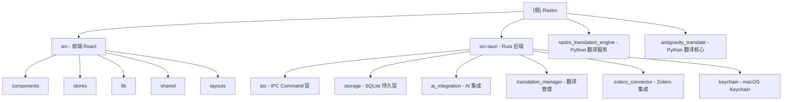

# Rastro - 科研文献阅读助手

> Tauri v2 + React 19 桌面应用，面向科研人员提供 PDF 阅读、AI 翻译、AI 问答、Zotero 集成等功能。

## 项目愿景

为考古学及其他学科的研一新生和科研人员提供一站式英文文献翻译与阅读工具。核心功能包括：PDF 查看与注释、基于多 AI 提供商（OpenAI/Claude/Gemini）的论文翻译（通过 pdf2zh 引擎）、AI 问答与总结、Zotero 文献管理集成。产品名"Rastro"（西班牙语"踪迹"），标识符 `com.rastro.app`。

## 架构总览

```
[React 19 前端] <--Tauri IPC (25个Command + 6个Event)--> [Rust 后端]
                                                            |
                                                            +--> SQLite (app.db)
                                                            +--> macOS Keychain (API Key)
                                                            +--> HTTP --> [Python 翻译引擎 :8890]
                                                                              |
                                                                              +--> antigravity_translate
                                                                              +--> pdf2zh (外部可执行文件)
```

- **前端**：React 19 + Vite 7 + TypeScript + Tailwind CSS 4 + Radix UI + Zustand 状态管理
- **后端**：Rust (Tauri 2) + rusqlite + reqwest + tokio + security-framework (macOS Keychain)
- **翻译引擎**：Python HTTP 服务 (`rastro_translation_engine`)，桥接 `antigravity_translate` 核心与 `pdf2zh` 工具
- **数据库**：SQLite，7 张表 + 6 个索引，存储文档、聊天会话/消息、翻译任务/产物、使用统计、Provider 配置

## 模块结构图



## 模块索引

| 模块路径 | 语言 | 职责 | 入口文件 | 测试 |
|---------|------|------|---------|------|
| `src/` | TypeScript/React | 前端 UI：PDF 查看器、侧边栏、聊天面板、设置面板 | `src/main.tsx` | 无 |
| `src-tauri/` | Rust | Tauri 后端：25 个 IPC Command、SQLite 存储、AI 集成、翻译管理 | `src-tauri/src/main.rs` | 有 (内联 `#[cfg(test)]`) |
| `rastro_translation_engine/` | Python | 翻译引擎 HTTP 服务，提供 REST API 供 Rust 端调用 | `rastro_translation_engine/__main__.py` | 无 |
| `antigravity_translate/` | Python | PDF 翻译核心：旋转页预处理、参考文献检测、调用 pdf2zh | `antigravity_translate/core.py` | 无 |

## 运行与开发

### 前提条件

- Node.js (推荐 18+)
- Rust toolchain (edition 2021)
- Python 3.12+ (翻译引擎)
- macOS (Keychain 依赖 `security-framework`)
- `pdf2zh` 可执行文件（翻译功能依赖）

### 开发启动

```bash
# 前端 + Rust 后端联合启动
npm run tauri dev

# 仅前端开发（Vite dev server :1420）
npm run dev

# 翻译引擎（独立运行）
python -m rastro_translation_engine --host 127.0.0.1 --port 8890
```

### 构建

```bash
npm run tauri build    # 生成 .dmg (macOS)
npm run build          # 仅前端构建
```

### 环境变量

| 变量 | 用途 | 默认值 |
|------|------|-------|
| `RASTRO_ENGINE_HOST` | 翻译引擎地址 | `127.0.0.1` |
| `RASTRO_ENGINE_PORT` | 翻译引擎端口 | `8890` |
| `RASTRO_ZOTERO_DB_PATH` | Zotero 数据库路径 | 自动检测 |
| `RASTRO_ZOTERO_PROFILE_DIR` | Zotero profile 目录 | 自动检测 |
| `AG_PDF2ZH_EXE` | pdf2zh 可执行文件路径 | Windows 默认路径 |
| `AG_CLAUDE_BASE_URL` | LLM API 基础 URL | 预设代理地址 |
| `AG_CLAUDE_API_KEY` | LLM API Key | 预设值 |
| `AG_CLAUDE_MODEL` | LLM 模型名称 | `Claude Sonnet 4.6` |

## 测试策略

- **Rust 后端**：使用 `#[cfg(test)]` 内联单元测试 + Tauri `test` feature 的 IPC 集成测试
  - `errors.rs`：错误码序列化一致性（19 个错误码对齐 TypeScript）
  - `storage/mod.rs`：全 CRUD 回归测试（in-memory SQLite）
  - `ipc/document.rs`：IPC Command 错误序列化验证
  - `ipc/translation.rs`：翻译请求错误路径验证
  - `ipc/zotero.rs`：Zotero 未安装场景验证
  - `zotero_connector/mod.rs`：完整 Zotero DB 读写集成测试
  - `translation_manager/mod.rs`：输出模式标准化验证
  - `keychain/mod.rs`：Key 脱敏函数测试
- **前端**：目前无测试（`package.json` 的 `test` 脚本为 placeholder）
- **Python**：目前无测试

```bash
# 运行 Rust 测试
cd src-tauri && cargo test
```

## 编码规范

- **Rust**：serde rename `camelCase` 保持与前端 JSON 契约一致；错误统一走 `AppError` 模型；`#![allow(dead_code)]` 用于开发阶段
- **TypeScript**：严格模式 (`strict: true`)；IPC 类型定义集中在 `src/shared/types.ts`，IPC 客户端封装在 `src/lib/ipc-client.ts`
- **Python**：使用 `from __future__ import annotations` 延迟类型标注；配置通过模块级变量 + 环境变量注入
- **IPC 契约**：Rust 端 DTO 与 TypeScript 类型一一对应，错误码使用 `SCREAMING_SNAKE_CASE`

## 设计文档 (`genesis/v1/`)

项目包含完整的设计文档套件，位于 `genesis/v1/`：

| 文档 | 内容 |
|------|------|
| `00_MANIFEST.md` | 版本清单与检查表 |
| `01_PRD.md` | 产品需求：9 个用户故事，10 维歧义扫描 |
| `02_ARCHITECTURE_OVERVIEW.md` | C4 L1 上下文图，3 系统分解 |
| `03_ADR/ADR_001_TECH_STACK.md` | 技术栈决策：Tauri 2 > Electron, React > SwiftUI |
| `03_ADR/ADR_002_MULTI_MODEL_COLLABORATION.md` | 5-Wave 并行开发策略（Wave 0 IPC 契约先行） |
| `04_SYSTEM_DESIGN/frontend-system.md` | 前端架构设计 |
| `04_SYSTEM_DESIGN/rust-backend-system.md` | Rust 后端系统设计（**权威 IPC 命名源**）|
| `04_SYSTEM_DESIGN/translation-engine-system.md` | Python 翻译引擎设计 |
| `07_CHALLENGE_REPORT.md` | 设计评审：12 个问题（5 High / 5 Medium / 2 Low）|

### 关键设计决策

- **Tauri 2 而非 Electron**：<50MB 安装包，Rust 后端安全性，跨平台路径 macOS→Windows
- **多 Provider 无锁定**：OpenAI/Claude/Gemini 可切换，显式 `match` 分支（无 trait 抽象）
- **IPC 契约先行 (Wave 0)**：TypeScript types + Rust traits 先锁定接口，解锁前后端并行开发
- **翻译引擎独立进程**：Python FastAPI 包装 PDFMathTranslate，通过 HTTP 解耦

### 已知设计问题 (Challenge Report P0)

1. **H1**: 前后端设计文档 IPC 命名不一致 → 以 `rust-backend-system.md` 为准
2. **H2**: NotebookLM 后端缺少 IPC Command → 需明确前端自治还是后端中介
3. **H3**: 翻译展示模型矛盾（文件切换 vs DOM 叠加）→ 已标准化为"翻译 PDF 文件切换"
4. **H4**: Python 环境缺少错误码和引导 UI → 已补充 `PythonNotFound` 等错误码
5. **H5**: 熔断器过严（原 10min 冷却）→ 已改为 30s/60s/180s 指数退避 + 手动重启

## AI 使用指引

1. **IPC 契约是核心**：修改任何 IPC 接口时必须同步更新 `src/shared/types.ts` 和对应的 Rust DTO
2. **错误码对齐**：19 个 `AppErrorCode` 在 Rust 和 TypeScript 之间必须保持一致，有单测保障
3. **翻译引擎是独立进程**：Rust 通过 HTTP 与 Python 翻译引擎通信，翻译引擎通过子进程调用 pdf2zh
4. **macOS 专属**：Keychain 操作使用 `security-framework`，非 macOS 平台无法存储 API Key
5. **状态管理**：前端使用 Zustand store（`useDocumentStore` / `useChatStore`），后端使用 `AppState` 单例
6. **翻译缓存**：基于文档 SHA256 + Provider + 模型 + 语言参数生成 cache_key，命中缓存直接返回

## 变更记录 (Changelog)

| 日期 | 操作 | 说明 |
|------|------|------|
| 2026-03-12 | 初始化 | 首次全仓扫描，生成根级 + 4 个模块级 CLAUDE.md |
| 2026-03-12 | 补扫 | 深度扫描 ai_integration/、translation_manager/ 子模块；补录 genesis/v1/ 设计文档 |
