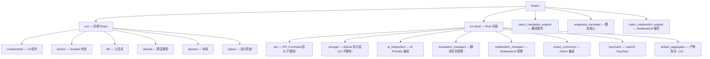

# Rastro — 科研文献阅读助手

> Tauri v2 + React 19 桌面应用，面向科研人员提供 PDF 阅读、AI 翻译、AI 问答、NotebookLM 集成、Zotero 集成。
> 产品名 "Rastro"（西班牙语 "踪迹"），标识符 `com.rastro.app`。

---

## 项目架构

```text
[React 19 前端] <--Tauri IPC (40个Command + 6个Event)--> [Rust 后端]
                                                             |
                                                             +---> SQLite (app.db)
                                                             +---> macOS Keychain (API Key)
                                                             +---> HTTP --> [Python 翻译引擎 :8890]
                                                             |                 +-> antigravity_translate
                                                             |                 +-> pdf2zh (外部可执行文件)
                                                             +---> HTTP --> [NotebookLM 引擎 :8891]
```

### 数据流

- **前端 → 后端**: Tauri IPC `invoke()` / `listen()`, JSON 序列化
- **后端 → 前端**: `AppHandle::emit()` 事件推送（翻译进度、AI 流式 token 等）
- **后端 → 翻译引擎**: HTTP REST API（reqwest → FastAPI）
- **后端 → NotebookLM 引擎**: HTTP REST API
- **后端 → 数据库**: rusqlite 直连 SQLite 文件（`app.db`）
- **后端 → Keychain**: `security-framework` macOS 原生 Keychain 读写

---

## 技术栈

### 前端

| 依赖 | 版本 | 用途 |
|------|------|------|
| React | ^19.2.4 | UI 框架 |
| TypeScript | ^5.9.3 | 类型系统 |
| Vite | ^7.3.1 | 构建工具，dev server :1420 |
| Tailwind CSS | ^4.2.1 | 原子化 CSS（v4 `@theme` + `@layer`） |
| Zustand | ^5.0.11 | 全局状态管理 |
| @tanstack/react-virtual | ^3.13.21 | 虚拟化长列表 |
| @radix-ui/themes | ^3.3.0 | 无障碍 UI 原语 |
| framer-motion | ^12.35.2 | 动画 |
| lucide-react | ^0.577.0 | 图标库 |
| pdfjs-dist | ^5.5.207 | PDF 渲染 |
| react-markdown | ^10.1.0 | Markdown 渲染（配合 remark-gfm + rehype-sanitize） |
| @tauri-apps/api | ^2.10.1 | Tauri IPC 前端 SDK |
| @tauri-apps/plugin-dialog | ^2.6.0 | 原生文件对话框 |

### 后端 (Rust)

| 依赖 | 版本 | 用途 |
|------|------|------|
| tauri | 2 | 应用框架（features: `protocol-asset`, `test`） |
| rusqlite | 0.37 | SQLite 持久层（bundled 编译） |
| serde / serde_json | 1 | JSON 序列化 |
| reqwest | 0.12 | HTTP 客户端（rustls-tls, json, stream） |
| tokio | 1 | 异步运行时 |
| chrono | 0.4 | 时间处理 |
| uuid | 1 | UUID v4 生成 |
| parking_lot | 0.12 | 高性能互斥锁 |
| sha2 | 0.10 | 文件哈希（翻译缓存 key） |
| security-framework | 3 | macOS Keychain（cfg target_os = macos） |
| tauri-plugin-dialog | 2.6.0 | 原生对话框插件 |
| **[dev]** axum | 0.8 | 测试用 mock HTTP 服务器 |

- Rust edition: **2021**
- Cargo package name: `rastro`, version: `0.1.0`

### Python 引擎

| 依赖 | 版本 | 模块 |
|------|------|------|
| PyMuPDF | ≥1.24.0 | `antigravity_translate` PDF 处理 |
| notebooklm-py | 0.3.4 | `rastro_notebooklm_engine` API 客户端 |
| browser-cookie3 | 0.20.1 | NotebookLM 认证 cookie 读取 |
| pdf2zh | 外部可执行文件 | PDF 数学公式翻译 |

- Python 要求: **3.12+**

---

## 项目模块划分



### 模块索引

| 模块路径 | 语言 | 职责 | 入口 | 测试 |
|---------|------|------|------|------|
| `src/` | TS/React | 前端 UI: PDF 查看器、侧栏、聊天、设置、NotebookLM | `src/main.tsx` | 无 |
| `src-tauri/` | Rust | 后端: 40 IPC Command、SQLite、AI、翻译、Zotero | `src-tauri/src/main.rs` | 有（70+ tests） |
| `rastro_translation_engine/` | Python | 翻译引擎 HTTP 服务 | `__main__.py` | 无 |
| `antigravity_translate/` | Python | PDF 翻译核心逻辑 | `core.py` | 无 |
| `rastro_notebooklm_engine/` | Python | NotebookLM 本地代理 HTTP 服务 | `__main__.py` | 无 |

---

## 文件与文件夹布局

```text
antigravity-paper/
├── CLAUDE.md                          # 项目指导文件（本文件）
├── package.json                       # Node 依赖 + scripts
├── tsconfig.json                      # TypeScript 配置（strict, ES2020）
├── vite.config.ts                     # Vite 开发服务器配置（port 1420）
├── tailwind.config.js                 # Tailwind CSS 配置
├── postcss.config.js                  # PostCSS 配置
├── index.html                         # SPA 入口
├── requirements.txt                   # Python 依赖
│
├── src/                               # ===== 前端 =====
│   ├── main.tsx                       # React 挂载入口
│   ├── App.tsx                        # 根组件
│   ├── vite-env.d.ts                  # Vite 类型声明
│   ├── shared/
│   │   └── types.ts                   # IPC DTO 类型定义（与 Rust 一一对应）
│   ├── lib/
│   │   ├── ipc-client.ts              # IPC 客户端封装
│   │   ├── notebooklm-client.ts       # NotebookLM 客户端
│   │   ├── notebooklm-automation.ts   # NotebookLM 自动化逻辑
│   │   └── pdf-text-extractor.ts      # PDF 文本提取
│   ├── stores/
│   │   ├── useDocumentStore.ts        # 文档状态 + PDF + 翻译
│   │   ├── useChatStore.ts            # 聊天会话状态
│   │   ├── useSummaryStore.ts         # AI 总结状态
│   │   └── useNotebookLMStore.ts      # NotebookLM 状态
│   ├── layouts/
│   │   └── AppLayout.tsx              # 三栏布局（sidebar + main + right panel）
│   ├── styles/
│   │   └── globals.css                # 设计系统（Shiba Warm Palette, 461 行）
│   ├── components/
│   │   ├── sidebar/                   # 侧栏
│   │   │   ├── Sidebar.tsx            # 主容器（近期文档 + Zotero 切换）
│   │   │   ├── ZoteroList.tsx         # Zotero 文献列表（虚拟化）
│   │   │   └── DocumentTree.tsx       # v2: 树形文献列表（开发中）
│   │   ├── pdf-viewer/                # PDF 查看器
│   │   │   ├── PdfViewer.tsx          # PDF 渲染（pdfjs-dist）
│   │   │   ├── PdfToolbar.tsx         # 工具栏（缩放、翻译按钮）
│   │   │   └── TranslationSwitch.tsx  # 原文/译文切换
│   │   ├── chat-panel/                # AI 聊天
│   │   │   ├── ChatPanel.tsx          # 聊天面板
│   │   │   ├── ChatInput.tsx          # 输入框
│   │   │   └── ChatMessage.tsx        # 消息气泡
│   │   ├── summary/
│   │   │   └── SummaryPanel.tsx       # AI 总结面板
│   │   ├── notebooklm/
│   │   │   └── NotebookLMView.tsx     # NotebookLM 视图
│   │   ├── settings/                  # 设置
│   │   │   ├── SettingsPanel.tsx       # 设置面板
│   │   │   ├── ProviderCard.tsx        # Provider 配置卡片
│   │   │   └── ModelSettings.tsx       # 模型选择
│   │   ├── setup/
│   │   │   └── SetupWizard.tsx        # 首次启动向导
│   │   ├── panel/
│   │   │   └── RightPanel.tsx         # 右侧面板容器
│   │   └── ui/                        # 基础 UI 原语
│   │       ├── Button.tsx
│   │       ├── Card.tsx
│   │       ├── Dialog.tsx
│   │       └── Input.tsx
│   └── assets/shiba/                  # 柴犬主题图片资源
│
├── src-tauri/                         # ===== Rust 后端 =====
│   ├── Cargo.toml
│   ├── tauri.conf.json                # Tauri 应用配置
│   ├── capabilities/                  # Tauri v2 权限声明
│   ├── migrations/
│   │   ├── 001_init.sql               # v1 Schema（7 表）
│   │   └── v2_document_workspace.sql  # v2 Schema（+2 表 + ALTER）
│   └── src/
│       ├── main.rs                    # 入口：注册 40 个 IPC Command
│       ├── app_state.rs               # AppState 单例（Storage + AI + Translation + Keychain）
│       ├── errors.rs                  # 统一错误模型（31 AppErrorCode + AppError）
│       ├── models.rs                  # 共享数据模型
│       ├── artifact_aggregator.rs     # v2: 跨表产物聚合查询
│       ├── ipc/                       # IPC Command 层
│       │   ├── mod.rs
│       │   ├── document.rs            # 文档管理（8 Commands）
│       │   ├── translation.rs         # 翻译任务（8 Commands）
│       │   ├── ai.rs                  # AI 问答/总结（8 Commands）
│       │   ├── settings.rs            # Provider 配置 + 统计（8 Commands）
│       │   ├── zotero.rs              # Zotero 集成（3 Commands）
│       │   └── notebooklm.rs          # NotebookLM（11 Commands）
│       ├── storage/                   # SQLite 持久层
│       │   ├── mod.rs                 # Storage 包装（Arc<Mutex<Connection>>）
│       │   ├── migration.rs           # Migration 框架
│       │   ├── migrations.rs          # Migration 注册表
│       │   ├── documents.rs           # documents 表（CRUD + 过滤）
│       │   ├── document_summaries.rs  # v2: AI 总结表（upsert/get/delete）
│       │   ├── chat_sessions.rs       # 聊天会话表
│       │   ├── chat_messages.rs       # 聊天消息表
│       │   ├── translation_jobs.rs    # 翻译任务表
│       │   ├── translation_artifacts.rs # 翻译产物表
│       │   ├── provider_settings.rs   # Provider 配置表
│       │   └── usage_events.rs        # 使用统计表
│       ├── ai_integration/            # AI Provider 集成
│       │   ├── mod.rs
│       │   ├── chat_service.rs        # 流式聊天服务
│       │   ├── provider_registry.rs   # Provider 注册与切换
│       │   └── usage_meter.rs         # Token 用量统计
│       ├── translation_manager/       # 翻译管理
│       │   ├── mod.rs
│       │   ├── engine_supervisor.rs   # 引擎进程监控
│       │   ├── http_client.rs         # 翻译引擎 HTTP 客户端
│       │   ├── job_registry.rs        # 翻译任务注册表
│       │   ├── artifact_index.rs      # 翻译产物索引
│       │   └── cache_eviction.rs      # 缓存淘汰策略
│       ├── notebooklm_manager/        # NotebookLM 引擎管理
│       │   ├── mod.rs
│       │   ├── engine_supervisor.rs   # 引擎进程监控
│       │   └── http_client.rs         # NotebookLM 引擎 HTTP 客户端
│       ├── zotero_connector/
│       │   └── mod.rs                 # Zotero SQLite 只读连接
│       └── keychain/
│           └── mod.rs                 # macOS Keychain CRUD
│
├── rastro_translation_engine/         # ===== Python 翻译服务 =====
│   ├── __init__.py
│   ├── __main__.py                    # 入口
│   ├── server.py                      # FastAPI HTTP 服务
│   └── worker.py                      # 翻译工作线程
│
├── antigravity_translate/             # ===== Python 翻译核心 =====
│   ├── __init__.py
│   ├── __main__.py                    # CLI 入口
│   ├── core.py                        # 翻译核心逻辑
│   ├── config.py                      # 配置
│   └── prompts.py                     # AI 翻译 Prompt 模板
│
├── rastro_notebooklm_engine/          # ===== Python NotebookLM 服务 =====
│   ├── __init__.py
│   ├── __main__.py                    # 入口（未使用，由 server.py 入口）
│   ├── server.py                      # HTTP 服务
│   ├── service.py                     # 核心业务逻辑
│   └── models.py                      # 数据模型
│
├── genesis/                           # ===== 设计文档 =====
│   ├── v1/                            # v1 初始设计
│   └── v2/                            # v2 文档管理迭代（当前活跃）
│
├── scripts/                           # 构建脚本
│   └── generate_app_icons.py          # 图标生成
│
└── .agent/                            # AI Agent 配置
    ├── workflows/                     # Agent 工作流定义
    └── skills/                        # Agent 技能定义
```

---

## 项目业务模块

### 1. PDF 阅读器

- `PdfViewer.tsx` + `PdfToolbar.tsx` 基于 pdfjs-dist 渲染 PDF
- 支持缩放（25%-400%）、页码跳转、全屏
- 本地文件通过 Tauri `protocol-asset` 协议加载（`convertFileSrc`）

### 2. AI 翻译

- 翻译流程: 前端 `requestTranslation` → Rust `TranslationManager` → HTTP → Python `rastro_translation_engine` → `pdf2zh` + LLM API
- 缓存策略: SHA256(文件内容) + Provider + Model + 语言参数 → `cache_key`
- 翻译产物: 翻译后的 PDF 文件存储在 `data_dir/translation_cache/`
- 进度推送: Rust 通过 `AppHandle::emit("translation-progress", ...)` → 前端 `listen()`

### 3. AI 问答

- 基于选中文本或全文的上下文问答
- 流式输出: Rust SSE 桥接 → 前端 `listen("ai-stream-token")` 逐 token 渲染
- 支持 OpenAI / Claude / Gemini 多 Provider 切换

### 4. AI 总结

- 一键生成文献总结（Markdown 格式）
- v2: 总结持久化到 `document_summaries` 表，可重新生成

### 5. NotebookLM 集成

- 本地代理引擎 (Python) 自动上传 PDF 并生成产物（思维导图、测验等）
- Rust `NotebookLMManager` 管理引擎生命周期

### 6. Zotero 集成

- 只读连接 Zotero SQLite 数据库
- 虚拟化列表展示 Zotero 文献，支持搜索、分页

### 7. 文档工作空间 (v2)

- 文献 → 产物的树形结构管理（翻译 PDF / AI 总结 / NotebookLM 产物）
- `artifact_aggregator.rs` 跨表聚合查询
- 收藏、软删除、搜索过滤

---

## 代码风格与规范

### 命名约定

#### Rust

| 元素 | 风格 | 示例 |
|------|------|------|
| 模块/文件 | `snake_case` | `translation_manager`, `cache_eviction.rs` |
| 结构体/枚举 | `PascalCase` | `AppState`, `AppErrorCode`, `TranslationManager` |
| 函数/方法 | `snake_case` | `list_artifacts_for_document()`, `toggle_favorite()` |
| 常量 | `SCREAMING_SNAKE_CASE` | `SEARCH_DEBOUNCE_MS`（前端）、错误码序列化 |
| IPC Command | `snake_case` | `#[tauri::command] list_recent_documents` |
| DTO 字段 | `snake_case`（Rust），`camelCase`（JSON 序列化） | `#[serde(rename_all = "camelCase")]` |

#### TypeScript

| 元素 | 风格 | 示例 |
|------|------|------|
| 组件 | `PascalCase` 函数组件 + named export | `export const Sidebar = () => {}` |
| 文件名 | `PascalCase.tsx`（组件）/ `camelCase.ts`（工具） | `Sidebar.tsx`, `ipc-client.ts` |
| 类型/接口 | `PascalCase` + `Dto` 后缀 | `DocumentSnapshot`, `AISummaryDto`, `TranslationJobDto` |
| Hook | `use` 前缀 | `useDocumentStore`, `useChatStore` |
| 函数 | `camelCase` | `handleOpenLocalPdf`, `loadRecentDocuments` |
| 常量 | `SCREAMING_SNAKE_CASE` 或 `PascalCase` | `PAGE_SIZE`, `SEARCH_DEBOUNCE_MS` |
| IPC 命令名 | `snake_case` 字符串 | `"list_recent_documents"`, `"request_translation"` |

#### Python

| 元素 | 风格 | 示例 |
|------|------|------|
| 模块/文件 | `snake_case` | `core.py`, `server.py` |
| 函数 | `snake_case` | `detect_reference_pages()` |
| 类 | `PascalCase` | `TranslationWorker` |
| 配置变量 | 模块级 `SCREAMING_SNAKE_CASE` | `AG_CLAUDE_BASE_URL` |

### 代码风格

#### Rust

- **注释语言**: 中文
- `#![allow(dead_code)]` 用于开发阶段模块顶部
- 每个模块文件开头有单行注释说明用途: `// 全局应用状态`
- 文档注释使用 `///` + 中文描述
- 模块组织: 每个 `mod.rs` 顶部注释说明职责，`pub mod` 声明子模块
- 使用 `parking_lot::Mutex` 替代 `std::sync::Mutex`

#### TypeScript

- **注释语言**: 中文
- 严格模式: `"strict": true`
- Target: ES2020, Module: ES2020, moduleResolution: bundler
- JSX: `react-jsx`（无需 `import React`，但实际代码中仍使用显式 import）
- 组件文件结构: 区块注释分隔 → 类型 → 常量 → 主组件 → 子组件
  ```text
  // ---------------------------------------------------------------------------
  // 类型
  // ---------------------------------------------------------------------------
  ```

#### CSS

- 使用 Tailwind CSS v4 `@theme` 注册 CSS 变量为 utility token
- 颜色系统: **Shiba Warm Palette**（琥珀金主色 `#D4924A`、暖象牙背景 `#FFFBF5`）
- 支持 Light/Dark 两套配色（`@media (prefers-color-scheme: dark)`）
- 组件类名通过 CSS 变量引用: `bg-[var(--color-bg)]`、`text-[var(--color-text)]`
- 字体: `-apple-system` 系统字体栈 + `PingFang SC` 中文

#### 毛玻璃浮窗设计语言（Frosted Glass Popups）

所有浮窗/弹出层组件**必须**使用统一的毛玻璃配方。
本规范经过大量调试确定，请勿随意修改参数值。

##### 1. 外壳样式（必须完全一致）

```tsx
// Tailwind 类名
className="fixed z-[200] rounded-xl backdrop-blur-xl backdrop-saturate-150 border border-white/30 dark:border-white/10 shadow-xl"

// 内联样式
style={{ backgroundColor: 'rgba(255, 240, 200, 0.35)' }}
```

| 属性 | 值 | 设计意图 |
|------|------|---------|
| `backgroundColor` | `rgba(255, 240, 200, 0.35)` | 暖黄色调 + 35% 透明度 |
| `backdrop-blur-xl` | 24px 模糊 | 比 2xl(40px) 更少模糊，保留背景细节 |
| `backdrop-saturate-150` | 1.5倍饱和度 | 增强暖色调 |
| `border-white/30` | 白色 30% 边框（dark: `white/10`） | 微发光边缘 |
| `shadow-xl` | 多层阴影 | 浮起感 |
| `z-[200]` | z-index 200 | 浮于页面内容之上（Tooltip 用 `z-[99999]`） |

##### 2. 入场/退场动画（framer-motion，所有浮窗统一）

```tsx
initial={{ opacity: 0, scale: 0.9, y: -4 }}  // y: -4 下弹；y: 4 上弹
animate={{ opacity: 1, scale: 1, y: 0 }}
exit={{ opacity: 0, scale: 0.9, y: -4 }}
transition={{ duration: 0.15 }}               // 150ms，不用 spring
```

| 参数 | 值 | 说明 |
|------|------|------|
| `scale` | `0.9 → 1` | 微微放大进入 |
| `opacity` | `0 → 1` | 淡入淡出 |
| `y` | `±4px` | 下弹 `-4`，上弹 `+4`，与 placement 联动 |
| `duration` | `0.15s` | 150ms，快速不拖沓 |

##### 3. 内部元素颜色规则（禁止冷色/硬编码灰色）

| 用途 | ✅ 正确 | ❌ 禁止 |
|------|---------|---------|
| 按钮 hover | `hover:bg-[var(--color-hover)]` | `hover:bg-white/40`, `hover:bg-black/10` |
| 分隔线 | `bg-[var(--color-separator)]` | `bg-black/10`, `bg-gray-200` |
| 标题栏分隔线 | `border-[var(--color-border-secondary)]` | `border-black/5` |
| 文字颜色 | `text-[var(--color-text-secondary)]` | `text-gray-500` |
| 关闭按钮图标 | `text-[var(--color-text-tertiary)]` | `text-gray-400` |

##### 4. 内部输入元素样式

```tsx
// textarea / input 在毛玻璃内的样式
className="w-full p-2 text-sm rounded-md bg-white/30 dark:bg-white/10
           border border-white/40 dark:border-white/15
           text-[var(--color-text)] placeholder:text-[var(--color-text-quaternary)]
           resize-none focus:outline-none focus:border-[var(--color-border-focus)]"
```

##### 5. 加载态骨架屏

```tsx
<div className="h-3 w-4/5 rounded bg-white/30 dark:bg-white/10 animate-pulse" />
```

##### 6. 现有毛玻璃组件清单

| 组件 | 路径 | 用途 |
|------|------|------|
| `NotePopup` | `src/components/pdf-viewer/NotePopup.tsx` | 批注编辑弹窗（**模板组件**） |
| `SelectionPopupMenu` | `src/components/pdf-viewer/SelectionPopupMenu.tsx` | 选词操作菜单 |
| `TranslationBubble` | `src/components/pdf-viewer/TranslationBubble.tsx` | 翻译结果气泡 |
| `TitleTranslationTooltip` | `src/components/sidebar/TitleTranslationTooltip.tsx` | 侧栏标题翻译 Tooltip |

##### 7. 注意事项

- 不要使用 `.glass-panel` CSS 类（透明度 0.85 太高）
- `backdrop-blur-2xl`（40px）模糊过强，白色区域完全不透明
- 背景色透明度 < 0.25 暖色不明显，> 0.40 透明感不足，**0.35 最佳**
- **新增浮窗**：复制 `NotePopup.tsx` 的外壳 + 内部颜色，保持像素级一致

#### 侧边栏图标设计语言

##### 图标库

- 通用 UI 图标统一使用 `lucide-react`（线条风格，2px 描边，round cap/join）
- 文件夹图标使用自定义 `FolderIcon` SVG 内联组件（位于 `ZoteroList.tsx`）

##### 文件夹图标 — S3 线条 + 微填充方案

```tsx
// 核心参数
strokeWidth: 1.75           // 比 lucide 默认 2 稍细
strokeLinecap: 'round'
strokeLinejoin: 'round'
fill: `${color}18`          // hex 后缀 18 ≈ 10% 透明度
```

| 状态 | 描边色 | 填充 | 其他 |
|------|--------|------|------|
| **关闭** | `color`（`FOLDER_COLORS[i].accent`） | `${color}18`（10%） | — |
| **打开** | `color` | 后层 `${color}08`（3%），翻盖 `${color}18`（10%） | 双 path 翻盖效果 |
| **未分类** | `#9A8068`（暖灰固定） | 无 | `strokeDasharray="3 2.5"`, `opacity=0.6` |

##### Shiba Warm Palette 文件夹色板（`FOLDER_COLORS`）

7 色暖色系，每个文件夹按 `index % 7` 分配：琥珀金、深琥珀、蜂蜜、金麦、赭石、砂岩、暖灰。


### Import 规则

#### Rust

```rust
// 1. 标准库
use std::{collections::HashMap, fs, path::PathBuf, sync::Arc};
// 2. 第三方 crate
use parking_lot::Mutex;
use serde::Serialize;
// 3. 本 crate 模块（使用 crate:: 前缀）
use crate::{errors::AppError, storage::Storage};
```

#### TypeScript

```typescript
// 1. React
import React, { useCallback, useEffect, useState } from 'react';
// 2. 第三方库
import { motion, AnimatePresence } from 'framer-motion';
import { Settings, FileText } from 'lucide-react';
// 3. Tauri API
import { invoke } from '@tauri-apps/api/core';
// 4. 本项目模块（相对路径）
import { useDocumentStore } from '../../stores/useDocumentStore';
import { ipcClient } from '../../lib/ipc-client';
import type { DocumentSnapshot } from '../../shared/types';
```

- **Type-only import**: 使用 `import type { ... }` 语法

### 状态管理

- **前端**: Zustand store（4 个独立 store），通过 selector 订阅最小状态
- **后端**: `AppState` 单例，`tauri::State<AppState>` 注入到 IPC Command
- 全局状态字段使用 `Arc<Mutex<T>>` 保护并发访问

### 异常处理

#### Rust 统一错误模型

```text
AppErrorCode (31 个错误码, SCREAMING_SNAKE_CASE 序列化)
  └── AppError { code, message, retryable, details? }
        ├── From<rusqlite::Error>  → InternalError
        ├── From<std::io::Error>  → InternalError
        └── From<reqwest::Error>  → ProviderConnectionFailed (retryable: true)
```

- **所有 IPC Command 返回** `Result<T, AppError>`
- 错误码与 TypeScript `AppErrorCode` 枚举一一对应，有单测保障
- `AppError::with_detail()` 附加诊断信息（如 `cooldownUntil`, `retryAfterSeconds`）

#### TypeScript 错误处理

- IPC 调用使用 `try/catch`，`console.error('中文描述:', err)` 记录
- 无全局错误边界（ErrorBoundary）

### 日志规范

#### Rust

- 使用 `eprintln!()` 输出到 stderr（无结构化日志框架）
- 关键路径: `eprintln!("Rastro 启动失败: {}", e)`

#### TypeScript

- `console.error('中文错误描述:', err)` — 所有 catch 块
- `console.warn()` — 非致命警告
- 无日志框架、无日志级别系统

### 参数校验

- **Rust**: 依赖类型系统 + serde 反序列化校验；无运行时 validator
- **TypeScript**: 依赖 TypeScript 类型检查；无运行时 schema 校验（如 zod）
- **IPC 契约**: Rust `#[serde(rename_all = "camelCase")]` 确保字段名与前端 TypeScript 接口对齐

---

## 测试与质量

### 单元测试 (Rust)

- 位置: 各模块内 `#[cfg(test)] mod tests`（内联测试）
- 数据库测试: 使用 `Storage::new_memory()` in-memory SQLite
- 当前: **70+ tests** 覆盖以下模块:

| 模块 | 测试内容 |
|------|---------|
| `errors` | 31 错误码序列化一致性、AppError JSON 结构 |
| `storage/documents` | CRUD + 过滤查询 + 收藏/软删除 |
| `storage/document_summaries` | upsert / get / delete + UNIQUE 约束 |
| `storage/mod` | 全表回归测试 |
| `artifact_aggregator` | 4 源聚合、空文档、计数 |
| `ipc/document` | IPC 错误序列化 + 产物列表 + 过滤 |
| `ipc/translation` | 翻译请求错误路径 + 缓存删除 |
| `ipc/ai` | 总结 CRUD IPC |
| `ipc/zotero` | Zotero 未安装场景 |
| `zotero_connector` | Zotero DB 读写集成 |
| `translation_manager` | 输出模式标准化、job 注册表、缓存淘汰、引擎监控 |
| `keychain` | Key 脱敏函数 |

### 集成测试

- **dev-dependency**: `axum 0.8` 用于 mock HTTP 服务器
- Tauri `test` feature 启用 IPC Command 测试无需 GUI

### 前端测试

- **当前无测试**（`package.json` 的 `test` 脚本为 placeholder）

---

## 构建、测试与运行

### 前提条件

- Node.js 18+
- Rust toolchain (edition 2021)
- Python 3.12+
- macOS（Keychain 依赖 `security-framework`）
- `pdf2zh` 可执行文件（翻译功能依赖）

### 常用命令

```bash
# 前端 + Rust 后端联合启动
npm run tauri dev

# 仅前端开发（Vite dev server :1420）
npm run dev

# 翻译引擎（独立运行）
python -m rastro_translation_engine --host 127.0.0.1 --port 8890

# Rust 测试
cd src-tauri && cargo test

# Rust 编译检查
cd src-tauri && cargo check

# 生产构建（macOS .dmg）
npm run tauri build

# 仅前端构建
npm run build

# 图标生成
npm run icons:generate
```

### 环境变量

| 变量 | 用途 | 默认值 |
|------|------|--------|
| `RASTRO_ENGINE_HOST` | 翻译引擎地址 | `127.0.0.1` |
| `RASTRO_ENGINE_PORT` | 翻译引擎端口 | `8890` |
| `RASTRO_ZOTERO_DB_PATH` | Zotero 数据库路径 | 自动检测 |
| `RASTRO_ZOTERO_PROFILE_DIR` | Zotero profile 目录 | 自动检测 |
| `AG_PDF2ZH_EXE` | pdf2zh 可执行文件路径 | 自动探测 |
| `AG_CLAUDE_BASE_URL` | LLM API 基础 URL | 预设代理地址 |
| `AG_CLAUDE_API_KEY` | LLM API Key | 预设值 |
| `AG_CLAUDE_MODEL` | LLM 模型名称 | `Claude Sonnet 4.6` |

---

## Git 工作流程

- **分支模型**: 单 `main` 分支
- **远程仓库**: `origin` → `https://github.com/xkkabishou/rastro.git`
- **Commit 风格**: Conventional Commits
  - `feat(v2): S1 document workspace backend — migration, storage, IPC`
  - `fix: 翻译引擎端口冲突时先尝试清理孤儿进程`
  - `chore: 从 Git 索引中移除 Tauri 自动生成的 schemas`
  - `docs: 同步 Challenge Report 修复状态`
- **忽略规则** (.gitignore): `node_modules/`, `dist/`, `src-tauri/target/`, `src-tauri/gen/`, `__pycache__/`, `.venv/`, `.env*`, `tmp-*.png`

---

## 文档目录

### 设计文档

| 路径 | 版本 | 状态 | 内容 |
|------|------|------|------|
| `genesis/v1/01_PRD.md` | v1 | 已归档 | 产品需求：9 个用户故事 |
| `genesis/v1/02_ARCHITECTURE_OVERVIEW.md` | v1 | 已归档 | C4 L1 架构，3 系统分解 |
| `genesis/v1/03_ADR/` | v1 | 已归档 | 技术栈决策 + 多模型协作策略 |
| `genesis/v1/04_SYSTEM_DESIGN/` | v1 | 已归档 | 3 个系统设计文档 |
| `genesis/v1/07_CHALLENGE_REPORT.md` | v1 | 已归档 | 设计评审：12 个问题 |
| `genesis/v2/01_PRD.md` | **v2** | **活跃** | 侧栏树形 + 翻译管理 + AI 总结（US-010~017） |
| `genesis/v2/02_ARCHITECTURE_OVERVIEW.md` | **v2** | **活跃** | v2 架构总览 |
| `genesis/v2/03_ADR/ADR_003_DOCUMENT_WORKSPACE.md` | **v2** | **活跃** | 文献工作空间 ADR |
| `genesis/v2/04_SYSTEM_DESIGN/rust-backend-system.md` | **v2** | **活跃** | v2 后端设计（权威 IPC 契约源） |
| `genesis/v2/05_TASKS.md` | **v2** | **活跃** | WBS 任务清单：4 Sprint × 33 + 4 INT |
| `genesis/v2/06_CHANGELOG.md` | **v2** | **活跃** | 变更记录 |
| `genesis/v2/07_CHALLENGE_REPORT.md` | **v2** | **活跃** | v2 设计评审 |

### 子模块 CLAUDE.md

| 路径 | 内容 |
|------|------|
| `src/CLAUDE.md` | 前端模块文档 |
| `src-tauri/CLAUDE.md` | Rust 后端模块文档 |
| `rastro_translation_engine/CLAUDE.md` | 翻译服务模块文档 |
| `antigravity_translate/CLAUDE.md` | 翻译核心模块文档 |

### 文档存储规范

- **设计文档**: 统一存放在 `genesis/vN/` 目录，按版本隔离
- **文档编号**: `00_MANIFEST` → `01_PRD` → `02_ARCHITECTURE` → `03_ADR` → `04_SYSTEM_DESIGN` → `05_TASKS` → `06_CHANGELOG` → `07_CHALLENGE_REPORT`
- **ADR**: 存放在 `03_ADR/ADR_NNN_NAME.md`，带编号
- **模块文档**: 各模块根目录下 `CLAUDE.md` 描述模块内部细节
- **权威源**: IPC 命名以 `genesis/v2/04_SYSTEM_DESIGN/rust-backend-system.md` 为准
- **无 `/docs` 目录**: 所有设计文档在 `genesis/`，无独立 docs 文件夹

---

## v2 迭代进度

| Sprint | 状态 | 完成情况 |
|--------|------|----------|
| **S1** 数据基石 | ✅ 完成 | 7/7 后端任务，70 tests（migration + storage + aggregator + 8 IPC） |
| **S2** 树形视图 | ✅ 完成 | 9/9 前端任务（types + IPC client + sidebar + store + icons） |
| **S3** 产物管理 | ✅ 完成 | 右键菜单 + 翻译管理 + AI 总结 UI |
| **S4** 搜索优化 | ✅ 完成 | 搜索筛选 + 缓存管理 + 缓存统计 IPC |

---

## AI 使用指引

1. **IPC 契约是核心**: 修改任何 IPC 接口时必须同步更新 `src/shared/types.ts` 和对应的 Rust DTO
2. **错误码对齐**: 31 个 `AppErrorCode` 在 Rust 和 TypeScript 之间一一对应，有单测保障
3. **翻译引擎是独立进程**: Rust 通过 HTTP 与 Python 翻译引擎通信
4. **macOS 专属**: Keychain 操作使用 `security-framework`
5. **状态管理**: 前端 Zustand store（4 个），后端 `AppState` 单例
6. **翻译缓存**: SHA256 + Provider + Model + Language → `cache_key`
7. **代码注释用中文**: 跨 Rust/TypeScript/CSS 均使用中文注释
8. **设计文档路径**: v2 活跃设计在 `genesis/v2/`，v1 已归档在 `genesis/v1/`

---

## 变更记录

| 日期 | 操作 | 说明 |
|------|------|------|
| 2026-03-12 | 初始化 | 首次全仓扫描，生成根级 + 4 个模块级 CLAUDE.md |
| 2026-03-12 | 补扫 | 深度扫描子模块；补录 genesis/v1/ 设计文档 |
| 2026-03-16 | Bug 修复 | 翻译引擎检测逻辑修复，解决全文翻译仅翻前几页问题 |
| 2026-03-16 | v2 Genesis | 完成 v2 设计全流程：PRD → Architecture → System Design → Blueprint → Challenge |
| 2026-03-16 | v2 S1 完成 | 后端数据层 + IPC 契约实现（7 任务，10 文件，70 tests） |
| 2026-03-16 | CLAUDE.md 重写 | 基于实际代码分析重写，覆盖架构、规范、测试、文档全维度 |
