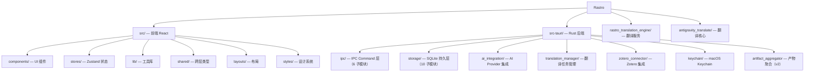

# Rastro — 科研文献阅读助手

> Tauri v2 + React 19 桌面应用，面向科研人员提供 PDF 阅读、AI 翻译、AI 问答、Zotero 集成。
> 产品名 "Rastro"（西班牙语 "踪迹"），标识符 `com.rastro.app`。

---

## 项目架构

```text
[React 19 前端] <--Tauri IPC (Command + Event)--> [Rust 后端]
                                                       |
                                                       +---> SQLite (app.db)
                                                       +---> macOS Keychain (API Key)
                                                       +---> HTTP --> [Python 翻译引擎 :8890]
                                                       |                 +-> antigravity_translate
                                                       |                 +-> pdf2zh (外部可执行文件)
```

### 数据流

- **前端 → 后端**: Tauri IPC `invoke()` / `listen()`, JSON 序列化
- **后端 → 前端**: `AppHandle::emit()` 事件推送（翻译进度、AI 流式 token 等）
- **后端 → 翻译引擎**: HTTP REST API（reqwest → FastAPI）
- **后端 → 数据库**: rusqlite 直连 SQLite 文件（`app.db`）
- **后端 → Keychain**: `security-framework` macOS 原生 Keychain 读写

---

## 项目模块划分



> 各子模块详情见其根目录下的 `CLAUDE.md`。

---

## 项目业务模块

### 1. PDF 阅读器

- `PdfViewer.tsx` + `PdfToolbar.tsx` 基于 pdfjs-dist 渲染 PDF
- 支持缩放（25%-400%）、页码跳转、全屏
- 本地文件通过 Tauri `protocol-asset` 协议加载（`convertFileSrc`）

### 2. AI 翻译

- 翻译流程: 前端 `requestTranslation` → Rust `TranslationManager` → HTTP → Python `rastro_translation_engine` → `pdf2zh` + LLM API
- 缓存策略: SHA256(文件内容) + Provider + Model + 语言参数 → `cache_key`
- 翻译产物: 翻译后的 PDF 文件存储在 `data_dir/translation_cache/`
- 进度推送: Rust 通过 `AppHandle::emit("translation-progress", ...)` → 前端 `listen()`

### 3. AI 问答

- 基于选中文本或全文的上下文问答
- 流式输出: Rust SSE 桥接 → 前端 `listen("ai-stream-token")` 逐 token 渲染
- 支持 OpenAI / Claude / Gemini 多 Provider 切换

### 4. AI 总结

- 一键生成文献总结（Markdown 格式）
- v2: 总结持久化到 `document_summaries` 表，可重新生成

### 5. Zotero 集成

- 只读连接 Zotero SQLite 数据库
- 虚拟化列表展示 Zotero 文献，支持搜索、分页

### 6. 文档工作空间 (v2)

- 文献 → 产物的树形结构管理（翻译 PDF / AI 总结）
- `artifact_aggregator.rs` 跨表聚合查询
- 收藏、软删除、搜索过滤

---

## 代码风格与规范

### 命名约定

#### Rust

| 元素 | 风格 | 示例 |
|------|------|------|
| 模块/文件 | `snake_case` | `translation_manager`, `cache_eviction.rs` |
| 结构体/枚举 | `PascalCase` | `AppState`, `AppErrorCode`, `TranslationManager` |
| 函数/方法 | `snake_case` | `list_artifacts_for_document()`, `toggle_favorite()` |
| 常量 | `SCREAMING_SNAKE_CASE` | `SEARCH_DEBOUNCE_MS`（前端）、错误码序列化 |
| IPC Command | `snake_case` | `#[tauri::command] list_recent_documents` |
| DTO 字段 | `snake_case`（Rust），`camelCase`（JSON 序列化） | `#[serde(rename_all = "camelCase")]` |

#### TypeScript

| 元素 | 风格 | 示例 |
|------|------|------|
| 组件 | `PascalCase` 函数组件 + named export | `export const Sidebar = () => {}` |
| 文件名 | `PascalCase.tsx`（组件）/ `camelCase.ts`（工具） | `Sidebar.tsx`, `ipc-client.ts` |
| 类型/接口 | `PascalCase` + `Dto` 后缀 | `DocumentSnapshot`, `AISummaryDto`, `TranslationJobDto` |
| Hook | `use` 前缀 | `useDocumentStore`, `useChatStore` |
| 函数 | `camelCase` | `handleOpenLocalPdf`, `loadRecentDocuments` |
| 常量 | `SCREAMING_SNAKE_CASE` 或 `PascalCase` | `PAGE_SIZE`, `SEARCH_DEBOUNCE_MS` |
| IPC 命令名 | `snake_case` 字符串 | `"list_recent_documents"`, `"request_translation"` |

#### Python

| 元素 | 风格 | 示例 |
|------|------|------|
| 模块/文件 | `snake_case` | `core.py`, `server.py` |
| 函数 | `snake_case` | `detect_reference_pages()` |
| 类 | `PascalCase` | `TranslationWorker` |
| 配置变量 | 模块级 `SCREAMING_SNAKE_CASE` | `AG_CLAUDE_BASE_URL` |

### 代码风格

- **注释语言**: 全栈统一使用中文（Rust / TypeScript / CSS）
- **Rust**: `parking_lot::Mutex`；模块顶部单行注释说明用途；`///` 中文文档注释
- **TypeScript**: strict 模式；ES2020；组件文件用区块注释分隔（类型 → 常量 → 主组件）
- **CSS**: Tailwind v4 `@theme` + CSS 变量；**Shiba Warm Palette**（琥珀金 `#D4924A`、暖象牙 `#FFFBF5`）；Light/Dark 双配色

> 详细编码规范见 `.trellis/spec/frontend/` 和 `.trellis/spec/backend/` 下的 guideline 文件。

#### 视觉语言

- **Shiba Warm Palette** 琥珀金 `#D4924A` + 暖象牙 `#FFFBF5`；Light/Dark 双配色
- **毛玻璃浮窗**（popover/tooltip/bubble）使用统一配方：`backdrop-blur-xl` + `rgba(255,240,200,0.35)` + `z-[200]`；模板组件 `NotePopup.tsx`
- **侧边栏文件夹图标** 使用自定义 `FolderIcon` SVG（`ZoteroList.tsx`），7 色暖色板 `FOLDER_COLORS`
- **参数值经大量调试确定，不得随意修改**

> 毛玻璃规范（外壳 / 动画 / 内部颜色 / 禁用项）、图标规范、BEM 使用场景、token 速查表详见 `.trellis/spec/frontend/css-design.md`

### Import 规则

- **Rust**: 标准库 → 第三方 crate → 本 crate（`crate::` 前缀）
- **TypeScript**: React → 第三方库 → Tauri API → 本项目模块（相对路径）；类型用 `import type { ... }`

### 状态管理

- **前端**: Zustand 多 store 拆域(document / chat / summary)，selector 订阅最小状态
- **后端**: `AppState` 单例，`tauri::State<AppState>` 注入；`Arc<Mutex<T>>` 保护并发

> 详见 `.trellis/spec/frontend/state-management.md`

### 异常处理

- **Rust**: 统一 `AppError { code, message, retryable, details? }`，所有 IPC Command 返回 `Result<T, AppError>`
- **TypeScript**: `ipcClient` 统一 `try/catch`，`console.error('中文描述:', err)`
- 错误码 Rust ↔ TypeScript 一一对应，有单测保障

> 详见 `.trellis/spec/backend/error-handling.md`

### 日志规范

- **Rust**: `eprintln!()` 输出到 stderr，中文描述 + 关键 ID + 错误对象
- **TypeScript**: `console.error()` / `console.warn()`，中文上下文
- 无结构化日志框架

> 详见 `.trellis/spec/backend/logging-guidelines.md`

### 参数校验

- **Rust**: 类型系统 + serde 反序列化；无运行时 validator
- **TypeScript**: TypeScript strict；无 zod/yup
- **IPC 契约**: `#[serde(rename_all = "camelCase")]` 对齐前后端字段名

---

## 测试与质量

- **Rust 测试**: `cd src-tauri && cargo test`，70+ 内联测试覆盖 storage CRUD、错误序列化、IPC 错误路径、翻译管理器、Zotero 集成
- **前端测试**: `npm test`（vitest run）
- **集成测试**: `axum 0.8` mock HTTP + Tauri `test` feature 无 GUI 测试
- **前端构建验证**: `npm run build`

> 详细质量规范见 `.trellis/spec/backend/quality-guidelines.md` 和 `.trellis/spec/frontend/quality-guidelines.md`

---

## AI 使用指引

1. **IPC 契约是核心**: 修改任何 IPC 接口时必须同步更新 `src/shared/types.ts` 和对应的 Rust DTO
2. **错误码对齐**: 31 个 `AppErrorCode` 在 Rust 和 TypeScript 之间一一对应，有单测保障
3. **翻译引擎是独立进程**: Rust 通过 HTTP 与 Python 翻译引擎通信
4. **macOS 专属**: Keychain 操作使用 `security-framework`
5. **状态管理**: 前端 Zustand store（3 个），后端 `AppState` 单例
6. **翻译缓存**: SHA256 + Provider + Model + Language → `cache_key`
7. **代码注释用中文**: 跨 Rust/TypeScript/CSS 均使用中文注释
8. **设计文档路径**: v2 活跃设计在 `genesis/v2/`（权威 IPC 契约源: `genesis/v2/04_SYSTEM_DESIGN/rust-backend-system.md`），v1 已归档在 `genesis/v1/`
