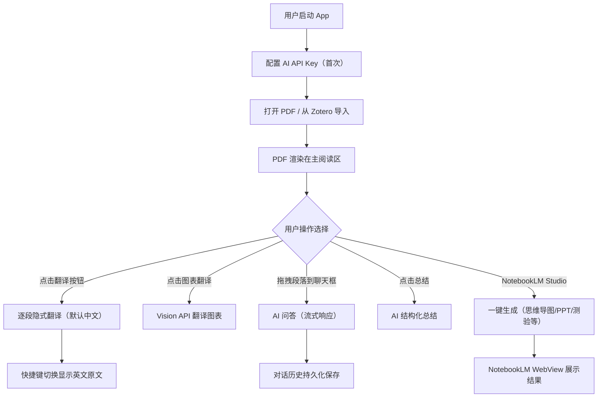

# 产品需求文档 (PRD) v1.0

**项目名称**: Rastro
**功能名称**: AI 学术文献智能阅读器
**文档状态**: 评审中 (Review)
**版本号**: 1.0
**负责人**: Genesis Agent
**创建日期**: 2026-03-11

---

## 1. 执行摘要 (Executive Summary)

Rastro 是一款 macOS 桌面端 AI 学术文献阅读器，通过多 AI API 集成提供全文翻译（含图表）、AI 问答和一键 NotebookLM Studio 生成，大幅提升外文文献理解效率。

---

## 2. 背景与上下文 (Background & Context)

### 2.1 问题陈述 (Problem Statement)
- **当前痛点**: 中国科研工作者阅读英文学术文献时，需要频繁在 PDF 阅读器、翻译工具、AI 助手和 NotebookLM 之间切换。现有工具无法保持学术论文排版结构，无法翻译图表中的标签和内容，更无法一键生成思维导图和演示文稿辅助理解。
- **影响范围**: 需要阅读英文学术文献的中国科研工作者、医务人员、高校师生。
- **业务影响**: 阅读一篇 20 页英文论文平均耗时 2-4 小时（含查词翻译），理解论文核心需额外 1-2 小时制作笔记/思维导图。效率提升空间巨大。

### 2.2 核心机会 (Opportunity)
集成多家 AI API（OpenAI GPT / Anthropic Claude / Google Gemini）+ Google NotebookLM Studio 的生成能力，在一个桌面 App 中完成从阅读→翻译→问答→总结→生成学习材料的完整闭环，将外文文献理解效率提升 5-10 倍。

### 2.3 竞品与参考 (Reference & Competitors)
- **沉浸式翻译 (Immersive Translate)**: 浏览器翻译插件，支持双语对照，但不支持 PDF 原生排版保持、无图表翻译、无 AI 问答。
- **zotero-pdf2zh + PDFMathTranslate**: 开源布局保留翻译引擎（EMNLP 2025），翻译质量极高，但仅作为 Zotero 插件，无独立阅读器 UI、无 AI 问答、无 NotebookLM 集成。我们将**集成其翻译引擎**。
- **Readwise Reader**: 优秀的 PDF 阅读器，但收费较高（$8.99/月），无图表翻译，不集成 NotebookLM。
- **Zotero + 翻译插件**: 学术文献管理工具，翻译功能有限，无 AI 能力。
- **NotebookLM 网页版**: 强大的 AI 知识库，但不与 PDF 阅读器集成，上传/切换不便。
- **我们的护城河**: 一站式体验（阅读→翻译→问答→生成学习材料）、集成 PDFMathTranslate 的论文级布局保留翻译、NotebookLM Studio 一键集成、多 AI Provider 可切换。

---

## 3. 目标与范围 (Goals & Non-Goals)

### 3.1 目标 (Goals)
- **[G1]**: 用户可在 App 内打开 PDF 文献，首页渲染 < 1 秒，渲染保真度 ≥ 95%（对标 Chrome PDF 查看器）。
- **[G2]**: 实现英→中 PDF 全文翻译（含文字段落和图表），隐式双语对照模式（默认中文、快捷键显示原文），文字段落翻译覆盖率 ≥ 90%，图表翻译覆盖率 ≥ 80%。
- **[G3]**: 用户可拖拽选中段落至聊天框进行 AI 问答，首 token 响应 < 3 秒，对话历史持久化。
- **[G5]**: 一键触发 NotebookLM Studio 生成内容（思维导图、演示文稿、测验、闪卡、信息图等），从点击到开始生成 < 30 秒。
- **[G6]**: 支持 OpenAI GPT / Claude / Gemini 三大 AI Provider 一键切换。
- **[G7]**: 打包后 App 体积 < 50MB（不含 Chromium），安装后首次启动 < 3 秒。

### 3.2 非目标 (Non-Goals)
- **[NG1]**: 不做 PDF 编辑/批注功能（如高亮、笔记），专注阅读和理解。
- **[NG2]**: 不做内置文献库管理（收藏、分类、标签），使用 Zotero 作为文献管理工具。
- **[NG3]**: 不做非英文语言互译（仅英→中，后续版本可扩展）。
- **[NG4]**: 不支持 OCR 扫描件 PDF（仅支持可提取文本的 PDF）。
- **[NG5]**: 不做 iOS/Android 移动端（首发 macOS，后期增加 Windows）。
- **[NG6]**: 不自建 AI 模型训练（完全依赖第三方 API）。
- **[NG7]**: 不做实时协作/多人文献分享功能。

---

## 4. 用户故事与需求清单 (User Stories)

### US-001: PDF 文件打开与渲染 [REQ-001] (优先级: P0)

*   **故事描述**: 作为一名科研工作者，我想要在 App 中直接打开 PDF 文献并浏览，以便于在一个界面内完成所有阅读操作。
*   **用户价值**: 消除工具切换，提供一站式阅读入口。
*   **独立可测性**: 打开任意 PDF 文件，验证渲染结果与系统预览一致，支持翻页和缩放。
*   **涉及系统**: `pdf-viewer-system`
*   **验收标准 (Acceptance Criteria)**:
    *   [ ] **Given** 用户将 .pdf 文件拖入 App 窗口, **When** 文件加载完成, **Then** PDF 在主阅读区渲染显示，首页渲染 < 1 秒。
    *   [ ] **Given** PDF 文件包含 100+ 页, **When** 用户滚动浏览, **Then** 采用懒加载策略，当前页前后各预加载 2 页，内存占用 < 500MB。
    *   [ ] **Given** 用户使用键盘/触控板, **When** 执行缩放操作, **Then** 支持 25%-400% 缩放范围，缩放平滑无闪烁。
    *   [ ] **异常处理**: 当 PDF 文件损坏或格式不支持时，显示明确的中文错误提示"该 PDF 文件无法打开，请检查文件是否完整"。
*   **边界与极限情况**:
    *   超大 PDF（> 500 页）的渲染性能和内存占用须控制在 500MB 以内。
    *   包含大量矢量图形的 PDF 不得出现黑屏或白屏。

### US-002: PDF 全文翻译（含图表）[REQ-002] (优先级: P0)

*   **故事描述**: 作为一名科研工作者，我想要将整篇英文 PDF 翻译为中文（包括正文段落和图表中的文字标签），并以隐式双语对照方式展示，以便于无障碍阅读译文且随时参考原文。
*   **用户价值**: 一键翻译整篇文献（文字+图表），默认中文降低阅读门槛，快捷键切换保留原文参考能力。
*   **独立可测性**: 翻译一篇含图表的 10 页论文，验证文字段落和图表标签均被翻译，默认显示中文，快捷键可切换英文原文。
*   **涉及系统**: `pdf-viewer-system`, `ai-integration-system`
*   **验收标准 (Acceptance Criteria)**:
    *   [ ] **Given** 用户打开了一篇英文 PDF, **When** 点击工具栏"翻译"按钮, **Then** 整页内容（文本段落 + 图表标签）被翻译为中文，默认显示中文译文。
    *   [ ] **Given** 翻译已完成, **When** 用户鼠标悬停在某段落上并按下快捷键（如 Option/Alt）, **Then** 该段落切换显示为英文原文，松开快捷键恢复中文。
    *   [ ] **Given** PDF 页面包含图表（如数据图、流程图）, **When** 全文翻译触发, **Then** 图表中的文字标签（坐标轴、图例等）被翻译为中文对照格式（如 "Particle Size → 粒径"），同时 AI 在图表下方给出内容理解描述。
    *   [ ] **Given** 翻译正在进行中, **When** 译文流式返回, **Then** 用户可以看到逐段翻译进度（带 Loading 骨架屏），不是全部完成后一次性替换。
    *   [ ] **异常处理**: 当 AI API 调用超时（> 30 秒无响应）时，显示"翻译超时，请重试"提示，保留已完成的翻译部分。
*   **边界与极限情况**:
    *   双栏排版的学术论文需正确识别分栏，不得将左右栏文本混在一起翻译。
    *   图表翻译需要 Vision API（如 GPT-4V / Claude Vision / Gemini Pro Vision），成本高于纯文本翻译，App 内需告知用户。
    *   参考文献列表（References）默认不翻译，用户可手动触发。
    *   公式、化学方程式保持原样不翻译。
    *   低分辨率或模糊图表可能识别失败，显示"该图表无法识别"。

### US-003: AI 问答 - 拖拽段落交互 [REQ-003] (优先级: P0)

*   **故事描述**: 作为一名科研工作者，我想要选中 PDF 中的段落后拖入聊天框与 AI 问答，以便于深入理解文献中的具体内容。
*   **用户价值**: 随时随地对文献内容追问，如同有一位学术导师陪读。
*   **独立可测性**: 在 PDF 中选中段落，拖拽至右侧聊天框，输入问题后收到 AI 回答。
*   **涉及系统**: `pdf-viewer-system`, `ai-integration-system`, `storage-system`
*   **验收标准 (Acceptance Criteria)**:
    *   [ ] **Given** 用户在 PDF 阅读区选中了一段文本, **When** 拖拽至右侧聊天区域, **Then** 选中的文本自动填入聊天框作为上下文引用（显示为引用块样式）。
    *   [ ] **Given** 聊天框中已有引用段落和用户输入的问题, **When** 用户发送消息, **Then** AI 基于该段落和文献上下文回答，首 token 出现 < 3 秒，采用流式输出。
    *   [ ] **Given** 用户关闭 App 后重新打开同一 PDF, **When** 查看聊天区域, **Then** 之前的对话历史完整保留。
    *   [ ] **异常处理**: 当未打开任何 PDF 时，聊天框显示"请先打开一篇文献"提示。
*   **边界与极限情况**:
    *   对话上下文仅限当前打开的文献，切换文献后自动加载对应文献的历史对话。
    *   单次引用文本上限 2000 字，超出时截断并提示。

### US-004: 多 AI Provider 配置与切换 [REQ-004] (优先级: P0)

*   **故事描述**: 作为一名科研工作者，我想要在 OpenAI GPT / Anthropic Claude / Google Gemini 之间自由切换 AI 后端，以便于选择最适合的模型或在某个 API 不可用时快速切换。
*   **用户价值**: 避免被单一 API 锁定，灵活选择性价比最优方案。
*   **独立可测性**: 在设置页面配置 API Key，切换至不同 Provider 后执行翻译，验证结果正常。
*   **涉及系统**: `ai-integration-system`, `storage-system`
*   **验收标准 (Acceptance Criteria)**:
    *   [ ] **Given** 用户打开设置页面, **When** 输入任一 Provider 的 API Key, **Then** Key 安全存储于 macOS Keychain（不明文保存在配置文件中），输入框显示脱敏 Key（如 sk-...3Fz）。
    *   [ ] **Given** 用户已配置多个 Provider, **When** 在设置中切换当前 Provider, **Then** 后续所有 AI 操作（翻译、问答、总结）使用新 Provider 的 API。
    *   [ ] **Given** 用户配置了 API Key, **When** 点击"测试连接"按钮, **Then** 发送测试请求验证 Key 有效性，显示"连接成功"或"Key 无效"。
    *   [ ] **异常处理**: 当 API Key 余额不足时，显示"API 额度不足，请更换 Provider 或充值"提示。
*   **边界与极限情况**:
    *   切换 Provider 不影响已完成的翻译缓存。
    *   每个 Provider 需单独配置模型版本（如 GPT-4o、Claude 3.5 Sonnet 等）。

### US-005: AI 文献总结 [REQ-005] (优先级: P1)

*   **故事描述**: 作为一名科研工作者，我想要一键生成当前文献的结构化总结，以便于快速判断文献是否值得精读。
*   **用户价值**: 大量文献筛选阶段节省时间，5 分钟内了解论文核心。
*   **独立可测性**: 打开一篇论文，触发总结功能，验证输出包含摘要、方法、结论、创新点。
*   **涉及系统**: `ai-integration-system`, `pdf-viewer-system`
*   **验收标准 (Acceptance Criteria)**:
    *   [ ] **Given** 用户打开了一篇 PDF, **When** 点击工具栏"总结"按钮, **Then** AI 生成结构化总结（包含：研究背景、核心方法、主要结论、创新点/局限性），以 Markdown 格式渲染在右侧面板。
    *   [ ] **Given** 文献超过 50 页, **When** 触发总结, **Then** 系统分段提取文本，显示处理进度条。
    *   [ ] **异常处理**: 当文本提取失败时，提示用户"该 PDF 不支持文本提取"。
*   **边界与极限情况**:
    *   非学术文献（如产品手册）可能总结格式不完全匹配学术模板，做最优尝试。

### US-006: NotebookLM Studio 一键生成 [REQ-006] (优先级: P1)

*   **故事描述**: 作为一名科研工作者，我想要一键通过 NotebookLM 生成思维导图、演示文稿、测验等学习材料，以便于多维度理解文献内容。
*   **用户价值**: 不离开 App 即可获得 NotebookLM Studio 的全部生成能力。
*   **独立可测性**: 打开 PDF，点击"生成思维导图"，验证 NotebookLM 自动上传文献并触发生成。
*   **涉及系统**: `notebooklm-system`, `pdf-viewer-system`
*   **验收标准 (Acceptance Criteria)**:
    *   [ ] **Given** 用户首次使用 NotebookLM 功能, **When** 点击任一 Studio 生成按钮, **Then** 弹出 NotebookLM WebView 登录 Google 账号（一次性操作），后续记住登录状态。
    *   [ ] **Given** 用户已登录 Google, **When** 点击"生成思维导图"按钮, **Then** 系统自动在 NotebookLM 中创建/更新 Notebook → 上传当前 PDF 为 Source → 点击 Studio → 思维导图，从点击到开始生成 < 30 秒。
    *   [ ] **Given** NotebookLM Studio 支持的所有生成类型（音频概览、演示文稿、视频概览、思维导图、报告、闪卡、测验、信息图、数据表格）, **When** 用户选择任一类型, **Then** 对应触发 NotebookLM 的生成，结果在 NotebookLM WebView 中展示。
    *   [ ] **异常处理**: 当 NotebookLM 网页加载超时（> 60 秒）时，显示"NotebookLM 连接失败，请检查网络"提示。
*   **边界与极限情况**:
    *   Google 可能更新 NotebookLM UI 导致自动化脚本失效，需定期维护。
    *   免费版 NotebookLM 有使用限制（如每天生成次数），超限时提示用户。

### US-007: Zotero 集成 [REQ-007] (优先级: P1)

*   **故事描述**: 作为一名科研工作者，我想要 App 与 Zotero 集成，以便于使用 Zotero 管理文献库并在 App 中快速打开。
*   **用户价值**: 不重复造轮子，复用已有的文献管理工作流。
*   **独立可测性**: 在 App 中浏览 Zotero 文献库，选择一篇文献后直接在 App 中打开 PDF。
*   **涉及系统**: `zotero-bridge-system`, `pdf-viewer-system`
*   **验收标准 (Acceptance Criteria)**:
    *   [ ] **Given** 用户本地已安装 Zotero, **When** 在 App 设置中启用 Zotero 集成, **Then** App 读取 Zotero 本地数据库（SQLite），在侧边栏显示文献列表。
    *   [ ] **Given** 侧边栏显示了 Zotero 文献列表, **When** 用户点击某篇文献, **Then** 对应的 PDF 附件在阅读区打开。
    *   [ ] **异常处理**: 当 Zotero 未安装或数据库路径找不到时，显示"未检测到 Zotero，请先安装 Zotero 并添加文献"。
*   **边界与极限情况**:
    *   Zotero 数据库变更（增删文献）时 App 需自动刷新列表。
    *   仅读取 Zotero 数据，不修改 Zotero 数据库。

### US-008: 翻译缓存与复用 [REQ-008] (优先级: P2)

*   **故事描述**: 作为一名科研工作者，我想要翻译结果被缓存，以便于再次打开同一文献时无需重复翻译消耗 API 额度。
*   **用户价值**: 节省 API 费用，提升重复阅读的体验速度。
*   **独立可测性**: 翻译一篇文献后关闭，重新打开时验证译文从缓存加载。
*   **涉及系统**: `storage-system`, `pdf-viewer-system`
*   **验收标准 (Acceptance Criteria)**:
    *   [ ] **Given** 用户已翻译了某页 PDF, **When** 关闭后重新打开该 PDF, **Then** 翻译结果从本地缓存加载，< 500ms 显示。
    *   [ ] **异常处理**: 当缓存文件损坏时，静默清除并重新翻译。
*   **边界与极限情况**:
    *   缓存使用文件内容 SHA-256 哈希作为 key，文件内容变化自动失效。
    *   缓存存储上限 [ASSUMPTION: 500MB，超出后 LRU 淘汰最旧缓存]。

### US-009: API 额度监控 [REQ-009] (优先级: P2)

*   **故事描述**: 作为一名科研工作者，我想要了解 API 调用量和预估费用，以便于合理控制使用。
*   **用户价值**: 避免意外的高额 API 费用。
*   **独立可测性**: 使用翻译/问答功能后，在设置页面查看调用统计。
*   **涉及系统**: `ai-integration-system`, `storage-system`
*   **验收标准 (Acceptance Criteria)**:
    *   [ ] **Given** 用户使用了翻译和问答功能, **When** 打开设置→使用统计, **Then** 显示各 Provider 的调用次数、输入/输出 Token 数和预估费用。
    *   [ ] **异常处理**: 预估费用基于公开价格计算，若价格变动显示"费用仅供参考"。
*   **边界与极限情况**:
    *   统计数据仅保存本地，不上传任何服务器。

---

## 5. 用户体验与设计 (User Experience)

### 5.1 关键用户旅程 (Key User Flows)



### 5.2 界面布局

```
┌──────────────────────────────────────────────────┐
│  工具栏: [翻译] [总结] [NotebookLM ▼] [设置]     │
├──────────┬───────────────────────┬────────────────┤
│  侧边栏  │                      │                │
│ ───────  │    PDF 阅读主区域      │    聊天/对话    │
│ Zotero   │  （隐式双语对照显示）   │    面板        │
│ 文献列表  │                      │  （拖拽段落     │
│          │                      │   AI 问答）     │
│ 最近打开  │                      │                │
│          │                      │                │
├──────────┴───────────────────────┴────────────────┤
│  状态栏: [当前 Provider: GPT-4o] [翻译进度] [页码] │
└──────────────────────────────────────────────────┘
```

### 5.3 交互规范 (Design Guidelines)
- **视觉风格**: 苹果 HIG 设计规范，Sidebar + Detail Layout，类似 Apple Notes / Raycast 质感。支持 macOS 系统浅色/深色模式自动跟随。
- **响应模式**: 翻译时显示行级 Loading 骨架屏；AI 问答使用流式输出；NotebookLM 操作显示进度指示器。
- **动效**: 使用 macOS 原生过渡动画（easing curves），避免生硬切换。
- **平台兼容**: macOS 首发（Sonoma 14.0+），后期 Windows。

---

## 6. 约束与限制 (Constraint Analysis)

### 6.1 技术约束 (Technical Constraints)
*   **技术栈**: Tauri 2.0（Rust 后端 + Web 前端），前端框架待 Step 3 (tech-evaluator) 确定。
*   **PDF 翻译引擎**: 集成 PDFMathTranslate（[GitHub](https://github.com/PDFMathTranslate/PDFMathTranslate)）作为核心翻译引擎，通过本地 Python 服务调用，支持布局保留、公式保持、双语 PDF 输出。参考项目: [zotero-pdf2zh](https://github.com/guaguastandup/zotero-pdf2zh)。
*   **Python 依赖**: 用户本地需要 Python 3.12 环境（或 App 内嵌精简 Python runtime），用于运行 PDFMathTranslate 服务。
*   **AI 依赖**: 问答/总结功能依赖第三方 AI API（OpenAI / Claude / Gemini），翻译功能通过 PDFMathTranslate 支持多种后端（Google、DeepL、Ollama、OpenAI 兼容等）。
*   **NotebookLM**: 通过内嵌 WebView + JS 注入实现自动化，依赖 Google NotebookLM 网页端可用性。

### 6.2 安全与合规 (Security & Compliance)
*   **数据安全**: API Key 存储于 macOS Keychain，不明文保存。PDF 内容和翻译数据仅本地存储。
*   **隐私**: 除 AI API 调用和 NotebookLM 交互外，不与任何第三方服务器通信。
*   **Google 账号**: NotebookLM 登录凭据保存在 WebView Cookie 中，App 不存储 Google 密码。

### 6.3 时间与资源 (Time & Resources)
*   **开发模式**: 多模型协作（Claude + Gemini 做前端，Codex 做后端），需要清晰的前后端 API 契约。
*   **前后端分界**: 通过 Tauri IPC（invoke commands）通信，所有 Command 接口必须预先定义。
*   **交付节奏**: MVP 版本优先交付 P0 功能，P1 功能后续迭代。

---

## 8. 完成标准 (Definition of Done)

*   [ ] P0 功能全部通过验收标准。
*   [ ] App 可通过 `tauri build` 打包为 macOS .dmg 安装包。
*   [ ] 主要功能有基本的错误处理和中文用户提示。
*   [ ] 前后端 API 接口有完整的 TypeScript 类型定义和 Rust 文档注释。
*   [ ] README 文档包含安装说明和使用指南。
*   [ ] 代码结构清晰，关键模块有中文注释。

---

## 9. 附录 (Appendix)

### 9.1 术语表 (Glossary)
- **Tauri**: Rust 驱动的轻量级桌面应用框架，使用系统原生 WebView 渲染前端界面。
- **pdf.js**: Mozilla 开源的 PDF 渲染引擎，纯 JavaScript 实现。
- **隐式双语对照**: 默认显示翻译后的中文，通过快捷键临时显示英文原文。区别于"显式双语对照"（同时展示原文和译文）。
- **Vision API**: 支持图像输入的 AI 大模型 API（如 GPT-4V、Claude Vision、Gemini Pro Vision），用于理解图表内容。
- **NotebookLM Studio**: Google NotebookLM 的内容生成面板，可生成演示文稿、思维导图、测验、闪卡等多种学习材料。
- **Tauri IPC**: Tauri 的进程间通信机制，前端通过 `invoke()` 调用 Rust 后端定义的 Command。
- **Codex**: OpenAI 的自主编码 Agent，本项目中负责 Rust 后端开发。

### 9.2 10 维歧义扫描结果

| # | 维度 | 状态 |
|---|------|:----:|
| 1 | **功能范围与行为** | ✅ Clear |
| 2 | **领域与数据模型** | ✅ Clear |
| 3 | **交互与 UX 流程** | ✅ Clear |
| 4 | **非功能质量** | ✅ Clear |
| 5 | **集成与外部依赖** | ✅ Clear |
| 6 | **边界与失败情况** | ✅ Clear |
| 7 | **约束与权衡** | ✅ Clear |
| 8 | **术语一致性** | ✅ Clear |
| 9 | **完成信号** | ✅ Clear |
| 10 | **占位符** | ✅ Clear（仅 1 处 ASSUMPTION：缓存上限 500MB） |
