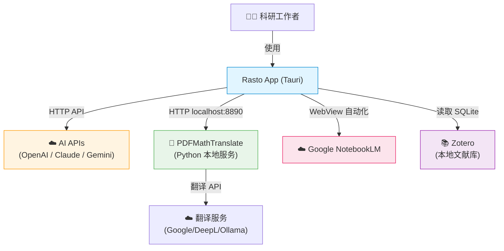
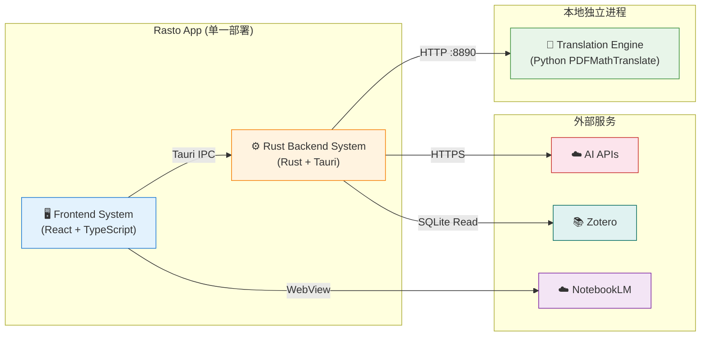

# 系统架构总览 (Architecture Overview)

**项目**: Rasto - AI 学术文献阅读器
**版本**: 1.0
**日期**: 2026-03-11

---

## 1. 系统上下文 (System Context)

### 1.1 C4 Level 1 - 系统上下文图



### 1.2 关键用户 (Key Users)

- **科研工作者**: 使用 Rasto 阅读、翻译和理解英文学术文献的中国研究人员和学生

### 1.3 外部系统 (External Systems)

| 外部系统 | 交互方式 | 用途 |
|---------|---------|------|
| OpenAI / Claude / Gemini | HTTPS REST API | AI 问答、文献总结 |
| PDFMathTranslate | HTTP localhost | PDF 全文翻译（布局保留） |
| Google NotebookLM | WebView + JS 注入 | 生成思维导图、PPT、测验等 |
| Zotero | 本地 SQLite 读取 | 文献库集成 |
| 翻译后端 (Google/DeepL 等) | 由 PDFMathTranslate 调用 | 实际翻译服务 |

---

## 2. 系统清单 (System Inventory)

### System 1: Frontend System
**系统 ID**: `frontend-system`

**职责 (Responsibility)**:
- PDF 文件渲染与阅读交互（缩放、翻页、搜索）
- 翻译结果展示（隐式双语对照）
- AI 聊天面板（拖拽段落 → 问答）
- NotebookLM WebView 内嵌与自动化
- 设置界面（API Key 配置、Provider 切换、使用统计）
- Apple HIG 风格的 UI/UX

**边界 (Boundary)**:
- **输入**: 用户操作（键盘/鼠标/触控板）、Tauri IPC 响应数据
- **输出**: Tauri IPC 请求（invoke commands）
- **依赖**: `rust-backend-system`（通过 Tauri IPC）

**关联需求**: [REQ-001], [REQ-002], [REQ-003], [REQ-004], [REQ-005], [REQ-006], [REQ-009]

**技术栈**:
- Framework: React 18 + TypeScript
- Build Tool: Vite
- PDF 渲染: pdf.js
- 设计指导: `frontend-design` + `ui-ux-pro-max` Agent Skills
- 状态管理: Zustand / Context API

**子模块**:
- `pdf-viewer`: PDF 渲染、文本选择、翻页、缩放
- `chat-panel`: AI 问答界面、拖拽交互、对话历史
- `notebooklm-webview`: NotebookLM 内嵌 WebView、JS 注入自动化
- `settings-panel`: API Key 配置、Provider 切换、使用统计
- `translation-overlay`: 翻译结果覆盖渲染、双语对照切换

**设计文档**: `04_SYSTEM_DESIGN/frontend-system.md` (待创建)

---

### System 2: Rust Backend System
**系统 ID**: `rust-backend-system`

**职责 (Responsibility)**:
- Tauri IPC Command 处理（前端请求分发）
- AI API 调用管理（多 Provider 路由、流式响应）
- PDFMathTranslate 进程生命周期管理（启动/停止/健康检查）
- SQLite 数据持久化（对话历史、翻译缓存索引、API 统计）
- macOS Keychain 安全存储（API Key）
- Zotero 本地数据库读取
- PDF 文件操作（打开、元数据提取）

**边界 (Boundary)**:
- **输入**: Tauri IPC 请求（前端 invoke）、PDFMathTranslate HTTP 响应
- **输出**: Tauri IPC 响应（JSON）、PDFMathTranslate HTTP 请求
- **依赖**: `translation-engine-system`（通过 HTTP）、外部 AI APIs（通过 HTTPS）

**关联需求**: [REQ-001]-[REQ-009] 全部

**技术栈**:
- Language: Rust
- Framework: Tauri 2.0
- HTTP Client: reqwest
- Database: rusqlite (SQLite)
- Key Storage: security-framework (macOS Keychain)
- Serialization: serde + serde_json

**子模块**:
- `ipc-handlers`: Tauri Command 处理器，前后端接口定义
- `ai-integration`: 多 Provider AI API 客户端（OpenAI/Claude/Gemini），Prompt 工程
- `translation-manager`: PDFMathTranslate 进程管理、翻译任务编排
- `storage`: SQLite CRUD、翻译缓存索引、对话历史持久化
- `keychain`: macOS Keychain 安全读写
- `zotero-connector`: Zotero SQLite 读取、文献列表解析

**设计文档**: `04_SYSTEM_DESIGN/rust-backend-system.md` (待创建)

---

### System 3: Translation Engine System
**系统 ID**: `translation-engine-system`

**职责 (Responsibility)**:
- PDF 全文翻译（英→中，布局保留）
- 文本段落翻译 + 图表/表格标签翻译
- 公式检测与保留（不翻译数学公式）
- 双语 PDF 生成（并排/上下对照）
- 翻译进度报告

**边界 (Boundary)**:
- **输入**: HTTP 请求（PDF 文件路径 + 翻译配置）
- **输出**: HTTP 响应（翻译后的 PDF 文件路径 + 进度信息）
- **依赖**: 翻译后端服务（Google/DeepL/Ollama/OpenAI 兼容 API）

**关联需求**: [REQ-002], [REQ-008]

**技术栈**:
- Language: Python 3.12
- Core Engine: PDFMathTranslate (pdf2zh / pdf2zh_next)
- Layout Detection: DocLayout-YOLO
- HTTP Server: 内置服务 (端口 8890)
- Font Rendering: Go Noto Universal

**独立性说明**:
- 作为独立 Python 进程运行，由 `rust-backend-system` 的 `translation-manager` 模块管理
- 通过 HTTP API 通信，技术栈完全解耦
- 可独立升级、独立调试
- 来源: [PDFMathTranslate](https://github.com/PDFMathTranslate/PDFMathTranslate) (EMNLP 2025)

**设计文档**: `04_SYSTEM_DESIGN/translation-engine-system.md` (待创建)

---

## 3. 系统边界矩阵 (System Boundary Matrix)

| 系统 | 输入 | 输出 | 依赖系统 | 被依赖系统 | 关联需求 |
|------|------|------|---------|----------|---------|
| Frontend | 用户操作 | IPC 请求 | Rust Backend | — | [REQ-001]-[REQ-006], [REQ-009] |
| Rust Backend | IPC 请求、HTTP 响应 | IPC 响应、HTTP 请求 | Translation Engine、AI APIs | Frontend | [REQ-001]-[REQ-009] |
| Translation Engine | HTTP 请求 (PDF路径) | HTTP 响应 (翻译PDF) | 翻译服务 API | Rust Backend | [REQ-002], [REQ-008] |

---

## 4. 系统依赖图 (System Dependency Graph)



**依赖关系说明**:
- Frontend → Rust Backend：单向依赖，通过 Tauri IPC（invoke commands）
- Rust Backend → Translation Engine：单向依赖，通过 HTTP API
- 无循环依赖 ✅
- Frontend 直接操作 NotebookLM WebView（不经过 Backend）

---

## 5. 技术栈总览 (Technology Stack Overview)

| Layer | Technology | Used By |
|-------|-----------|---------| 
| **Frontend** | React 18, TypeScript, Vite, pdf.js | Frontend System |
| **Backend** | Rust, Tauri 2.0, rusqlite, reqwest | Rust Backend System |
| **Translation** | Python 3.12, PDFMathTranslate | Translation Engine System |
| **Storage** | SQLite, macOS Keychain | Rust Backend System (内嵌) |
| **Design Skills** | frontend-design, ui-ux-pro-max | Frontend System |

---

## 6. 拆分原则与理由 (Decomposition Rationale)

### 为什么拆分为 3 个系统？

**技术栈维度**:
- Frontend (TypeScript/React) vs Backend (Rust) vs Translation (Python) → 3 种完全不同的语言和生态

**部署维度**:
- Frontend + Backend 打包为单一 Tauri .app
- Translation Engine 是独立 Python 进程（需要 Python 环境）

**职责维度**:
- Frontend 专注 UI 展示和交互
- Backend 专注业务逻辑和数据管理
- Translation Engine 专注 PDF 翻译（复杂的文档解析和布局重建）

**多 Agent 协作维度**:
- Frontend 由 Claude + Gemini 协作开发
- Backend 由 Codex 开发
- 清晰的 IPC 接口契约确保并行开发

### 为什么不进一步拆分？

- **NotebookLM 不独立拆分**: 它是前端 WebView 的一个模块，共享 UI 生命周期
- **Storage 不独立拆分**: SQLite 是嵌入式数据库，与 Rust 后端紧耦合
- **AI Integration 不独立拆分**: 它是后端的核心模块，HTTP 调用逻辑不足以构成独立系统

---

## 7. 系统复杂度评估 (Complexity Assessment)

**系统数量**: 3 个系统

**评估**:
- ✅ 数量合理（3 < 10）
- ✅ 边界清晰（IPC + HTTP，明确的数据格式）
- ✅ 无循环依赖（单向链路）
- ✅ 技术栈分明（TypeScript / Rust / Python）
- ✅ 支持多 Agent 并行开发

**潜在风险**:
- Rust Backend 是枢纽系统，职责可能过重（AI + Storage + 进程管理 + Zotero）
  - 缓解：通过子模块（ai-integration, storage, translation-manager 等）实现内部模块化
- PDFMathTranslate Python 依赖增加安装复杂度
  - 缓解：首次启动自动检测引导 + 后期 PyInstaller 打包

---

## 8. 下一步行动 (Next Steps)

### 为每个系统创建详细设计文档

```bash
/design-system frontend-system
/design-system rust-backend-system
/design-system translation-engine-system
```

### 所有系统设计完成后

```bash
/blueprint    # 任务蓝图
/challenge    # 设计审查
/forge        # 铸造代码
```
