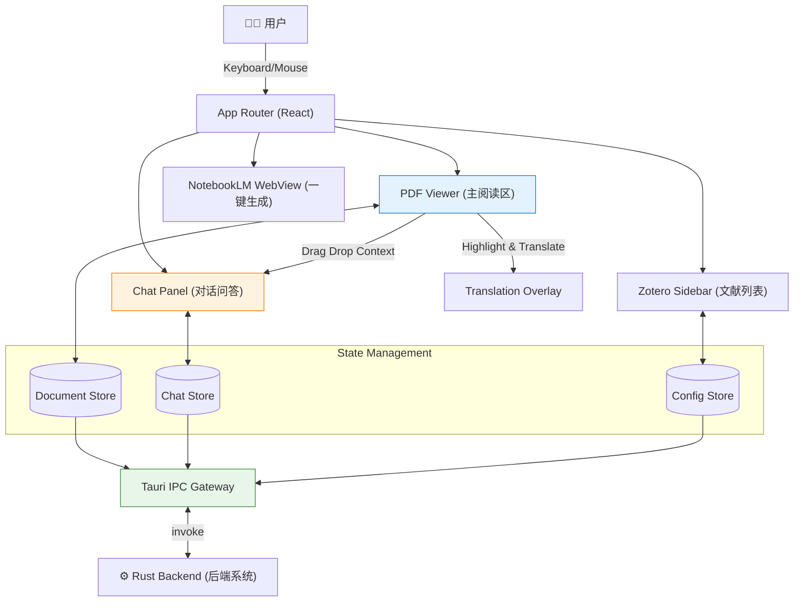
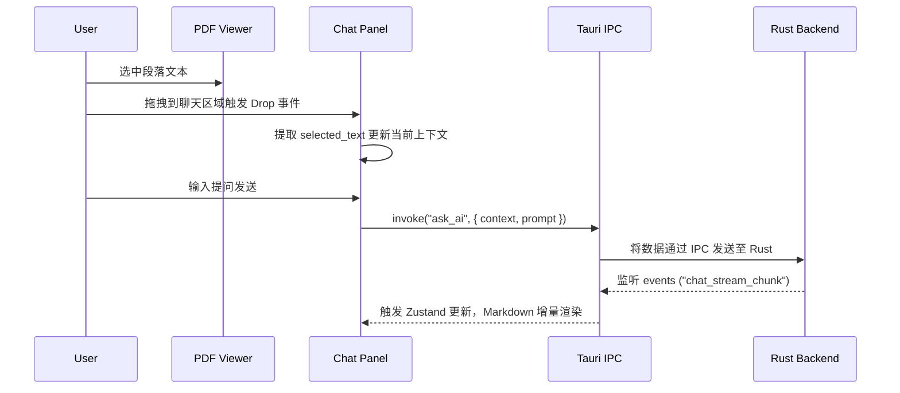

# Frontend System Design (前端系统设计)

**系统 ID**: `frontend-system`
**状态**: 评审中 (Review)
**版本**: 1.0

---

## 1. 概览 (Overview)
`frontend-system` 是 Rasto 的用户界面系统，一个基于 Tauri 2.0 Webview 构建、采用 React 18 + TypeScript 开发的 macOS 桌面级应用前端。

**核心职责**:
- 提供 Apple HIG 风格的沉浸式阅读体验，处理 PDF 解析、缩放及隐式双语展示。
- 管理多模型辅助功能：包括拖拽式对话问答（Chat Panel）及一键生成知识图谱（NotebookLM WebView）。
- 提供用户设置面板，包括 API 配置与用量统计。

**系统边界**:
- **输入**: 用户交互操作、Tauri IPC 响应、系统主题（Dark/Light）。
- **输出**: Tauri IPC Commands 触发请求、WebView 自动化 JavaScript 注入。
- **依赖**: 强依赖于 `rust-backend-system` 及其 IPC 网关暴露的服务。

---

## 2. 目标与非目标 (Goals & Non-Goals)

### 目标 (Goals)
- **极速渲染**: DOM 加载与首页渲染耗时 < 1 秒，并维持内存 < 500MB，支持 100+ 页文档的懒加载 **[REQ-001]**。
- **丝滑视效**: 平滑缩放 25%-400%，提供 60FPS 的弹跳动效与侧边栏毛玻璃展开。
- **沉浸多语**: 支持原生级翻译内容重叠展示（隐式对照），按下热键实时切换并带有渐变淡入动画 **[REQ-002]**。
- **交互创新**: 首创选中段落拖拽至 AI 助手区域进行快速流式追问 **[REQ-003]**。
- **一键串联**: 内嵌 NotebookLM 闭环化生成（PPT/思维导图等）**[REQ-006]**。

### 非目标 (Non-Goals)
- 不处理对原始 PDF 文件的持久层修改（如批注叠加保存等）。
- 不运行 AI 的大模型本地推理逻辑，所有 AI 流由 Backend IPC 透传。
- 不提供针对移动端设备的触摸/响应式优化方案。

---

## 3. 背景与上下文 (Background)
Rasto 旨在为中国科研工作者提供最高效的外文文献阅读环境。基于 **[ADR-001]** 确定的 Tauri + React 18 技术栈，结合多智能体协作开发策略 **[ADR-002]**，前端系统需首先明确接口通信契约与组件规范，以同时满足强烈的个性化设计风格要求（`frontend-design`, `ui-ux-pro-max`）及开发并行效率。

---

## 4. 系统架构 (Architecture)

### 4.1 组件关系架构图


### 4.2 流式问答数据流图


---

## 5. 接口设计 (Interface Design)

### 操作契约：Tauri IPC 接口调度

本系统强依赖于通过 `@tauri-apps/api/core` 进行命令调度。以下契约以 `rust-backend-system.md` Section 7 为**唯一权威源**。

> **注**: NotebookLM WebView 自动化由前端自治模块直接完成（参见 Challenge H2），不经过 Backend IPC。

#### A. 文档与应用状态
| 操作 | [REQ] | 传入参数 | 产出 |
|------|:-----:|---------|------|
| `invoke("get_backend_health")` | 基础 | `void` | `BackendHealth` |
| `invoke("open_document")` | 001 | `{ filePath, sourceType?, zoteroItemKey? }` | `DocumentSnapshot` |
| `invoke("list_recent_documents")` | 001 | `{ limit? }` | `DocumentSnapshot[]` |
| `invoke("get_document_snapshot")` | 001 | `{ documentId }` | `DocumentSnapshot` |

#### B. Translation Engine 生命周期
| 操作 | [REQ] | 传入参数 | 产出 |
|------|:-----:|---------|------|
| `invoke("ensure_translation_engine")` | 002 | `{ expectedPort?, force? }` | `TranslationEngineStatus` |
| `invoke("shutdown_translation_engine")` | 002 | `{ force? }` | `TranslationEngineStatus` |
| `invoke("get_translation_engine_status")` | 002 | `void` | `TranslationEngineStatus` |

#### C. 翻译任务
| 操作 | [REQ] | 传入参数 | 产出 |
|------|:-----:|---------|------|
| `invoke("request_translation")` | 002 | `RequestTranslationInput` | `TranslationJobDto` |
| `invoke("get_translation_job")` | 002 | `{ jobId }` | `TranslationJobDto` |
| `invoke("cancel_translation")` | 002 | `{ jobId }` | `{ jobId, cancelled }` |
| `invoke("load_cached_translation")` | 002 | `{ documentId, provider?, model? }` | `TranslationJobDto | null` |

#### D. AI 问答与总结
| 操作 | [REQ] | 传入参数 | 产出 |
|------|:-----:|---------|------|
| `invoke("ask_ai")` | 003 | `AskAiInput` | `AIStreamHandle` |
| `invoke("cancel_ai_stream")` | 003 | `{ streamId }` | `{ streamId, cancelled }` |
| `invoke("generate_summary")` | 005 | `GenerateSummaryInput` | `AIStreamHandle` |
| `invoke("list_chat_sessions")` | 003 | `{ documentId }` | `ChatSessionDto[]` |
| `invoke("get_chat_messages")` | 003 | `{ sessionId }` | `ChatMessageDto[]` |

#### E. Provider 配置与凭据
| 操作 | [REQ] | 传入参数 | 产出 |
|------|:-----:|---------|------|
| `invoke("list_provider_configs")` | 004 | `void` | `ProviderConfigDto[]` |
| `invoke("save_provider_key")` | 004 | `{ provider, apiKey }` | `ProviderConfigDto` |
| `invoke("remove_provider_key")` | 004 | `{ provider }` | `{ provider, removed }` |
| `invoke("set_active_provider")` | 004 | `{ provider, model }` | `ProviderConfigDto` |
| `invoke("test_provider_connection")` | 004 | `{ provider, model? }` | `ProviderConnectivityDto` |

#### F. 使用统计
| 操作 | [REQ] | 传入参数 | 产出 |
|------|:-----:|---------|------|
| `invoke("get_usage_stats")` | 009 | `{ from?, to?, provider? }` | `UsageStatsDto` |

#### G. Zotero 集成
| 操作 | [REQ] | 传入参数 | 产出 |
|------|:-----:|---------|------|
| `invoke("detect_zotero_library")` | 007 | `void` | `ZoteroStatusDto` |
| `invoke("fetch_zotero_items")` | 007 | `{ query?, offset?, limit? }` | `PagedZoteroItemsDto` |
| `invoke("open_zotero_attachment")` | 007 | `{ itemKey }` | `DocumentSnapshot` |

---

## 6. 数据模型 (Data Model)

通过 `Zustand` 的分块 Store 进行客户端状态映射定义。

```typescript
// Document & Reading State [REQ-001, REQ-002]
export interface DocumentState {
  currentFileId: string | null;
  metadata: { title: string; pages: number; path: string } | null;
  zoomLevel: number;        // 默认 100，有效值 25 到 400
  bilingualMode: boolean;   // 是否处于快捷键显示的英文原文状态
  translationProgress: Record<string, number>; // PageID => 0~100进度
}

// Chat Record State [REQ-003, REQ-009]
export interface ChatMessage {
  id: string;
  role: 'user' | 'assistant';
  content: string;
  contextQuote?: string;    // 段落拖拽附加的引用上下文
  timestamp: string;
  isStreaming?: boolean;    // 是否处于仍在接收流的状态
}

// Global Preferences [REQ-004]
export interface GlobalsState {
  aiProvider: 'openai' | 'claude' | 'gemini';
  theme: 'light' | 'dark' | 'system';
  apiCount: { inputToken: number; outputToken: number; estFee: number }; // 统计
}
```

---

## 7. 技术选型 (Tech Stack)

- **核心视图框架**: **React 18** (结合 **TypeScript**，保证代码可扩展性与 Agent 对接规范)。
- **构建工具**: **Vite** (闪电型 HMR 与模块打包)。
- **PDF 引擎**: **Mozilla pdf.js** (保证高保真、底层字符坐标位置提取用于双语位置映射)。
- **状态管理**: **Zustand** (性能远高于 Context API，无模板代码负担，支持基于 Selector 重渲染)。
- **UI & 样式体系**: **Tailwind CSS**，结合 **Radix UI** 无样式组件，通过 `framer-motion` 增强 Apple HIG 风格需要的流体阻尼动画。
- **图标**: **Lucide React** (提供简洁的单线条风格图标，极佳匹配苹果设计哲学)。

---

## 8. Trade-offs & Alternatives

### Decision 1: 样式管理（Tailwind vs CSS Modules/Vanilla Extract）
**Option A: Tailwind CSS (✅ Selected)**
- ✅ 优点: 开发速度极高，类名即文档。可通过 `dark:` 快速响应主题。对 AI 代码生成极其友好。
- ❌ 缺点: 当涉及异常复杂的透明度毛玻璃、`box-shadow` 嵌套 (HIG 常见设计) 时， JSX 类名臃肿。

**Option B: Vanilla Extract / 原生 CSS Modules**
- ✅ 优点: 零运行时成本，真正的样式与业务隔离。
- ❌ 缺点: 心智负担大，与多模型 Agent 开发环境结合较不友好，往往要跳转多个文件排查样式。

**Decision**: 选择 **Tailwind CSS**。鉴别于本项目的桌面特性，我们将利用 `@tailwindcss/typography` 增强文字排版，并通过提取局部的 `components` CSS 层配合特定的 `box-shadow` 变量来精确复刻 HIG 的悬浮效果。

### Decision 2: Context / 状态管理（Context API vs Zustand）
**Option A: Zustand (✅ Selected)**
- ✅ 优点: 组件外也可以无阻抗访问状态 (例如在专门处理 Tauri IPC 的非组件 TS 文件中)。不会导致顶级 Provider 更新带来树渲染海啸。
- ❌ 缺点: 第三方依赖。

**Option B: React Context API**
- ✅ 优点: 官方直接支持，纯粹原生。
- ❌ 缺点: Chat Panel 流式渲染每一帧 Token 大概 10-20ms 触发一次，使用 Context 如果隔离不当将造成 PDF 阅读器发生致命掉帧。

**Decision**: 选用 **Zustand**，极大程度上优化流式数据返回期间的主线程卡顿。

---

## 9. 安全性考虑 (Security)

1. **防范 Payload 注入 (XSS)**: 所有基于 [REQ-003] 的聊天窗口内容以及翻译出的文本，将被 `react-markdown` 进行解析时，严格通过 `rehype-sanitize` 过滤掉不当的 HTML 脚本。
2. **WebView 安全边界**: `notebooklm-webview` 的运行受到 Tauri 的高度限制（沙盒模式），不允许其操作与本机系统交互相关的 IPC。
3. **敏感凭证**: 所有的 API Keys 不将在前端的 `localStorage` 被固化（内存仅在设置面板渲染时瞬时脱敏读取），所有密钥传递必须依赖 Rust Backend (keychain) 代工发包 **[REQ-004]**。

---

## 10. 性能考虑 (Performance)

1. **Web Worker 隔离**: 必须使用 `pdf.js` 提供的 worker script 处理解析。以确保当开启 200+ 页的文献时，React 主线程仍能响应 60FPS 悬浮菜单滑动。
2. **列表虚化 (Virtualization)**: 若加载 Zotero 条目达到数千项时，利用 `@tanstack/react-virtual` 对侧边栏做视窗渲染控制。
3. **分层渲染**: 双语 Translation Overlay 利用 `will-change: opacity` 甚至单独抽出成 `canvas` 覆盖层避免不断触发 DOM layout thrashing。

---

## 11. 测试策略 (Testing)

- **Unit Testing**: Vitest。对各类 PDF 字符边界提炼算法、Zustand actions 进行核心逻辑的断言测试。
- **Component Testing**: 针对 `chat-panel` 中的滚动到底部（Auto-scroll）、流式气泡追加等逻辑编写带有 Mock Data 的 RTL 组件级侧面验证。
- **E2E Testing (可选)**: 若项目涉及与后端集成 CI，则利用 Playwright-WebView 测试与 Rust Server 的连通性。

---

## 12. 部署与环境约定 (Deployment)

1. `frontend-system` 作为在 Tauri 内的子包存在，打包过程由 `tauri build` 一键统一处理。
2. 支持使用 `vite dev` 独立运行于 Chrome 内以完成 Mock 开发，直到通过 `Wave 5` 进行应用整合期联调。
