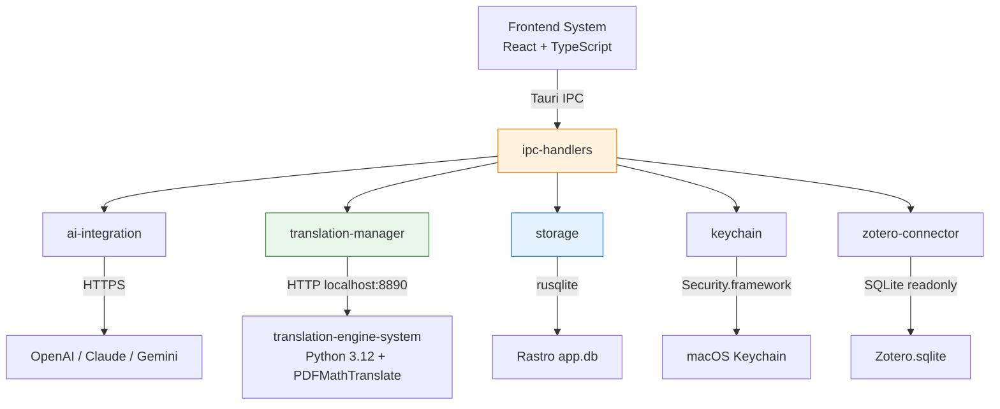
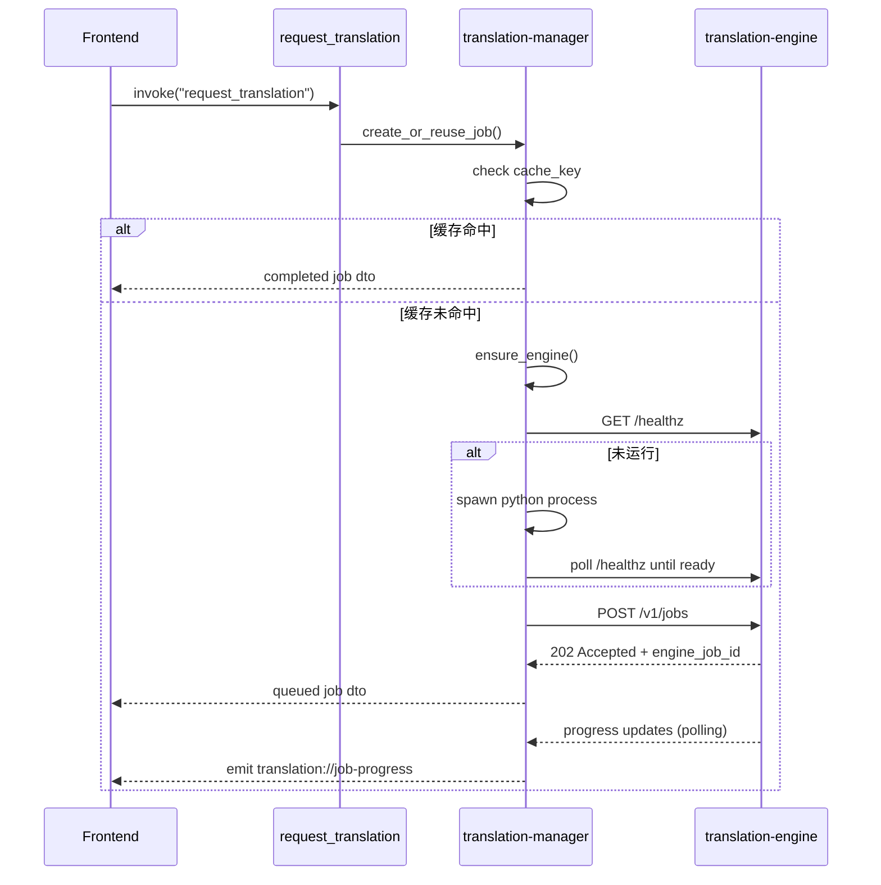

# Rust Backend System Design (Rust 后端系统设计)

**系统 ID**: `rust-backend-system`  
**状态**: 评审中 (Review)  
**版本**: 1.0

---

## 1. 概览 (Overview)
`rust-backend-system` 是 Rastro 在 Tauri 2.0 中承载本地业务逻辑的核心枢纽层，负责把前端交互、AI Provider、PDF 翻译引擎、本地存储和 Zotero 数据源连接成一个可组合的本地应用后端。

**核心职责**:
- 作为前端唯一可信后端，暴露稳定的 Tauri IPC Command 契约。
- 管理 OpenAI / Claude / Gemini 的问答、总结和连通性测试。
- 管理 `translation-engine-system` 的本地 Python 进程生命周期，并通过 `http://127.0.0.1:8890` 调用翻译任务。
- 通过 SQLite 持久化文档索引、聊天记录、翻译缓存索引、任务状态和 API 使用统计。
- 通过 macOS Keychain 读写 API Key，避免明文落盘。
- 以只读方式集成 Zotero 本地 SQLite 文献库。

**系统边界**:
- **输入**: 前端 `invoke()` 请求、translation-engine 的 HTTP 响应、AI Provider 的 HTTPS 响应、Zotero SQLite 文件。
- **输出**: Tauri IPC 响应、Tauri event 流、到 translation-engine 的 HTTP 请求、到 AI Provider 的 HTTPS 请求。
- **不负责**: PDF 视觉渲染、NotebookLM WebView 自动化、前端状态管理。

---

## 2. 目标与非目标 (Goals & Non-Goals)

### 2.1 目标 (Goals)
- 为 Wave 1a / Wave 1b 并行开发提供稳定、可版本化的前后端契约。
- 将长耗时任务从 Tauri UI 线程剥离，避免阻塞前端交互。
- 为翻译任务提供统一的缓存、去重、进度跟踪和错误恢复能力。
- 将敏感配置与业务数据分离存储，满足 [REQ-004] 的安全要求。
- 让前端不直接接触外部 API 凭据、数据库路径和进程控制细节。

### 2.2 非目标 (Non-Goals)
- 不实现 PDF 页面渲染或文本选区计算，这属于 `frontend-system`。
- 不直接嵌入 PDFMathTranslate 的 Python 代码到 Rust 进程内；翻译引擎始终是独立进程。
- 不在 MVP 中实现跨设备同步或远程后端。
- 不修改 Zotero 数据库内容，只读查询。

---

## 3. 架构设计 (Architecture)

### 3.1 组件图


### 3.2 运行时分层
| 层级 | 主要组件 | 作用 |
|------|---------|------|
| IPC 接入层 | `ipc-handlers` | 参数校验、DTO 序列化、统一错误映射、事件发射 |
| 领域服务层 | `ai-integration`, `translation-manager`, `zotero-connector` | AI 调用、翻译任务编排、外部只读数据源读取 |
| 基础设施层 | `storage`, `keychain` | SQLite 持久化、Keychain 凭据、文件系统、哈希计算 |
| 外部集成层 | translation-engine, AI Providers, Zotero | 进程外依赖 |

### 3.3 并发模型
- Tauri Command 本身保持轻量，只做参数校验与调度。
- `reqwest::Client` 和 `TranslationSupervisor` 作为应用单例挂在 `tauri::State<AppState>`。
- `rusqlite` 采用串行写入策略；写操作通过专用阻塞线程池执行，避免阻塞异步任务。
- AI 流式输出和翻译任务进度通过 Tauri event 推送，前端不轮询 Tauri 命令。
- translation-engine 采用“单活进程 + 单活翻译任务 + 可排队后续任务”的模型，优先保证桌面场景稳定性和内存可控。

---

## 4. 模块职责 (Module Responsibilities)

### 4.1 `ipc-handlers`
**职责**:
- 注册所有 `#[tauri::command]` 接口。
- 完成请求 DTO 校验、路径标准化、绝对路径检查。
- 将内部错误转换成统一 `AppError`。
- 将长耗时任务的进度通过 `app.emit()` 推送到前端。

**设计约束**:
- 不编排复杂业务逻辑。
- 不直接操作 SQLite 或 Keychain。
- 所有 Command 名称保持稳定，作为前后端长期契约。

### 4.2 `ai-integration`
**职责**:
- 维护 `openai` / `claude` / `gemini` 的 Provider Adapter。
- 实现聊天和总结的 Prompt 组装、请求路由、流式 Token 处理。
- 统计输入/输出 token 与估算费用，回写 `usage_events`。
- 提供“测试连接”能力。

**内部子组件**:
- `provider_registry`: 统一管理 Provider、默认模型、能力矩阵。
- `chat_service`: 多轮问答与引用上下文编排。
- `summary_service`: 大文档分段总结与最终归并。
- `usage_meter`: token 与费用统计。

### 4.3 `translation-manager`
**职责**:
- 启动、停止、接管和健康检查 translation-engine 进程。
- 根据文档哈希和配置签名执行缓存命中判断。
- 将翻译请求转为 translation-engine HTTP 调用。
- 维护翻译任务状态机、事件推送和结果入库。

**内部子组件**:
- `engine_supervisor`: 进程生命周期管理。
- `job_registry`: 本地任务状态、队列和去重索引。
- `artifact_index`: 结果文件索引与缓存清理。
- `http_client`: 到 translation-engine 的 REST client。

### 4.4 `storage`
**职责**:
- 管理 `app.db` schema 和迁移。
- 持久化文档索引、聊天会话、翻译任务、翻译产物、总结、使用统计。
- 管理最近打开文档列表和全局设置。

### 4.5 `keychain`
**职责**:
- 把 Provider 的 API Key 写入 macOS Keychain。
- 返回脱敏后的摘要给前端。
- 在请求 AI 或翻译引擎时按需读取原始 Key，不写入日志和数据库。

### 4.6 `zotero-connector`
**职责**:
- 自动发现 Zotero profile 和数据库路径。
- 只读查询条目、附件、最近更新。
- 解析附件实际 PDF 路径并交给 `open_document` 流程。

---

## 5. 目录与运行时文件布局 (Files & Runtime Layout)

### 5.1 Rust 代码目录建议
```text
src-tauri/
├── src/
│   ├── main.rs
│   ├── app_state.rs
│   ├── ipc/
│   │   ├── mod.rs
│   │   ├── document.rs
│   │   ├── translation.rs
│   │   ├── ai.rs
│   │   ├── settings.rs
│   │   └── zotero.rs
│   ├── ai_integration/
│   ├── translation_manager/
│   ├── storage/
│   ├── keychain/
│   ├── zotero_connector/
│   └── errors.rs
└── migrations/
```

### 5.2 应用数据目录
默认根目录建议为:
`~/Library/Application Support/com.rastro.app/`

```text
app.db
cache/
  translations/
    <document_sha256>/
      <cache_key>/
        translated.pdf
        bilingual.pdf
        figures.json
        manifest.json
runtime/
  translation-engine.pid
  translation-engine.log
  translation-engine.stdout.log
```

设计原则:
- 原始 PDF 不复制，按原路径打开；翻译产物和缓存索引由应用托管。
- `manifest.json` 保存生成时间、引擎版本、provider、模型和缓存签名。
- PID 与日志文件仅用于故障诊断，不作为唯一真相源。

---

## 6. 数据模型 (Data Model)

### 6.1 核心实体
| 实体 | 说明 | 关键字段 |
|------|------|---------|
| `DocumentRecord` | 打开过的 PDF 文档索引 | `document_id`, `file_path`, `file_sha256`, `title`, `page_count` |
| `ChatSession` | 与某文档绑定的会话 | `session_id`, `document_id`, `provider`, `model`, `updated_at` |
| `ChatMessage` | 会话消息 | `message_id`, `session_id`, `role`, `content_md`, `context_quote` |
| `SummaryRecord` | 文档总结结果 | `summary_id`, `document_id`, `provider`, `content_md` |
| `TranslationJobRecord` | 翻译任务状态 | `job_id`, `document_id`, `engine_job_id`, `status`, `progress`, `cache_key` |
| `TranslationArtifact` | 翻译结果文件 | `artifact_id`, `job_id`, `artifact_kind`, `file_path`, `sha256` |
| `UsageEvent` | API 调用统计明细 | `provider`, `feature`, `input_tokens`, `output_tokens`, `estimated_cost` |
| `ProviderSetting` | 非敏感配置 | `provider`, `model`, `base_url`, `is_active`, `last_test_status` |

### 6.2 SQLite 表设计
```sql
CREATE TABLE documents (
  document_id TEXT PRIMARY KEY,
  file_path TEXT NOT NULL,
  file_sha256 TEXT NOT NULL UNIQUE,
  title TEXT,
  page_count INTEGER,
  source_type TEXT NOT NULL,           -- local | zotero
  zotero_item_key TEXT,
  created_at TEXT NOT NULL,
  last_opened_at TEXT NOT NULL
);

CREATE TABLE provider_settings (
  provider TEXT PRIMARY KEY,           -- openai | claude | gemini
  model TEXT NOT NULL,
  base_url TEXT,
  is_active INTEGER NOT NULL DEFAULT 0,
  last_test_status TEXT,
  last_tested_at TEXT
);

CREATE TABLE chat_sessions (
  session_id TEXT PRIMARY KEY,
  document_id TEXT NOT NULL,
  provider TEXT NOT NULL,
  model TEXT NOT NULL,
  title TEXT,
  created_at TEXT NOT NULL,
  updated_at TEXT NOT NULL,
  FOREIGN KEY(document_id) REFERENCES documents(document_id)
);

CREATE TABLE chat_messages (
  message_id TEXT PRIMARY KEY,
  session_id TEXT NOT NULL,
  role TEXT NOT NULL,                  -- user | assistant | system
  content_md TEXT NOT NULL,
  context_quote TEXT,
  input_tokens INTEGER DEFAULT 0,
  output_tokens INTEGER DEFAULT 0,
  estimated_cost REAL DEFAULT 0,
  created_at TEXT NOT NULL,
  FOREIGN KEY(session_id) REFERENCES chat_sessions(session_id)
);

CREATE TABLE summaries (
  summary_id TEXT PRIMARY KEY,
  document_id TEXT NOT NULL,
  provider TEXT NOT NULL,
  model TEXT NOT NULL,
  content_md TEXT NOT NULL,
  prompt_version TEXT NOT NULL,
  created_at TEXT NOT NULL,
  UNIQUE(document_id, provider, model, prompt_version)
);

CREATE TABLE translation_jobs (
  job_id TEXT PRIMARY KEY,
  document_id TEXT NOT NULL,
  engine_job_id TEXT,
  cache_key TEXT NOT NULL,
  provider TEXT NOT NULL,
  model TEXT NOT NULL,
  source_lang TEXT NOT NULL,
  target_lang TEXT NOT NULL,
  status TEXT NOT NULL,                -- queued | running | completed | failed | cancelled
  stage TEXT NOT NULL,
  progress REAL NOT NULL DEFAULT 0,
  error_code TEXT,
  error_message TEXT,
  created_at TEXT NOT NULL,
  started_at TEXT,
  finished_at TEXT,
  FOREIGN KEY(document_id) REFERENCES documents(document_id)
);

CREATE TABLE translation_artifacts (
  artifact_id TEXT PRIMARY KEY,
  job_id TEXT NOT NULL,
  document_id TEXT NOT NULL,
  artifact_kind TEXT NOT NULL,         -- translated_pdf | bilingual_pdf | figure_report | manifest
  file_path TEXT NOT NULL,
  file_sha256 TEXT NOT NULL,
  file_size_bytes INTEGER NOT NULL,
  created_at TEXT NOT NULL,
  FOREIGN KEY(job_id) REFERENCES translation_jobs(job_id),
  FOREIGN KEY(document_id) REFERENCES documents(document_id)
);

CREATE TABLE usage_events (
  event_id TEXT PRIMARY KEY,
  document_id TEXT,
  provider TEXT NOT NULL,
  model TEXT NOT NULL,
  feature TEXT NOT NULL,               -- chat | summary | translation
  input_tokens INTEGER NOT NULL DEFAULT 0,
  output_tokens INTEGER NOT NULL DEFAULT 0,
  estimated_cost REAL NOT NULL DEFAULT 0,
  currency TEXT NOT NULL DEFAULT 'USD',
  created_at TEXT NOT NULL
);
```

### 6.3 缓存键设计
`cache_key = sha256(document_sha256 + provider + model + target_lang + output_mode + figure_translation + engine_version + prompt_version)`

这样可以保证:
- 同一文件内容变化后自动失效。
- 切换 Provider / 模型不会误用旧缓存。
- 升级 translation-engine 或 Prompt 版本时缓存可自动分叉。

---

## 7. Tauri IPC 契约 (IPC Contract)

### 7.1 统一错误模型
所有 Command 失败时返回统一错误对象:

```ts
type AppError = {
  code:
    | "DOCUMENT_NOT_FOUND"
    | "DOCUMENT_UNSUPPORTED"
    | "ENGINE_UNAVAILABLE"
    | "ENGINE_PORT_CONFLICT"
    | "ENGINE_TIMEOUT"
    | "PYTHON_NOT_FOUND"                  // H4 新增：Python 未安装
    | "PYTHON_VERSION_MISMATCH"           // H4 新增：Python 版本不满足要求
    | "PDFMATHTRANSLATE_NOT_INSTALLED"    // H4 新增：PDFMathTranslate 包未安装
    | "TRANSLATION_FAILED"
    | "TRANSLATION_CANCELLED"
    | "PROVIDER_KEY_MISSING"
    | "PROVIDER_CONNECTION_FAILED"
    | "PROVIDER_RATE_LIMITED"
    | "PROVIDER_INSUFFICIENT_CREDIT"
    | "UNSUPPORTED_TRANSLATION_PROVIDER"
    | "ZOTERO_NOT_FOUND"
    | "ZOTERO_DB_LOCKED"
    | "CACHE_CORRUPTED"
    | "INTERNAL_ERROR";
  message: string;
  retryable: boolean;
  details?: Record<string, unknown>;
};
```

### 7.2 通用 DTO
```ts
type ProviderId = "openai" | "claude" | "gemini";
type TranslationJobStatus = "queued" | "running" | "completed" | "failed" | "cancelled";
type TranslationStage = "preflight" | "queued" | "extracting" | "translating" | "postprocessing" | "packaging" | "completed" | "failed" | "cancelled";

interface DocumentSnapshot {
  documentId: string;
  filePath: string;
  fileSha256: string;
  title: string;
  pageCount: number;
  sourceType: "local" | "zotero";
  zoteroItemKey?: string;
  cachedTranslation?: {
    available: boolean;
    provider?: ProviderId;
    model?: string;
    translatedPdfPath?: string;
    bilingualPdfPath?: string;
    updatedAt?: string;
  };
  lastOpenedAt: string;
}

interface TranslationJobDto {
  jobId: string;
  documentId: string;
  engineJobId?: string;
  status: TranslationJobStatus;
  stage: TranslationStage;
  progress: number;
  provider: ProviderId;
  model: string;
  translatedPdfPath?: string;
  bilingualPdfPath?: string;
  figureReportPath?: string;
  createdAt: string;
  startedAt?: string;
  finishedAt?: string;
}

interface AIStreamHandle {
  streamId: string;
  sessionId: string;
  provider: ProviderId;
  model: string;
  startedAt: string;
}
```

### 7.3 Command 列表

#### A. 文档与应用状态
| Command | 请求 | 响应 | 说明 |
|--------|------|------|------|
| `get_backend_health` | `void` | `BackendHealth` | 返回 DB、Keychain、engine、Zotero 探测状态 |
| `open_document` | `{ filePath: string; sourceType?: "local" \| "zotero"; zoteroItemKey?: string }` | `DocumentSnapshot` | 计算文件哈希、读取元数据、建立/更新 `documents` 记录 |
| `list_recent_documents` | `{ limit?: number }` | `DocumentSnapshot[]` | 最近打开文档 |
| `get_document_snapshot` | `{ documentId: string }` | `DocumentSnapshot` | 返回单文档快照，包括缓存可用性 |

#### B. Translation Engine 生命周期
| Command | 请求 | 响应 | 说明 |
|--------|------|------|------|
| `ensure_translation_engine` | `{ expectedPort?: number; force?: boolean }` | `TranslationEngineStatus` | 若未运行则启动；`force=true` 可绕过熔断状态 |
| `shutdown_translation_engine` | `{ force?: boolean }` | `TranslationEngineStatus` | 优雅关闭，必要时强杀 |
| `get_translation_engine_status` | `void` | `TranslationEngineStatus` | 仅查询，不触发启动 |

#### C. 翻译任务
| Command | 请求 | 响应 | 说明 |
|--------|------|------|------|
| `request_translation` | `RequestTranslationInput` | `TranslationJobDto` | 命中缓存则直接返回完成态，否则创建新任务 |
| `get_translation_job` | `{ jobId: string }` | `TranslationJobDto` | 获取单任务状态 |
| `cancel_translation` | `{ jobId: string }` | `{ jobId: string; cancelled: boolean }` | 取消排队或运行中的任务 |
| `load_cached_translation` | `{ documentId: string; provider?: ProviderId; model?: string }` | `TranslationJobDto \| null` | 前端重新打开文档时快速恢复缓存 |

```ts
interface RequestTranslationInput {
  documentId: string;
  filePath: string;
  sourceLang?: "en";
  targetLang?: "zh-CN";
  provider?: ProviderId;
  model?: string;
  outputMode?: "translated_only" | "bilingual";
  figureTranslation?: boolean;
  skipReferencePages?: boolean;
  forceRefresh?: boolean;
}
```

#### D. AI 问答与总结
| Command | 请求 | 响应 | 说明 |
|--------|------|------|------|
| `ask_ai` | `AskAiInput` | `AIStreamHandle` | 启动流式对话 |
| `cancel_ai_stream` | `{ streamId: string }` | `{ streamId: string; cancelled: boolean }` | 取消当前流 |
| `generate_summary` | `GenerateSummaryInput` | `AIStreamHandle` | 总结也采用统一流式通道 |
| `list_chat_sessions` | `{ documentId: string }` | `ChatSessionDto[]` | 当前文档的历史会话 |
| `get_chat_messages` | `{ sessionId: string }` | `ChatMessageDto[]` | 历史消息 |

```ts
interface AskAiInput {
  documentId: string;
  sessionId?: string;
  provider?: ProviderId;
  model?: string;
  userMessage: string;
  contextQuote?: string;
}

interface GenerateSummaryInput {
  documentId: string;
  filePath: string;
  provider?: ProviderId;
  model?: string;
  promptProfile?: "default" | "paper-review";
}
```

#### E. Provider 配置与凭据
| Command | 请求 | 响应 | 说明 |
|--------|------|------|------|
| `list_provider_configs` | `void` | `ProviderConfigDto[]` | 返回脱敏配置与当前激活状态 |
| `save_provider_key` | `{ provider: ProviderId; apiKey: string }` | `ProviderConfigDto` | Key 写入 Keychain，DB 只存非敏感字段 |
| `remove_provider_key` | `{ provider: ProviderId }` | `{ provider: ProviderId; removed: boolean }` | 删除 Keychain 中的 Key |
| `set_active_provider` | `{ provider: ProviderId; model: string }` | `ProviderConfigDto` | 修改当前生效 Provider 与模型 |
| `test_provider_connection` | `{ provider: ProviderId; model?: string }` | `ProviderConnectivityDto` | 实际发送测试请求 |

#### F. 使用统计
| Command | 请求 | 响应 | 说明 |
|--------|------|------|------|
| `get_usage_stats` | `{ from?: string; to?: string; provider?: ProviderId }` | `UsageStatsDto` | 汇总问答、总结、翻译消耗 |

#### G. Zotero 集成
| Command | 请求 | 响应 | 说明 |
|--------|------|------|------|
| `detect_zotero_library` | `void` | `ZoteroStatusDto` | 自动发现 profile 与 DB |
| `fetch_zotero_items` | `{ query?: string; offset?: number; limit?: number }` | `PagedZoteroItemsDto` | 返回文献条目和附件摘要 |
| `open_zotero_attachment` | `{ itemKey: string }` | `DocumentSnapshot` | 解析对应 PDF 路径后复用 `open_document` |

### 7.4 Tauri Event 通道
前端监听以下事件以获得流式状态:

| Event 名称 | Payload | 触发时机 |
|-----------|---------|---------|
| `translation://job-progress` | `TranslationJobDto` | 进度变化 |
| `translation://job-completed` | `TranslationJobDto` | 完成 |
| `translation://job-failed` | `{ jobId: string; error: AppError }` | 失败 |
| `ai://stream-chunk` | `{ streamId: string; delta: string }` | 新增 token / 文本块 |
| `ai://stream-finished` | `{ streamId: string; sessionId: string; messageId: string }` | 聊天或总结完成 |
| `ai://stream-failed` | `{ streamId: string; error: AppError }` | AI 请求失败 |

---

## 8. Translation Manager 详细设计 (Process Supervision & Job Orchestration)

### 8.1 进程管理契约
translation-engine 固定绑定:
- **地址**: `127.0.0.1`
- **端口**: `8890`
- **健康检查**: `GET /healthz`
- **优雅停机**: `POST /control/shutdown`

### 8.2 启动流程


### 8.3 `ensure_engine()` 规则
1. 优先读取内存态的 `Child` 句柄。
2. 若无句柄，则检查端口 `8890` 是否已有服务。
3. 若服务可通过 `/healthz` 返回合法签名，则直接接管，不重复启动。
4. 若端口被未知进程占用，返回 `ENGINE_PORT_CONFLICT`。
5. **Python 环境预检**（H4 新增）：启动 Python 进程前依次执行：
   - `python3 --version` → 版本 < 3.12 返回 `PYTHON_VERSION_MISMATCH`；未找到 → `PYTHON_NOT_FOUND`
   - `python3 -c "import pdf2zh"` → 失败 → `PDFMATHTRANSLATE_NOT_INSTALLED`
   - 预检失败**不进入时间熔断**，直接返回明确错误码引导用户安装
6. 启动命令建议:

```bash
python3 -m rastro_translation_engine --host 127.0.0.1 --port 8890
```

7. 启动后最多等待 15 秒；每 500ms 轮询一次 `/healthz`。
8. **运行时熔断策略**（H5 修订）：
   - **计数窗口**：仅 5 分钟内连续 3 次运行时崩溃才触发熔断
   - **指数退避**：冷却时间从 30s → 1min → 3min 递增
   - **分类型处理**：环境预检失败（`PYTHON_NOT_FOUND` 等）不进入时间熔断，直接返回错误码
   - **用户覆盖**：前端可调用 `ensure_translation_engine({ force: true })` 强制重启，绕过熔断状态

### 8.4 停机流程
- 正常关闭时优先调用 `POST /control/shutdown`。
- 5 秒内未退出则发送 `SIGTERM`。
- 再超时 3 秒才允许 `kill -9`，并记录异常日志。

### 8.5 任务编排规则
- 同一 `cache_key` 在运行中时，重复请求直接复用同一个 `jobId`。
- 只允许一个运行中的翻译任务，后续任务进入 FIFO 队列。
- 默认队列上限 3；超过后返回 `ENGINE_UNAVAILABLE`，提示稍后重试。
- 任务失败但部分产物存在时，标记为 `failed`，不写入缓存命中索引。

---

## 9. AI Integration 详细设计 (Providers, Streaming, Usage)

### 9.1 Provider 能力矩阵
| Provider | 聊天 | 总结 | 流式输出 | 连接测试 | 备注 |
|---------|------|------|---------|---------|------|
| OpenAI | ✅ | ✅ | ✅ | ✅ | 默认支持最完整 |
| Claude | ✅ | ✅ | ✅ | ✅ | 翻译引擎需自定义 adapter |
| Gemini | ✅ | ✅ | ✅ | ✅ | 可同时服务总结和翻译 |

### 9.2 流式问答处理
1. `ask_ai` 收到请求后装配上下文，包括引用段落和最近 N 条会话消息。
2. 从 Keychain 读取当前 Provider Key。
3. 启动异步流并立即返回 `streamId`。
4. 每次收到 token/文本块，通过 `ai://stream-chunk` 推送到前端。
5. 结束后把最终 assistant 消息落库，并写入 `usage_events`。

### 9.3 总结处理
- 对 50 页以上文档分块提取文本并分段总结。
- 前端只看到统一的流式事件；后端内部做 map-reduce 式归并。
- `prompt_version` 参与缓存签名，避免总结模板变更后误复用旧结果。

---

## 10. Keychain 与配置管理 (Secrets & Settings)

### 10.1 Keychain 存储约定
| 字段 | 值 |
|------|----|
| service | `com.rastro.ai` |
| account | `provider:<provider>`，例如 `provider:openai` |
| secret | 原始 API Key |

### 10.2 脱敏策略
- 前端永远拿不到明文 Key，只能看到 `sk-...3Fz` 这类脱敏摘要。
- 日志中统一使用 `provider` 和 `account` 标识，不打印密钥。
- translation-engine 调用所需密钥只在进程内内存中存在，不写入 SQLite、不写入文件。

### 10.3 设置存储
- `provider_settings` 保存模型、base URL、激活状态。
- UI 偏好如主题、最近窗口布局可由前端自行管理；与业务相关的默认 Provider 放在后端。

---

## 11. Zotero Connector 详细设计 (Read-Only Integration)

### 11.1 自动发现策略
按以下顺序尝试:
1. 用户设置中显式配置的 Zotero 数据目录。
2. `~/Zotero`
3. `~/Library/Application Support/Zotero`
4. profile 目录下的 `zotero.sqlite`

### 11.2 查询范围
- 仅读取 `items`, `itemAttachments`, `collections`, `creators`, `itemDataValues` 等必要表。
- 只返回有 PDF 附件的条目。
- 支持标题、作者、年份关键字检索。

### 11.3 安全约束
- 使用 SQLite read-only 模式打开。
- 不持有长事务，避免阻塞 Zotero。
- 数据库被锁时返回 `ZOTERO_DB_LOCKED`，前端提示稍后重试。

---

## 12. 性能与可靠性 (Performance & Reliability)

### 12.1 性能目标
- `open_document` 元数据加载 < 300ms（不含首个 SHA-256 计算的冷启动）。
- 缓存命中时 `load_cached_translation` < 500ms。
- `ask_ai` 首个流式事件目标 < 3 秒。
- `get_backend_health` < 100ms。

### 12.2 可靠性策略
- 所有外部 HTTP 请求都有超时和指数退避。
- translation-engine 启动与关闭记录结构化日志。
- SQLite 迁移失败时阻止应用进入可写模式，避免脏数据。
- 任何缓存产物校验失败都返回 `CACHE_CORRUPTED` 并触发重新翻译。

---

## 13. 安全性考虑 (Security)
- 仅后端能读取 API Key；前端永远不直接持有秘密。
- 对所有文件路径执行绝对路径和存在性校验，拒绝相对路径穿越。
- translation-engine 仅允许监听 `127.0.0.1`，禁止外网暴露。
- Zotero 访问使用只读连接。
- 所有错误消息对用户友好，但内部日志保留足够诊断字段。

---

## 14. 测试策略 (Testing)

### 14.1 单元测试
- `cache_key` 生成与失效逻辑。
- `AppError` 映射。
- Provider 配置切换和费用估算。
- Zotero 路径发现与附件解析。

### 14.2 集成测试
- SQLite migration + CRUD。
- Keychain mock / abstraction。
- translation-engine mock server 下的 `request_translation` 流程。
- AI Provider mock 下的 `ask_ai` / `generate_summary` 流。

### 14.3 手工验收重点
- 无 Python 进程时调用翻译，后端能自动拉起引擎。
- 端口 8890 被未知进程占用时能正确报错。
- 切换 Provider 后，新任务使用新配置，旧缓存不受影响。
- 重新打开同一 PDF 能恢复聊天历史和翻译缓存。

---

## 15. 风险与权衡 (Risks & Trade-offs)
| 风险 | 影响 | 缓解方案 |
|------|------|---------|
| Rust 后端职责过重 | 枢纽层复杂度提升 | 通过明确子模块边界和 DTO 契约控制耦合 |
| `rusqlite` 为同步 API | 高并发时可能阻塞 | 使用专用阻塞线程池，避免直接阻塞 async 任务 |
| Claude 不是 PDFMathTranslate 默认翻译后端 | 翻译路径存在适配成本 | 在 translation-engine 中实现自定义 adapter，并在后端暴露显式错误码 |
| 本地 Python 进程容易受用户环境影响 | 启动失败、依赖缺失 | 启动前预检 Python 版本和包版本，错误提示可操作 |

---

## 16. 与其他文档的接口关系 (Document Interfaces)
- 上游约束来自 [01_PRD.md](../01_PRD.md)、[02_ARCHITECTURE_OVERVIEW.md](../02_ARCHITECTURE_OVERVIEW.md)、[ADR_001_TECH_STACK.md](../03_ADR/ADR_001_TECH_STACK.md)、[ADR_002_MULTI_MODEL_COLLABORATION.md](../03_ADR/ADR_002_MULTI_MODEL_COLLABORATION.md)。
- 本文定义的 Tauri IPC Command 与 event 名称，应视为 Wave 0 后续实现的前后端正式契约。
- `translation-engine-system` 的 HTTP 接口由本文 `translation-manager` 所依赖，对应设计见 `translation-engine-system.md`。

---

## 17. 参考资料 (References)
- PDFMathTranslate 官方仓库: <https://github.com/PDFMathTranslate/PDFMathTranslate>
- Zotero PDF2ZH 参考实现: <https://github.com/guaguastandup/zotero-pdf2zh>
- Tauri 2.0 官方文档: <https://tauri.app/>
