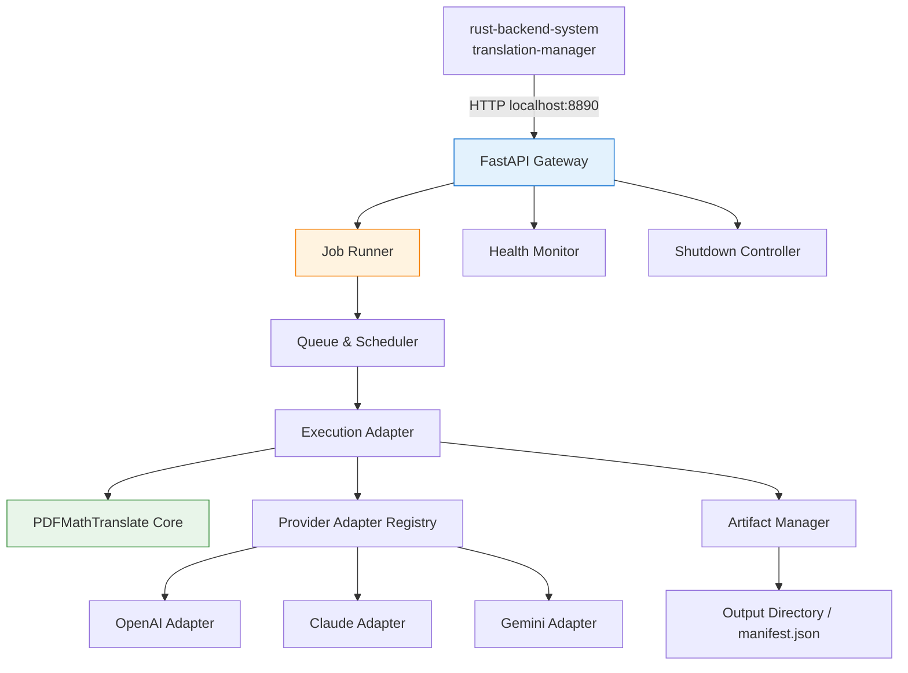
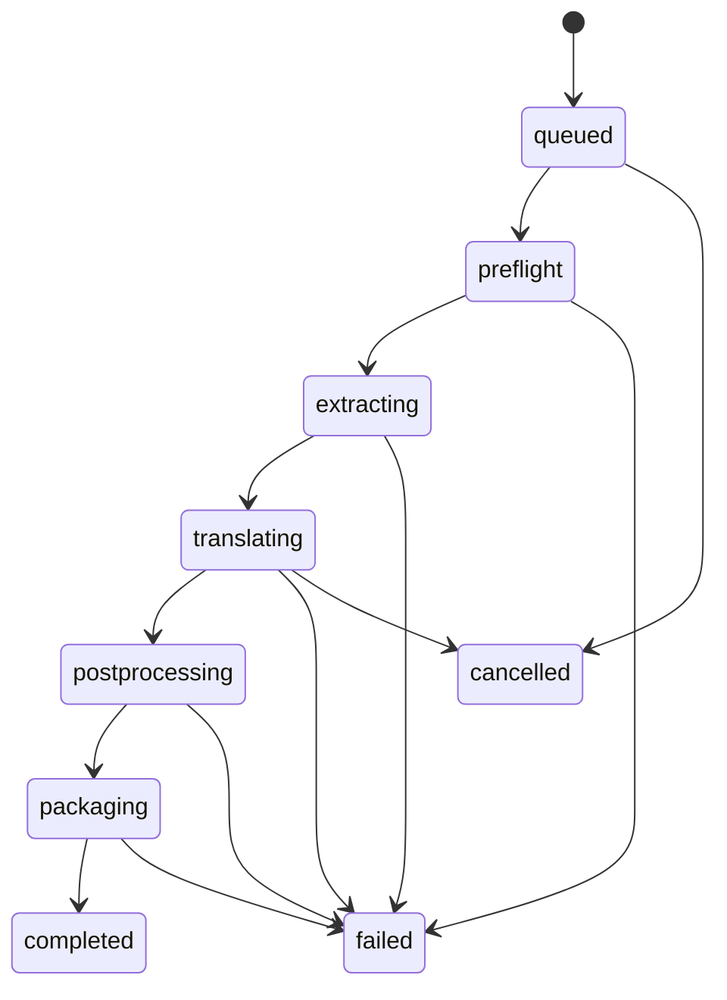

# Translation Engine System Design (翻译引擎系统设计)

**系统 ID**: `translation-engine-system`  
**状态**: 评审中 (Review)  
**版本**: 1.0

---

## 1. 概览 (Overview)
`translation-engine-system` 是一个独立于 Tauri 主进程运行的本地 Python 翻译服务，负责把输入 PDF 路径转换为保留版式的中文翻译 PDF，并向 Rust 后端提供任务级状态、健康检查和结果产物索引。

该系统不是直接暴露 PDFMathTranslate 官方的默认 HTTP API，而是一个**基于 PDFMathTranslate 的本地包装服务**：
- 对外统一监听 `http://127.0.0.1:8890`
- 对内复用 PDFMathTranslate 的版面解析、文本翻译、公式保留和 PDF 重建能力
- 补齐 Rasto 所需的本地单用户任务管理、进度查询、缓存协作和 Claude 自定义适配能力

**核心职责**:
- 接收 Rust 后端下发的翻译任务。
- 调用 PDFMathTranslate 完成英→中全文翻译。
- 返回翻译进度、任务状态和最终 PDF 路径。
- 提供健康检查与优雅停机接口，便于 `translation-manager` 监管。

---

## 2. 设计目标与非目标 (Goals & Non-Goals)

### 2.1 目标 (Goals)
- 对 Rust 后端提供稳定、简单、可本地部署的 HTTP API。
- 兼容 PDFMathTranslate 的核心优势：版式保留、公式不翻译、学术 PDF 友好。
- 适配 Rasto 的产品需求：任务状态机、结果文件路径返回、图表翻译开关、进度汇报。
- 在单机桌面场景下避免引入 Redis / Celery 这类重型依赖。
- 把 Provider 选择统一收敛为 `openai` / `claude` / `gemini` 三类产品语义。

### 2.2 非目标 (Non-Goals)
- 不向前端直接暴露 HTTP 端口；唯一调用方是 Rust 后端。
- 不承担 API Key 持久化；密钥由 Rust 后端从 Keychain 读取后按请求注入。
- 不实现多用户、多租户或跨机器任务分发。
- 不负责 PDF 在前端的交互式双语覆盖展示；它只生产 PDF 和 sidecar 产物。

---

## 3. 上游参考与派生策略 (Upstream Baseline)

### 3.1 参考项目
- **PDFMathTranslate**  
  上游提供:
  - Python API：适合嵌入调用
  - CLI：适合批处理和最稳态集成
  - 官方 HTTP API：依赖 Redis / Celery，更适合服务端部署

- **zotero-pdf2zh**  
  参考价值:
  - 证明“桌面插件/本地服务 + PDF2ZH 翻译”的落地方式可行
  - 采用本地 HTTP 包装层而非直接把上游 HTTP API 原样嵌入

### 3.2 本项目的取舍
Rasto 选择“**本地 FastAPI 包装服务 + PDFMathTranslate 内核**”而不是上游的 Redis/Celery HTTP API，原因如下:

| 方案 | 优点 | 缺点 | 结论 |
|------|------|------|------|
| 直接使用 PDFMathTranslate 官方 HTTP API | 与上游最一致 | 需要 Redis / Celery，桌面部署过重 | 不选 |
| 直接从 Rust 调 CLI | 集成简单 | 进度、健康检查、取消、队列都很难做 | 不选 |
| 本地包装服务 + PDFMathTranslate | 最符合单机桌面场景，可定制任务模型 | 需要维护一层适配代码 | 选用 |

---

## 4. 运行时架构 (Runtime Architecture)

### 4.1 组件图


### 4.2 模块说明
| 模块 | 职责 |
|------|------|
| `api_server` | 提供 HTTP 路由、参数校验、错误响应 |
| `job_registry` | 保存内存态任务状态、队列、取消标记 |
| `scheduler` | 控制单活任务执行和后续排队 |
| `execution_adapter` | 调用 PDFMathTranslate Python API 或稳定 CLI 包装 |
| `provider_adapter_registry` | 把产品语义的 Provider 映射到实际翻译适配器 |
| `artifact_manager` | 维护输出目录、产物清单、校验和 manifest |
| `health_monitor` | 暴露服务健康状态、版本和队列深度 |

### 4.3 并发模型
- 默认 **1 个运行中任务 + 最多 3 个排队任务**。
- 原因:
  - 学术 PDF 翻译内存占用高。
  - 双栏排版和图表处理对 CPU / GPU 峰值敏感。
  - 本地桌面场景中，稳定性优先于吞吐。
- 若后续要支持并行，优先增加“多进程 worker”而不是放开单进程并发。

---

## 5. 任务生命周期 (Job Lifecycle)

### 5.1 状态机


### 5.2 阶段说明
| 阶段 | 说明 | 可观测字段 |
|------|------|-----------|
| `queued` | 已接单，等待调度 | `queue_position` |
| `preflight` | 校验路径、输出目录、provider 参数、PDF 可读性 | `validation_errors` |
| `extracting` | 解析 PDF、建立版面结构、识别双栏/图表区域 | `current_page`, `total_pages` |
| `translating` | 调用具体 Provider 翻译文本与图表标签 | `progress`, `provider`, `model` |
| `postprocessing` | 合并版式、恢复字体、处理公式保留 | `progress` |
| `packaging` | 写出 PDF 和 sidecar 文件、生成 manifest | `artifact_paths` |
| `completed` | 成功完成 | `result` |
| `failed` | 失败 | `error` |
| `cancelled` | 已取消 | `cancelled_at` |

### 5.3 幂等与去重
- 若收到相同 `cache_key` 且产物已存在，直接返回 `completed`。
- 若收到相同 `cache_key` 且任务进行中，返回已存在的 `job_id`。
- 输出目录已存在但 `manifest.json` 缺失或校验和不一致时，视为损坏并重建。

---

## 6. HTTP API 契约 (HTTP API Contract)

### 6.1 基础约定
- **Base URL**: `http://127.0.0.1:8890`
- **Content-Type**: `application/json`
- **身份边界**: 仅绑定 localhost，不做额外用户认证；由 Rust 后端负责调用控制。
- **错误格式**:

```json
{
  "error": {
    "code": "ENGINE_BUSY",
    "message": "Translation queue is full",
    "retryable": true,
    "details": {
      "queue_depth": 3
    }
  }
}
```

### 6.2 `GET /healthz`
用于 Rust 后端启动前探测、存活检查和版本比对。

**响应示例**:
```json
{
  "status": "ok",
  "service": "translation-engine-system",
  "version": "1.0.0",
  "engine": "pdfmathtranslate",
  "engine_version": "upstream-semver",
  "python_version": "3.12.0",
  "uptime_seconds": 184,
  "queue_depth": 0,
  "active_job_id": null,
  "supported_providers": ["openai", "claude", "gemini"]
}
```

### 6.3 `POST /v1/jobs`
创建翻译任务。

**请求体**:
```json
{
  "request_id": "2f5757da-91a7-4b48-8ba4-9a3d001ca5ee",
  "document_id": "doc_01HS...",
  "cache_key": "sha256:abcd...",
  "pdf_path": "/absolute/path/paper.pdf",
  "output_dir": "/absolute/path/cache/translations/<doc>/<cache_key>",
  "source_lang": "en",
  "target_lang": "zh-CN",
  "provider": "openai",
  "model": "gpt-4.1-mini",
  "provider_auth": {
    "api_key": "sk-live-...",
    "base_url": null
  },
  "output_mode": "bilingual",
  "figure_translation": true,
  "skip_reference_pages": true,
  "force_refresh": false,
  "timeout_seconds": 1800,
  "glossary": [
    { "source": "Particle Size", "target": "粒径" }
  ]
}
```

**字段约束**:
- `pdf_path` 必须是绝对路径且文件存在。
- `output_dir` 必须由 Rust 后端生成，防止任意写目录。
- `provider_auth.api_key` 仅在内存中使用，绝不写入日志和 manifest。
- `provider` 为 `claude` 时，必须走自定义 Adapter。

**成功响应**:
```json
{
  "job_id": "te_job_01HS...",
  "status": "queued",
  "queue_position": 0,
  "cache_hit": false,
  "poll_after_ms": 1000
}
```

### 6.4 `GET /v1/jobs/{job_id}`
查询任务状态和产物路径。

**响应示例**:
```json
{
  "job_id": "te_job_01HS...",
  "document_id": "doc_01HS...",
  "status": "running",
  "stage": "translating",
  "progress": 0.56,
  "queue_position": 0,
  "current_page": 6,
  "total_pages": 12,
  "provider": "openai",
  "model": "gpt-4.1-mini",
  "started_at": "2026-03-11T10:00:00Z",
  "updated_at": "2026-03-11T10:02:12Z",
  "result": null,
  "error": null
}
```

**完成态响应中的 `result`**:
```json
{
  "translated_pdf_path": "/.../translated.pdf",
  "bilingual_pdf_path": "/.../bilingual.pdf",
  "figure_report_path": "/.../figures.json",
  "manifest_path": "/.../manifest.json"
}
```

### 6.5 `DELETE /v1/jobs/{job_id}`
取消任务。

**成功响应**:
```json
{
  "job_id": "te_job_01HS...",
  "cancelled": true
}
```

取消语义:
- 若任务仍在队列中，直接移除。
- 若任务已在执行中，设置取消标记；执行层在页间/阶段边界检查后中断。

### 6.6 `POST /control/shutdown`
供 Rust 后端在应用退出时优雅关闭服务。

**请求体**:
```json
{
  "graceful_timeout_seconds": 5
}
```

**响应**:
```json
{
  "accepted": true,
  "active_job_id": null
}
```

---

## 7. Provider 适配策略 (Provider Mapping)

### 7.1 映射表
| Rasto Provider | 引擎适配方式 | 备注 |
|---------------|-------------|------|
| `openai` | 直接使用 PDFMathTranslate 的 OpenAI 路径 | MVP 默认主路径 |
| `gemini` | 直接使用 PDFMathTranslate 的 Gemini 路径 | 支持图表翻译时优先使用 Vision 能力 |
| `claude` | 自定义 `AnthropicAdapter`，对接 PDFMathTranslate 的翻译接口 | 非上游默认能力，需要维护 |

### 7.2 `AnthropicAdapter` 设计
由于上游 PDFMathTranslate 并未把 Claude 作为默认稳定翻译后端，Rasto 在包装层提供一个自定义适配器:
- 输入: PDFMathTranslate 拆出的文本块、图表标签块。
- 输出: 保持原有块级接口的中文译文。
- 特点:
  - 不改变 PDFMathTranslate 的布局分析与重建能力。
  - 只替换“具体调用哪个大模型翻译文本块”的环节。
  - 升级 PDFMathTranslate 时需验证其 Translator 接口是否变化。

---

## 8. 执行流水线 (Translation Pipeline)

### 8.1 流水线步骤
1. **Preflight**
   - 校验 `pdf_path`
   - 校验输出目录写权限
   - 校验 `provider_auth`
   - 识别是否为受支持 PDF

2. **Layout Extraction**
   - 使用 PDFMathTranslate 的布局分析能力识别正文、双栏结构、图表和公式
   - 跳过 References 页或文后附录页（若启用）

3. **Text Translation**
   - 按块调用选定 Provider 翻译文本
   - 公式、化学式保留原样
   - 图表标签文本走同一任务队列，但可切换到视觉模型

4. **Post-processing**
   - 合并字体、重建版式
   - 生成纯译文 PDF 和双语 PDF
   - 输出可选的图表理解 sidecar：`figures.json`

5. **Packaging**
   - 写出 `manifest.json`
   - 计算产物校验和
   - 返回路径给 Rust 后端

### 8.2 输出产物
| 产物 | 必须 | 说明 |
|------|------|------|
| `translated.pdf` | 是 | 默认给阅读器使用的中文译文 PDF |
| `bilingual.pdf` | 是 | 用于导出或对照审阅 |
| `figures.json` | 否 | 图表标签翻译和图表理解结果 sidecar |
| `manifest.json` | 是 | 记录任务元数据、引擎版本、校验和、阶段耗时 |

### 8.3 `manifest.json` 建议结构
```json
{
  "job_id": "te_job_01HS...",
  "document_id": "doc_01HS...",
  "cache_key": "sha256:abcd...",
  "engine_version": "1.0.0",
  "pdfmathtranslate_version": "x.y.z",
  "provider": "openai",
  "model": "gpt-4.1-mini",
  "source_lang": "en",
  "target_lang": "zh-CN",
  "output_mode": "bilingual",
  "figure_translation": true,
  "artifacts": {
    "translated_pdf": { "path": "translated.pdf", "sha256": "..." },
    "bilingual_pdf": { "path": "bilingual.pdf", "sha256": "..." },
    "figure_report": { "path": "figures.json", "sha256": "..." }
  },
  "timings": {
    "extracting_ms": 5400,
    "translating_ms": 782000,
    "postprocessing_ms": 9100
  }
}
```

---

## 9. 输入校验与错误模型 (Validation & Errors)

### 9.1 主要错误码
| 错误码 | 含义 | 是否可重试 |
|-------|------|-----------|
| `INVALID_PDF_PATH` | PDF 路径不存在或不是绝对路径 | 否 |
| `OUTPUT_DIR_NOT_WRITABLE` | 输出目录不可写 | 否 |
| `ENGINE_BUSY` | 队列已满 | 是 |
| `PROVIDER_AUTH_MISSING` | 缺少 API Key | 否 |
| `UNSUPPORTED_PROVIDER` | 当前 Provider 不受支持 | 否 |
| `TRANSLATION_TIMEOUT` | 单任务超时 | 是 |
| `PDF_PARSE_FAILED` | PDF 解析失败 | 否 |
| `UPSTREAM_TRANSLATOR_ERROR` | 上游翻译器返回错误 | 视错误而定 |
| `JOB_NOT_FOUND` | 任务不存在 | 否 |
| `JOB_CANCELLED` | 任务已取消 | 否 |

### 9.2 日志脱敏
- `provider_auth.api_key` 永远不进日志。
- 仅记录路径 basename，不打印用户全路径到 info 级别日志。
- 故障日志允许记录 `job_id`, `provider`, `model`, `stage`。

---

## 10. 健康检查、监控与停机 (Health, Observability, Shutdown)

### 10.1 健康定义
`/healthz` 返回:
- `ok`: 服务可接单，队列未满
- `degraded`: 服务存活，但队列已满或出现近期失败
- `busy`: 当前队列已满，无法接单

### 10.2 指标
建议至少在内存中维护:
- `uptime_seconds`
- `queue_depth`
- `active_job_id`
- `completed_jobs_total`
- `failed_jobs_total`
- `average_job_duration_ms`

### 10.3 优雅停机
- 若无运行中任务，立即退出。
- 若有运行中任务，默认等待 `graceful_timeout_seconds`。
- 超时后将任务标记为 `cancelled` 并退出，由 Rust 后端决定是否重试。

---

## 11. 部署与启动约定 (Deployment & Startup)

### 11.1 启动命令
```bash
python3 -m rasto_translation_engine --host 127.0.0.1 --port 8890
```

### 11.2 Python 依赖
- Python 3.12
- `pdf2zh` / `pdfmathtranslate`
- `fastapi`
- `uvicorn`
- `pydantic`
- Provider 所需 SDK 或兼容 HTTP client

### 11.3 环境变量建议
| 变量 | 作用 |
|------|------|
| `RASTO_ENGINE_HOST` | 默认 `127.0.0.1` |
| `RASTO_ENGINE_PORT` | 默认 `8890` |
| `RASTO_ENGINE_LOG_LEVEL` | `info` / `debug` |
| `RASTO_ENGINE_TMP_DIR` | 中间文件目录 |

---

## 12. 性能与容量规划 (Performance & Capacity)

### 12.1 目标
- 健康检查 < 50ms
- 提交任务响应 < 200ms
- 单篇 10 页英文论文在网络正常时进入翻译阶段 < 3 秒
- 结果文件写出后，Rust 后端 500ms 内可读取 manifest 并更新缓存索引

### 12.2 关键瓶颈
- 大文档布局分析
- 图表与视觉模型调用
- 字体嵌入和 PDF 重建

### 12.3 优化方向
- 提前复用字体缓存
- 将 References 页默认跳过
- 在不牺牲稳定性的前提下，对页级任务做分段翻译

---

## 13. 安全与合规 (Security & Compliance)
- 仅监听 `127.0.0.1`，不暴露公网接口。
- 不持久化原始 API Key。
- 输出目录必须由 Rust 后端提供，避免任意文件写入。
- 仅接受本地绝对路径，拒绝 URL 输入。
- PDFMathTranslate 与相关依赖的许可证需要在交付阶段进一步合规确认，尤其是打包分发时的再分发要求。

---

## 14. 测试策略 (Testing)

### 14.1 单元测试
- Provider 映射和校验逻辑
- `manifest.json` 生成
- 队列和取消逻辑
- 路径校验和输出目录约束

### 14.2 集成测试
- 提交任务 -> 轮询状态 -> 获取产物路径的完整流程
- OpenAI / Gemini adapter mock
- Claude 自定义 adapter contract test
- 损坏 PDF、超时、取消、队列满等异常场景

### 14.3 与 Rust 后端联调重点
- `/healthz` 签名字段是否满足 `ensure_translation_engine`
- `POST /v1/jobs` 的错误码是否与 Rust `AppError` 一一映射
- 产物路径与 manifest 是否可直接被后端缓存索引复用

---

## 15. 风险与权衡 (Risks & Trade-offs)
| 风险 | 影响 | 缓解方案 |
|------|------|---------|
| Claude 需要自定义适配器 | 升级成本高 | 将适配逻辑封装在 `provider_adapter_registry` 中，单独做 contract test |
| 不使用 Redis/Celery | 任务能力比官方 HTTP API 简化 | 但更适合桌面单机，MVP 范围足够 |
| 图表理解依赖视觉模型 | 成本和时延上升 | 通过 `figure_translation` 开关明确告知用户 |
| 长 PDF 翻译耗时长 | 用户感知慢 | 提供阶段与页级进度，而非黑盒等待 |

---

## 16. 与 Rust Backend 的契约关系 (Interface with Rust Backend)
- Rust 后端负责:
  - 启动/停止本服务
  - 从 Keychain 读取 API Key
  - 生成 `output_dir` 与 `cache_key`
  - 轮询任务状态并转发成 Tauri event

- 本服务负责:
  - 执行翻译任务
  - 生成产物和 manifest
  - 暴露健康与停机接口

因此，`translation-engine-system` 是一个**受监管的本地 worker 服务**，而不是独立业务后端。

---

## 17. 参考资料 (References)
- PDFMathTranslate: <https://github.com/PDFMathTranslate/PDFMathTranslate>
- PDFMathTranslate API 文档: <https://github.com/PDFMathTranslate/PDFMathTranslate/blob/main/docs/APIS.md>
- zotero-pdf2zh: <https://github.com/guaguastandup/zotero-pdf2zh>
