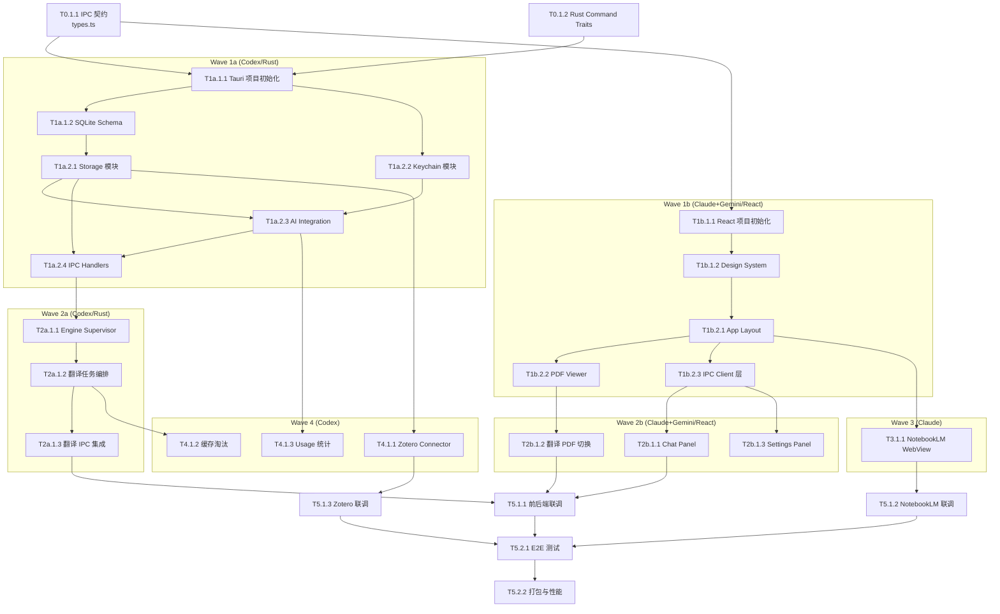

# Rasto 任务清单 (Task List)

> **版本**: genesis/v1  
> **生成日期**: 2026-03-11  
> **基准文档**: ADR-002 多模型协作策略 (Wave 0 → Wave 5)  
> **总任务数**: 42 | P0: 22 | P1: 14 | P2: 6  
> **总预估工时**: ~168h (~21 工作日)

---

## 📊 Sprint 路线图

| Sprint | 代号 | 波次 | 核心任务 | 退出标准 | 预估 |
|--------|------|------|---------|---------|------|
| S0 | 契约先行 | Wave 0 | IPC 接口契约 + 项目骨架 | `types.ts` + Rust trait 编译通过，前后端接口对齐 | 1d |
| S1 | 双轮启动 | Wave 1a ∥ 1b | Rust 后端核心 + React 前端骨架 | 后端 `tauri dev` 启动 + 前端 PDF 可渲染 | 4-5d |
| S2 | 功能成型 | Wave 2a ∥ 2b | 翻译编排 + 聊天面板 + 设置页 | 翻译可触发 + AI 问答可流式 + Provider 可切换 | 5-6d |
| S3 | 扩展集成 | Wave 3 ∥ 4 | NotebookLM + Zotero + 缓存 | NotebookLM 可生成 + Zotero 可浏览 + 缓存命中 | 3-4d |
| S4 | 联调交付 | Wave 5 | 集成联调 + Bug 修复 | 完整 App 可 `tauri build` 打包运行 | 3-4d |

---

## 🔀 依赖图总览

---

## Wave 0: IPC 接口契约 (Sprint S0)

> **负责模型**: Claude  
> **目标**: 定义前后端唯一通信契约，为 Wave 1a ∥ 1b 并行开发奠基

### Phase 1: 契约定义

- [x] **T0.1.1** [REQ-001~009]: 定义 TypeScript IPC 类型文件
  - **描述**: 基于 `rust-backend-system.md` Section 7 的 Command 列表，生成完整的 `types.ts`，包含所有 DTO、Error、Event 类型
  - **输入**: `rust-backend-system.md` Section 7 (IPC Contract)
  - **输出**: `src/shared/types.ts`（所有 Command 请求/响应 DTO + AppError + Event payload）
  - **验收标准**:
    - Given `types.ts` 已生成
    - When 执行 `tsc --noEmit` 类型检查
    - Then 零错误，所有 30+ 个 Command 的请求/响应类型完整定义
  - **验证说明**: 类型检查通过 + 人工确认与 `rust-backend-system.md` Section 7 表格一一对应
  - **估时**: 3h
  - **依赖**: 无
  - **优先级**: P0

- [x] **T0.1.2** [REQ-001~009]: 定义 Rust Command Trait 骨架
  - **描述**: 为每个 Tauri Command 创建函数签名（`#[tauri::command]` 标注 + 参数/返回类型），暂用 `todo!()` 占位实现
  - **输入**: T0.1.1 产出的 `types.ts`（确保 Rust 端 serde 类型与 TS 类型对齐）
  - **输出**: `src-tauri/src/ipc/mod.rs` + 各子模块骨架文件
  - **验收标准**:
    - Given Rust Command 骨架已生成
    - When 执行 `cargo check`
    - Then 编译通过（所有函数签名正确，`todo!()` 不影响编译）
  - **验证说明**: `cargo check` 通过 + Command 数量与 `types.ts` 匹配
  - **估时**: 3h
  - **依赖**: T0.1.1
  - **优先级**: P0

- [ ] **INT-S0** [MILESTONE]: S0 集成验证 — 契约先行
  - **描述**: 验证前后端契约对齐
  - **输入**: T0.1.1, T0.1.2 产出
  - **输出**: 契约对齐确认（Command 名称 + DTO 字段一一匹配）
  - **验收标准**:
    - Given T0.1.1 和 T0.1.2 已完成
    - When 逐条比对 TS 类型和 Rust 类型
    - Then `types.ts` 中每个 Command 在 Rust 端有对应 `#[tauri::command]`
  - **验证说明**: 人工交叉比对 + 类型名称 diff
  - **估时**: 1h
  - **依赖**: T0.1.1, T0.1.2

---

## Wave 1a: Rust 后端骨架 (Sprint S1, 与 Wave 1b 并行)

> **负责模型**: Codex  
> **目标**: 构建 Rust 后端核心基础设施

### Phase 1: Foundation

- [ ] **T1a.1.1** [基础]: Tauri 2.0 项目初始化
  - **描述**: 使用 `create-tauri-app` 初始化项目，配置 Cargo.toml 依赖（rusqlite, reqwest, serde, security-framework）
  - **输入**: T0.1.2 产出的 Rust Command 骨架
  - **输出**: 可编译的 `src-tauri/` 项目 + `tauri.conf.json`
  - **验收标准**:
    - Given 项目已初始化
    - When 执行 `cargo build`
    - Then 编译成功，`tauri dev` 可启动空白窗口
  - **验证说明**: `cargo build` + `tauri dev` 启动确认
  - **估时**: 3h
  - **依赖**: T0.1.2
  - **优先级**: P0

- [ ] **T1a.1.2** [REQ-003,008]: SQLite Schema 与 Migration
  - **描述**: 实现 `rust-backend-system.md` Section 6.2 全部 7 张表的 CREATE TABLE + Migration 逻辑
  - **输入**: `rust-backend-system.md` Section 6.2 SQL 定义
  - **输出**: `src-tauri/migrations/001_init.sql` + `src-tauri/src/storage/migration.rs`
  - **验收标准**:
    - Given Migration 文件已创建
    - When App 首次启动执行 migration
    - Then `app.db` 创建成功，7 张表结构与设计文档一致
  - **验证说明**: 启动后通过 `sqlite3 app.db ".tables"` 确认 + Schema diff
  - **估时**: 3h
  - **依赖**: T1a.1.1
  - **优先级**: P0

### Phase 2: Core

- [ ] **T1a.2.1** [REQ-003,008]: Storage 模块 CRUD 实现
  - **描述**: 为 `documents`, `chat_sessions`, `chat_messages`, `translation_jobs`, `translation_artifacts`, `usage_events`, `provider_settings` 实现 CRUD 函数
  - **输入**: T1a.1.2 产出的 SQLite Schema
  - **输出**: `src-tauri/src/storage/` 下各实体的 repository 模块
  - **验收标准**:
    - Given Storage 模块已实现
    - When 执行单元测试（内存 SQLite）
    - Then 所有 CRUD 操作正确，外键约束生效
  - **验证说明**: `cargo test -- storage` 全部通过
  - **估时**: 6h
  - **依赖**: T1a.1.2
  - **优先级**: P0

- [ ] **T1a.2.2** [REQ-004]: Keychain 模块实现
  - **描述**: 实现 macOS Keychain 的 API Key 读写和脱敏功能（`save_key`, `get_key`, `delete_key`, `mask_key`）
  - **输入**: `rust-backend-system.md` Section 10.1 Keychain 约定
  - **输出**: `src-tauri/src/keychain/mod.rs`
  - **验收标准**:
    - Given Keychain 模块已实现
    - When 调用 `save_key("openai", "sk-test123")` 后 `get_key("openai")`
    - Then 返回原始 Key; `mask_key` 返回 `sk-...123`
  - **验证说明**: 集成测试验证 Keychain 读写（需 macOS 环境）
  - **估时**: 3h
  - **依赖**: T1a.1.1
  - **优先级**: P0

- [ ] **T1a.2.3** [REQ-003,005]: AI Integration 模块
  - **描述**: 实现三大 Provider (OpenAI/Claude/Gemini) 的 HTTP 客户端 + 流式响应处理 + Usage 统计
  - **输入**: T1a.2.1 产出的 Storage 模块（写 usage_events）+ T1a.2.2 产出的 Keychain 模块（读 API Key）
  - **输出**: `src-tauri/src/ai_integration/` 含 `provider_registry.rs`, `chat_service.rs`, `summary_service.rs`, `usage_meter.rs`
  - **验收标准**:
    - Given 配置了有效 API Key
    - When 调用 `chat_service.ask(provider, messages)`
    - Then 流式返回 token，结束后 usage_events 写入 DB
  - **验证说明**: Mock Provider 单元测试 + 真实 API 手动测试
  - **估时**: 8h
  - **依赖**: T1a.2.1, T1a.2.2
  - **优先级**: P0

- [ ] **T1a.2.4** [REQ-001~005]: IPC Handlers 首批实现
  - **描述**: 将 T0.1.2 的 `todo!()` 占位替换为实际逻辑：`open_document`, `ask_ai`, `cancel_ai_stream`, `generate_summary`, `list_chat_sessions`, `get_chat_messages`, `list_provider_configs`, `save_provider_key`, `set_active_provider`, `test_provider_connection`, `get_backend_health`, `list_recent_documents`
  - **输入**: T1a.2.1 Storage + T1a.2.2 Keychain + T1a.2.3 AI Integration
  - **输出**: `src-tauri/src/ipc/` 各模块实际实现
  - **验收标准**:
    - Given 所有首批 IPC Handler 已实现
    - When `tauri dev` 启动后前端调用 `invoke("get_backend_health")`
    - Then 返回健康状态 JSON
  - **验证说明**: `cargo test` + `tauri dev` 手动验证核心 Command
  - **估时**: 6h
  - **依赖**: T1a.2.1, T1a.2.2, T1a.2.3
  - **优先级**: P0

---

## Wave 1b: React 前端骨架 (Sprint S1, 与 Wave 1a 并行)

> **负责模型**: Claude + Gemini  
> **目标**: 构建前端 UI 骨架和 PDF 渲染核心

### Phase 1: Foundation

- [ ] **T1b.1.1** [基础]: React + Vite + TypeScript 项目初始化
  - **描述**: 初始化前端项目，集成 Tauri API、Zustand、Tailwind CSS、Radix UI、framer-motion、Lucide React
  - **输入**: T0.1.1 产出的 `types.ts`
  - **输出**: `src/` 前端项目（`vite.config.ts`, `package.json`, `tailwind.config.js`）
  - **验收标准**:
    - Given 前端项目已初始化
    - When 执行 `npm run dev`
    - Then Vite dev server 启动，浏览器显示空白 App Shell
  - **验证说明**: `npm run dev` + `tsc --noEmit` 通过
  - **估时**: 3h
  - **依赖**: T0.1.1
  - **优先级**: P0

- [ ] **T1b.1.2** [基础]: Design System 基础设施
  - **描述**: 使用 `frontend-design` + `ui-ux-pro-max` Skills 建立设计系统：颜色 tokens（HIG 风格）、字体（SF Pro 降级链）、间距、圆角、阴影、暗色模式变量
  - **输入**: `frontend-system.md` Section 7 技术选型 + Apple HIG 参考
  - **输出**: `src/styles/` 设计 token 文件 + `src/components/ui/` 基础组件（Button, Input, Card, Dialog）
  - **验收标准**:
    - Given Design System 已建立
    - When 渲染 Storybook/测试页面展示基础组件
    - Then 组件风格一致，支持 Light/Dark 模式切换
  - **验证说明**: 视觉审查 + Tailwind 类名一致性检查
  - **估时**: 6h
  - **依赖**: T1b.1.1
  - **优先级**: P0

### Phase 2: Core

- [ ] **T1b.2.1** [REQ-001]: App Layout 三栏布局
  - **描述**: 实现 HIG 风格三栏布局（Sidebar + PDF 主区域 + 右侧面板），支持面板折叠/展开动画
  - **输入**: T1b.1.2 产出的 Design System
  - **输出**: `src/layouts/AppLayout.tsx` + `src/components/Sidebar.tsx`
  - **验收标准**:
    - Given Layout 已实现
    - When 拖拽窗口边缘调整大小
    - Then 三栏自适应，Sidebar 可折叠，Panel 可展开/收起，动效 60fps
  - **验证说明**: 浏览器中验证响应式行为 + 动效流畅度
  - **估时**: 5h
  - **依赖**: T1b.1.2
  - **优先级**: P0

- [ ] **T1b.2.2** [REQ-001]: PDF Viewer 核心渲染
  - **描述**: 集成 pdf.js，实现 PDF 文件打开、页面渲染、翻页、缩放（25%-400%）、懒加载（前后各预加载 2 页）
  - **输入**: T1b.2.1 产出的 App Layout
  - **输出**: `src/components/pdf-viewer/PdfViewer.tsx` + Worker 配置
  - **验收标准**:
    - Given PDF Viewer 已集成
    - When 拖拽 100+ 页 PDF 到窗口
    - Then 首页渲染 < 1s，滚动流畅，内存 < 500MB
  - **验证说明**: 用多种学术 PDF 测试（单栏、双栏、含图表）
  - **估时**: 8h
  - **依赖**: T1b.2.1
  - **优先级**: P0

- [ ] **T1b.2.3** [基础]: IPC Client 封装层
  - **描述**: 封装 `@tauri-apps/api/core` 的 `invoke()` 调用，创建类型安全的 API 客户端（自动错误处理、Loading 状态管理）
  - **输入**: T0.1.1 产出的 `types.ts` + T1b.2.1 产出的 Layout
  - **输出**: `src/lib/ipc-client.ts`（封装所有 30+ Command 的类型安全调用函数）
  - **验收标准**:
    - Given IPC Client 已封装
    - When 调用 `ipcClient.getBackendHealth()`
    - Then TypeScript 自动推断返回类型，错误统一处理
  - **验证说明**: `tsc --noEmit` 通过 + 手动 `tauri dev` 联调测试
  - **估时**: 4h
  - **依赖**: T0.1.1, T1b.2.1
  - **优先级**: P0

- [ ] **INT-S1** [MILESTONE]: S1 集成验证 — 双轮启动
  - **描述**: 验证后端可启动 + 前端可渲染 PDF + IPC 通道连通
  - **输入**: Wave 1a + Wave 1b 所有任务产出
  - **输出**: 集成验证报告
  - **验收标准**:
    - Given Wave 1a 和 1b 均已完成
    - When 执行 `tauri dev`
    - Then 应用窗口启动，可拖拽 PDF 到窗口并渲染，`get_backend_health` 返回 ok
  - **验证说明**: `tauri dev` 完整启动 + PDF 加载测试 + IPC 连通性测试
  - **估时**: 3h
  - **依赖**: T1a.2.4, T1b.2.3

---

## Wave 2a: 翻译进程管理 (Sprint S2, 与 Wave 2b 并行)

> **负责模型**: Codex  
> **目标**: PDFMathTranslate 进程管理 + 翻译任务编排

### Phase 1: Core

- [ ] **T2a.1.1** [REQ-002]: Engine Supervisor 进程管理
  - **描述**: 实现 `translation-manager` 的 `engine_supervisor` 模块：进程启动/停止、健康检查轮询、端口冲突检测、熔断机制（含 Challenge H5 修正：指数退避 + 分类型 + 用户覆盖）、Python 环境预检（含 Challenge H4 修正：`PYTHON_NOT_FOUND` 等错误码）
  - **输入**: T1a.2.4 产出的 IPC Handler 骨架 + `translation-engine-system.md` Section 6
  - **输出**: `src-tauri/src/translation_manager/engine_supervisor.rs`
  - **验收标准**:
    - Given Python 3.12 和 PDFMathTranslate 已安装
    - When 调用 `ensure_translation_engine`
    - Then 进程在 15s 内启动，`/healthz` 返回 ok
    - Given Python 未安装
    - When 调用 `ensure_translation_engine`
    - Then 返回 `PYTHON_NOT_FOUND` 而非通用 `ENGINE_UNAVAILABLE`
  - **验证说明**: 有/无 Python 环境下分别测试 + 熔断触发/恢复测试
  - **估时**: 8h
  - **依赖**: T1a.2.4
  - **优先级**: P0

- [ ] **T2a.1.2** [REQ-002,008]: 翻译任务编排与缓存
  - **描述**: 实现 `job_registry` + `artifact_index` + `http_client`：任务创建/去重/排队、缓存命中判断、进度轮询、结果入库
  - **输入**: T2a.1.1 产出的 Engine Supervisor + T1a.2.1 产出的 Storage 模块
  - **输出**: `src-tauri/src/translation_manager/job_registry.rs`, `artifact_index.rs`, `http_client.rs`
  - **验收标准**:
    - Given Translation Engine 运行中
    - When 调用 `request_translation` 提交翻译任务
    - Then 任务进入队列,进度事件通过 `translation://job-progress` 推送
    - When 同一文件再次翻译
    - Then 缓存命中,直接返回 completed
  - **验证说明**: Mock Translation Engine + 真实引擎联调
  - **估时**: 8h
  - **依赖**: T2a.1.1, T1a.2.1
  - **优先级**: P0

- [ ] **T2a.1.3** [REQ-002]: 翻译 IPC Handlers 集成
  - **描述**: 实现 `request_translation`, `get_translation_job`, `cancel_translation`, `load_cached_translation`, `ensure_translation_engine`, `shutdown_translation_engine`, `get_translation_engine_status` 七个 Command
  - **输入**: T2a.1.2 产出的翻译编排模块
  - **输出**: `src-tauri/src/ipc/translation.rs` 完整实现
  - **验收标准**:
    - Given 前端可调用翻译 IPC
    - When 通过 `invoke` 触发翻译
    - Then 全流程跑通：提交→排队→进度→完成→缓存
  - **验证说明**: `tauri dev` 下用前端 `invoke()` 完整测试翻译链路
  - **估时**: 4h
  - **依赖**: T2a.1.2
  - **优先级**: P0

---

## Wave 2b: 功能页面 (Sprint S2, 与 Wave 2a 并行)

> **负责模型**: Claude + Gemini  
> **目标**: 聊天面板 + 翻译展示 + 设置页

### Phase 1: Core

- [ ] **T2b.1.1** [REQ-003]: Chat Panel 聊天面板
  - **描述**: 实现右侧 AI 对话面板：拖拽段落引用、消息列表（含引用块样式）、流式 Markdown 渲染、自动滚动到底部、对话历史加载
  - **输入**: T1b.2.3 产出的 IPC Client（`ask_ai`, `list_chat_sessions`, `get_chat_messages` 调用）
  - **输出**: `src/components/chat-panel/ChatPanel.tsx`, `ChatMessage.tsx`, `ChatInput.tsx`
  - **验收标准**:
    - Given Chat Panel 已实现
    - When 在 PDF 中选中文本拖拽到聊天区域并发送问题
    - Then AI 流式回答在面板中增量渲染（Markdown 格式）
    - When 关闭 App 重新打开同一 PDF
    - Then 之前的对话历史恢复
  - **验证说明**: 拖拽交互测试 + 流式渲染流畅度 + 历史恢复
  - **估时**: 8h
  - **依赖**: T1b.2.3
  - **优先级**: P0

- [ ] **T2b.1.2** [REQ-002]: 翻译 PDF 切换展示
  - **描述**: 实现"隐式双语对照"功能：翻译完成后 pdf.js 切换渲染翻译 PDF，按住 Option 键切换回原始 PDF（带渐变淡入动画）。参见 Challenge H3 修正方案。
  - **输入**: T1b.2.2 产出的 PDF Viewer + T1b.2.3 产出的 IPC Client（翻译状态监听）
  - **输出**: `src/components/pdf-viewer/TranslationSwitch.tsx` + 翻译进度骨架屏
  - **验收标准**:
    - Given PDF 已翻译
    - When 翻译完成后查看阅读区
    - Then 默认显示中文译文 PDF
    - When 按住 Option 键
    - Then 动画切换到英文原文,松开恢复中文
    - When 翻译进行中
    - Then 显示逐页进度骨架屏（非全白等待）
  - **验证说明**: 用含图表的学术 PDF 测试翻译切换 + 动画流畅度
  - **估时**: 6h
  - **依赖**: T1b.2.2, T1b.2.3
  - **优先级**: P0

- [ ] **T2b.1.3** [REQ-004,009]: Settings Panel 设置面板
  - **描述**: 实现设置页面：API Key 输入（脱敏显示）、Provider 切换、模型选择、连接测试、使用统计展示
  - **输入**: T1b.2.3 产出的 IPC Client（`save_provider_key`, `set_active_provider`, `test_provider_connection`, `get_usage_stats` 调用）
  - **输出**: `src/components/settings/SettingsPanel.tsx`, `ProviderCard.tsx`, `UsageChart.tsx`
  - **验收标准**:
    - Given 设置面板已实现
    - When 输入 API Key 点击保存
    - Then Key 脱敏显示（sk-...xxx），可点击测试连接
    - When 切换 Provider
    - Then 后续 AI 操作使用新 Provider
  - **验证说明**: 配置 + 测试连接 + 切换 Provider 后问答验证
  - **估时**: 5h
  - **依赖**: T1b.2.3
  - **优先级**: P0

- [ ] **T2b.1.4** [REQ-005]: AI 文献总结面板
  - **描述**: 实现总结功能 UI：工具栏"总结"按钮、流式 Markdown 渲染、结构化总结展示（研究背景/方法/结论/创新点）
  - **输入**: T1b.2.3 产出的 IPC Client（`generate_summary` 调用）
  - **输出**: `src/components/summary/SummaryPanel.tsx`
  - **验收标准**:
    - Given 打开一篇 PDF
    - When 点击"总结"按钮
    - Then AI 流式生成结构化总结，Markdown 格式渲染
  - **验证说明**: 用 10+ 页论文测试总结质量和渲染效果
  - **估时**: 4h
  - **依赖**: T1b.2.3
  - **优先级**: P1

- [ ] **INT-S2** [MILESTONE]: S2 集成验证 — 功能成型
  - **描述**: 验证翻译 + AI 问答 + Provider 切换的端到端功能
  - **输入**: Wave 2a + Wave 2b 所有任务产出
  - **输出**: 集成验证报告
  - **验收标准**:
    - Given 全部 Wave 2 任务已完成
    - When 打开 PDF → 翻译 → 查看中文 → Option 切换原文 → 拖拽段落问答 → 切换 Provider
    - Then 所有功能正常，流式输出流畅
  - **验证说明**: 完整用户流程测试 + 截图记录
  - **估时**: 4h
  - **依赖**: T2a.1.3, T2b.1.1, T2b.1.2, T2b.1.3

---

## Wave 3: NotebookLM WebView 自动化 (Sprint S3, 与 Wave 4 并行)

> **负责模型**: Claude  
> **目标**: 内嵌 NotebookLM 一键生成

### Phase 1: Core

- [ ] **T3.1.1** [REQ-006]: NotebookLM WebView 模块
  - **描述**: 实现 NotebookLM 内嵌 WebView：Google 登录（一次性）、自动创建 Notebook、上传当前 PDF、触发 Studio 生成（思维导图/PPT/测验/闪卡等 9 种类型）。此模块为 Frontend 自治（参见 Challenge H2），不经过 Backend IPC。
  - **输入**: T1b.2.1 产出的 App Layout
  - **输出**: `src/components/notebooklm/NotebookLMView.tsx`, `src/lib/notebooklm-automation.ts`
  - **验收标准**:
    - Given 用户已登录 Google 账号
    - When 点击"生成思维导图"按钮
    - Then WebView 自动在 NotebookLM 中上传 PDF → 点击 Studio → 选择思维导图，从点击到开始生成 < 30s
  - **验证说明**: 真实 Google 账号测试全部 9 种生成类型
  - **估时**: 8h
  - **依赖**: T1b.2.1
  - **优先级**: P1

- [ ] **T3.1.2** [REQ-006]: NotebookLM 错误处理与状态管理
  - **描述**: 处理 WebView 加载超时、Google 登录过期、NotebookLM 使用限制等异常状态
  - **输入**: T3.1.1 产出的 NotebookLM WebView 模块
  - **输出**: 错误提示 UI + 重试逻辑
  - **验收标准**:
    - Given NotebookLM 网页加载超时（> 60s）
    - When 检测到超时
    - Then 显示"NotebookLM 连接失败,请检查网络"的中文提示
  - **验证说明**: 模拟网络断开/超时场景测试
  - **估时**: 3h
  - **依赖**: T3.1.1
  - **优先级**: P1

---

## Wave 4: Zotero 集成 + 缓存 + 统计 (Sprint S3, 与 Wave 3 并行)

> **负责模型**: Codex  
> **目标**: P1/P2 功能完善

### Phase 1: Core

- [ ] **T4.1.1** [REQ-007]: Zotero Connector 模块
  - **描述**: 实现 Zotero 本地数据库只读集成：自动发现 Zotero 路径、查询文献条目/附件、返回 PDF 路径。实现 `detect_zotero_library`, `fetch_zotero_items`, `open_zotero_attachment` 三个 IPC Handler
  - **输入**: T1a.2.1 产出的 Storage 模块 + `rust-backend-system.md` Section 11
  - **输出**: `src-tauri/src/zotero_connector/mod.rs` + `src-tauri/src/ipc/zotero.rs`
  - **验收标准**:
    - Given 本地已安装 Zotero 并有文献
    - When 调用 `detect_zotero_library`
    - Then 返回 Zotero 数据库路径和状态
    - When 调用 `fetch_zotero_items`
    - Then 返回分页文献列表（含 PDF 附件路径）
  - **验证说明**: 用真实 Zotero 数据库测试
  - **估时**: 6h
  - **依赖**: T1a.2.1
  - **优先级**: P1

- [ ] **T4.1.2** [REQ-008]: 翻译缓存淘汰策略
  - **描述**: 实现 LRU 缓存淘汰：计算当前缓存总大小、超 500MB 后淘汰最旧缓存（按 `last_opened_at` 排序）。参见 Challenge M2。
  - **输入**: T2a.1.2 产出的 artifact_index 模块
  - **输出**: `src-tauri/src/translation_manager/cache_eviction.rs`
  - **验收标准**:
    - Given 缓存已超过 500MB
    - When 新翻译完成后触发缓存检查
    - Then 最旧的缓存被删除，总大小降至 500MB 以下
  - **验证说明**: 创建假缓存文件模拟测试
  - **估时**: 3h
  - **依赖**: T2a.1.2
  - **优先级**: P2

- [ ] **T4.1.3** [REQ-009]: API 使用统计 IPC
  - **描述**: 实现 `get_usage_stats` IPC Handler，汇总各 Provider 的调用次数、Token 消耗和预估费用
  - **输入**: T1a.2.3 产出的 AI Integration（usage_meter 写入数据）
  - **输出**: `src-tauri/src/ipc/settings.rs` 中 `get_usage_stats` 实现
  - **验收标准**:
    - Given 已使用 AI 功能若干次
    - When 调用 `get_usage_stats`
    - Then 返回各 Provider 的 token 统计和预估费用
  - **验证说明**: 使用几次 AI 问答后查看统计数据
  - **估时**: 2h
  - **依赖**: T1a.2.3
  - **优先级**: P2

- [ ] **T4.1.4** [REQ-007]: Zotero 侧边栏 UI
  - **描述**: 实现左侧 Sidebar 的 Zotero 文献列表展示：虚拟化列表（@tanstack/react-virtual）、搜索过滤、点击打开 PDF
  - **输入**: T4.1.1 产出的 Zotero IPC + T1b.2.1 产出的 Sidebar
  - **输出**: `src/components/sidebar/ZoteroList.tsx`
  - **验收标准**:
    - Given Zotero 已配置
    - When 在 Sidebar 浏览文献列表
    - Then 显示文献条目列表（含标题、作者、年份），滚动流畅
    - When 点击某篇文献
    - Then 对应 PDF 在阅读区打开
  - **验证说明**: 用 1000+ 条 Zotero 数据测试列表性能
  - **估时**: 5h
  - **依赖**: T4.1.1, T1b.2.1
  - **优先级**: P1

- [ ] **T4.1.5** [基础]: Python 环境引导 UI
  - **描述**: 实现首次启动引导组件：检测 Python 环境 → 显示安装指引（检测 `PYTHON_NOT_FOUND`/`PYTHON_VERSION_MISMATCH`/`PDFMATHTRANSLATE_NOT_INSTALLED` 错误码）。参见 Challenge H4。
  - **输入**: T2a.1.1 产出的 Engine Supervisor（Python 预检错误码）
  - **输出**: `src/components/setup/SetupWizard.tsx`
  - **验收标准**:
    - Given Python 未安装
    - When 用户首次点击"翻译"
    - Then 弹出引导 Dialog 显示"请安装 Python 3.12"及安装命令
  - **验证说明**: 无 Python 环境下测试引导流程
  - **估时**: 4h
  - **依赖**: T2a.1.1
  - **优先级**: P1

- [ ] **INT-S3** [MILESTONE]: S3 集成验证 — 扩展集成
  - **描述**: 验证 NotebookLM + Zotero + 缓存的端到端功能
  - **输入**: Wave 3 + Wave 4 所有任务产出
  - **输出**: 集成验证报告
  - **验收标准**:
    - Given 全部 Wave 3+4 任务已完成
    - When 从 Zotero 侧边栏打开文献 → 翻译 → NotebookLM 生成思维导图 → 关闭后重新打开验证缓存
    - Then 所有功能正常
  - **验证说明**: 完整扩展功能流程测试
  - **估时**: 3h
  - **依赖**: T3.1.2, T4.1.4, T4.1.5

---

## Wave 5: 集成联调 + Bug 修复 (Sprint S4)

> **负责模型**: Claude  
> **目标**: 全系统联调、性能优化、打包交付

### Phase 1: Integration

- [ ] **T5.1.1** [REQ-001~005]: 前后端核心功能联调
  - **描述**: 验证 PDF 打开→翻译→问答→总结 的完整链路，修复 IPC 数据格式不一致等集成 Bug
  - **输入**: Wave 1-2 全部产出
  - **输出**: Bug 修复记录 + 联调通过确认
  - **验收标准**:
    - Given 全部核心模块已实现
    - When 完整执行 PRD US-001~US-005 的验收标准
    - Then 所有 P0 用户故事验收通过
  - **验证说明**: 逐条执行 PRD 验收标准
  - **估时**: 8h
  - **依赖**: T2a.1.3, T2b.1.1, T2b.1.2, T2b.1.3
  - **优先级**: P0

- [ ] **T5.1.2** [REQ-006]: NotebookLM 联调
  - **描述**: 验证 NotebookLM 自动化在 Tauri WebView 环境下的稳定性，修复 JS 注入兼容性问题
  - **输入**: T3.1.1, T3.1.2 产出
  - **输出**: 联调通过确认
  - **验收标准**:
    - Given 在 `tauri dev` 中运行
    - When 触发 NotebookLM 生成
    - Then WebView 自动化正常工作，9 种生成类型至少 7 种可用
  - **验证说明**: 在完整 Tauri 环境下测试（非独立浏览器）
  - **估时**: 4h
  - **依赖**: T3.1.2
  - **优先级**: P1

- [ ] **T5.1.3** [REQ-007]: Zotero 联调
  - **描述**: 验证 Zotero 集成的端到端流程：发现 → 列表 → 打开 → 翻译
  - **输入**: T4.1.1, T4.1.4 产出
  - **输出**: 联调通过确认
  - **验收标准**:
    - Given 本地 Zotero 有文献
    - When 从侧边栏点击文献打开 PDF
    - Then PDF 渲染 + 翻译 + 问答全链路通过
  - **验证说明**: 真实 Zotero 环境测试
  - **估时**: 3h
  - **依赖**: T4.1.4
  - **优先级**: P1

### Phase 2: Polish

- [ ] **T5.2.1** [基础]: E2E 测试与 Bug 修复
  - **描述**: 编写核心路径 E2E 测试、修复联调阶段发现的所有 Bug
  - **输入**: T5.1.1, T5.1.2, T5.1.3 产出的 Bug 清单
  - **输出**: E2E 测试套件 + Bug 修复 PR
  - **验收标准**:
    - Given E2E 测试已编写
    - When 执行测试套件
    - Then 核心路径（打开→翻译→问答）全部通过
  - **验证说明**: 测试套件运行结果
  - **估时**: 6h
  - **依赖**: T5.1.1, T5.1.2, T5.1.3
  - **优先级**: P0

- [ ] **T5.2.2** [基础]: 打包与性能优化
  - **描述**: `tauri build` 打包为 macOS .dmg，验证打包体积 < 50MB，首次启动 < 3s，应用 AI stream batching（Challenge M5）
  - **输入**: T5.2.1 产出的稳定代码
  - **输出**: `target/release/bundle/` 下的 .dmg 安装包
  - **验收标准**:
    - Given 代码已稳定
    - When 执行 `tauri build`
    - Then .dmg 生成成功,体积 < 50MB,安装后首次启动 < 3s
  - **验证说明**: `tauri build` + 体积检查 + 冷启动计时
  - **估时**: 4h
  - **依赖**: T5.2.1
  - **优先级**: P0

- [ ] **INT-S4** [MILESTONE]: S4 集成验证 — 联调交付
  - **描述**: 最终发布验收——验证打包后的 .dmg 安装包可正常运行
  - **输入**: T5.2.2 产出的 .dmg
  - **输出**: 最终验收报告
  - **验收标准**:
    - Given .dmg 安装在干净 macOS 上
    - When 运行 App 完整测试 P0 功能
    - Then 打开→翻译→问答→总结→NotebookLM→Zotero 全部可用
  - **验证说明**: 在另一台 Mac 上安装测试
  - **估时**: 4h
  - **依赖**: T5.2.2

---

## 🎯 User Story Overlay

### US-001: PDF 文件打开与渲染 (P0)
**涉及任务**: T0.1.1 → T1b.2.2 → T1a.2.4(`open_document`) → T5.1.1
**关键路径**: T1b.2.2 (PDF Viewer)
**独立可测**: ✅ S1 结束即可演示
**覆盖状态**: ✅ 完整

### US-002: PDF 全文翻译含图表 (P0)
**涉及任务**: T2a.1.1 → T2a.1.2 → T2a.1.3 → T2b.1.2 → T5.1.1
**关键路径**: T2a.1.1 → T2a.1.2 → T2b.1.2
**独立可测**: ✅ S2 结束即可演示
**覆盖状态**: ✅ 完整

### US-003: AI 问答 - 拖拽段落交互 (P0)
**涉及任务**: T1a.2.3 → T1a.2.4 → T2b.1.1 → T5.1.1
**关键路径**: T1a.2.3 → T2b.1.1
**独立可测**: ✅ S2 结束即可演示
**覆盖状态**: ✅ 完整

### US-004: 多 AI Provider 配置与切换 (P0)
**涉及任务**: T1a.2.2 → T1a.2.3 → T2b.1.3 → T5.1.1
**关键路径**: T1a.2.2 → T2b.1.3
**独立可测**: ✅ S2 结束即可演示
**覆盖状态**: ✅ 完整

### US-005: AI 文献总结 (P1)
**涉及任务**: T1a.2.3 → T2b.1.4 → T5.1.1
**关键路径**: T1a.2.3 → T2b.1.4
**独立可测**: ✅ S2 结束即可演示
**覆盖状态**: ✅ 完整

### US-006: NotebookLM Studio 一键生成 (P1)
**涉及任务**: T3.1.1 → T3.1.2 → T5.1.2
**关键路径**: T3.1.1 → T3.1.2
**独立可测**: ✅ S3 结束即可演示
**覆盖状态**: ✅ 完整

### US-007: Zotero 集成 (P1)
**涉及任务**: T4.1.1 → T4.1.4 → T5.1.3
**关键路径**: T4.1.1 → T4.1.4
**独立可测**: ✅ S3 结束即可演示
**覆盖状态**: ✅ 完整

### US-008: 翻译缓存与复用 (P2)
**涉及任务**: T2a.1.2(缓存命中) → T4.1.2(淘汰)
**关键路径**: T2a.1.2
**独立可测**: ✅ S2 结束即可验证缓存命中, S3 验证淘汰
**覆盖状态**: ✅ 完整

### US-009: API 额度监控 (P2)
**涉及任务**: T1a.2.3(usage_meter) → T4.1.3(stats IPC) → T2b.1.3(UI展示)
**关键路径**: T4.1.3 → T2b.1.3
**独立可测**: ✅ S2 设置面板已包含展示
**覆盖状态**: ✅ 完整
