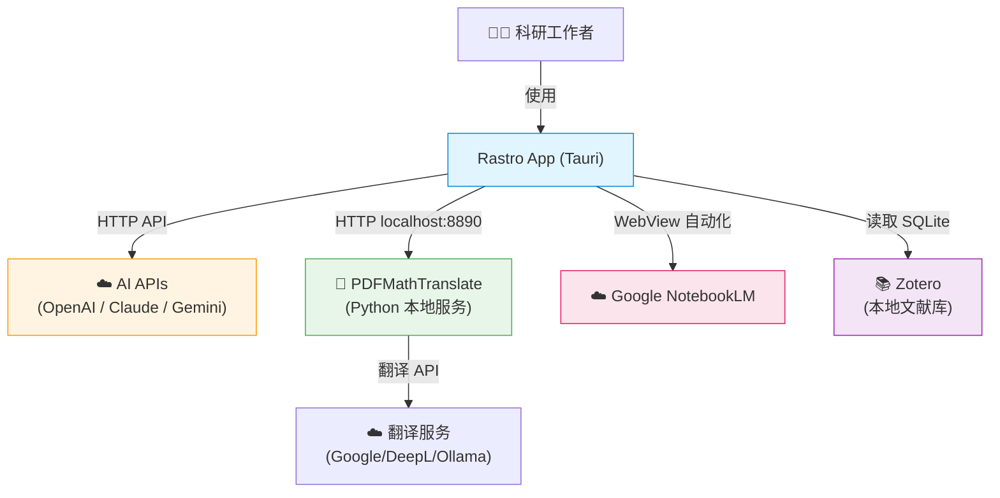
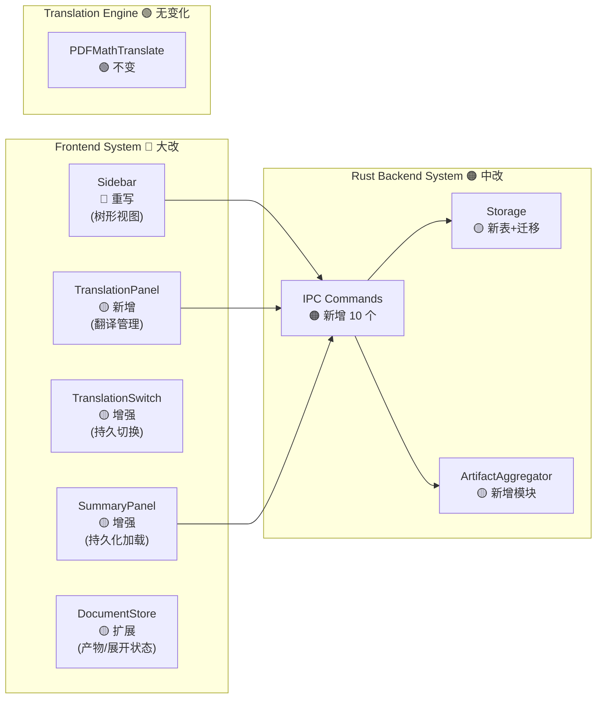
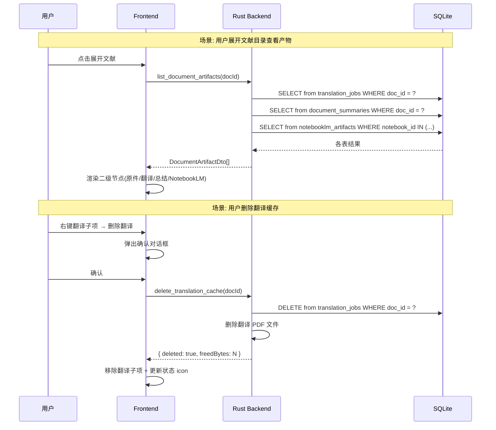

# 系统架构总览 (Architecture Overview)

**项目**: Rastro - AI 学术文献阅读器
**版本**: 2.0
**前序版本**: 1.0
**日期**: 2026-03-16

---

## 1. 系统上下文 (System Context)

> v2 系统上下文与 v1 相同。Rastro 仍然是 Tauri 2.0 桌面应用，连接 AI APIs、PDFMathTranslate、NotebookLM 和 Zotero。

### 1.1 C4 Level 1 - 系统上下文图



---

## 2. v2 变更范围 (v2 Change Scope)

> ⚠️ v2 聚焦于**文档管理系统**的迭代。系统边界保持 3 个系统不变，变化集中在 Frontend System 和 Rust Backend System 的内部模块。

### 2.1 v2 变更架构热力图



### 2.2 变更分类

| 模块 | 变更级别 | 说明 |
|------|:-------:|------|
| **Sidebar (前端)** | 🔴 重写 | 从双 Tab 扁平列表 → Zotero 式树形视图 |
| **TranslationPanel (前端)** | 🟡 新增 | 翻译详情/重新翻译/删除翻译管理面板 |
| **TranslationSwitch (前端)** | 🟡 增强 | 新增工具栏分段控件，保留 Option 键 |
| **SummaryPanel (前端)** | 🟡 增强 | 加载已保存的总结，支持重新生成 |
| **DocumentStore (前端)** | 🟡 扩展 | 新增产物列表、展开状态、筛选状态 |
| **IPC Commands (后端)** | 🟠 新增 | 10 个新命令 + 2 个修改 (见 PRD §6) |
| **Storage (后端)** | 🟡 新增 | `document_summaries` 表 + `documents` 表字段迁移 |
| **ArtifactAggregator (后端)** | 🟡 新增 | 聚合翻译/总结/NotebookLM 产物的查询层 |
| **Translation Engine** | 🟢 无变化 | Python 翻译引擎不受影响 |

---

## 3. 系统清单 (System Inventory)

### System 1: Frontend System (v2 更新)
**系统 ID**: `frontend-system`

**v2 新增/变更子模块**:

| 子模块 | v1 状态 | v2 变化 |
|-------|:------:|--------|
| `sidebar/Sidebar.tsx` | 双 Tab + 扁平列表 | 🔴 → 重写为 `DocumentTree.tsx`（树形视图） |
| `sidebar/ZoteroList.tsx` | 独立 Zotero 列表 | 🔴 → 合并入 DocumentTree（统一列表） |
| `pdf-viewer/TranslationSwitch.tsx` | Option 键切换 | 🟡 → 增加工具栏分段控件 |
| `pdf-viewer/TranslationPanel.tsx` | 不存在 | 🟡 → 新增翻译管理面板 |
| `summary/SummaryPanel.tsx` | 仅流式输出 | 🟡 → 增加持久化加载 |
| `stores/useDocumentStore.ts` | 基础文档状态 | 🟡 → 扩展产物列表、展开状态 |
| `shared/types.ts` | v1 IPC 类型 | 🟡 → 新增 v2 DTO 类型 |
| `lib/ipc-client.ts` | v1 IPC 方法 | 🟡 → 新增 v2 IPC 方法 |

**新增依赖**: 无（复用 `@tanstack/react-virtual`）

---

### System 2: Rust Backend System (v2 更新)
**系统 ID**: `rust-backend-system`

**v2 新增/变更子模块**:

| 子模块 | v1 状态 | v2 变化 |
|-------|:------:|--------|
| `ipc/document.rs` | 基础文档命令 | 🟡 → 增加 `list_document_artifacts`, `remove_recent_document`, `toggle_document_favorite`, `reveal_in_finder` |
| `ipc/translation.rs` | 翻译命令 | 🟡 → 增加 `delete_translation_cache` |
| `ipc/ai.rs` | AI 命令 | 🟡 → 增加 `get_document_summary`, `save_document_summary`, `delete_document_summary` |
| `ipc/settings.rs` | 设置命令 | 🟡 → 增加 `get_cache_stats`, `clear_all_translation_cache` |
| `storage/document_summaries.rs` | 不存在 | 🟡 → 新增 AI 总结存储模块 |
| `storage/documents.rs` | 基础文档 CRUD | 🟡 → 增加 `is_favorite`, `is_deleted` 字段 |
| `storage/migration.rs` | v1 迁移 | 🟡 → 新增 v2 迁移脚本 |
| `artifact_aggregator.rs` | 不存在 | 🟡 → 新增产物聚合查询模块 |

---

### System 3: Translation Engine System (v2 不变)
**系统 ID**: `translation-engine-system`

> 翻译引擎无任何变化。v2 的翻译管理变更完全在前后端完成。

---

## 4. 系统边界矩阵 (v2 更新)

| 系统 | 输入 | 输出 | 新增接口(v2) |
|------|------|------|-------------|
| **Frontend** | 用户操作 | IPC 请求 | 10 个新 IPC invoke 调用 |
| **Rust Backend** | IPC 请求 | IPC 响应 | 10 个新 Command + 2 个修改 |
| **Translation Engine** | HTTP 请求 | HTTP 响应 | 无变化 |

---

## 5. 数据流图 — 文献工作空间 (v2 新增)



---

## 6. 项目结构 (v2 更新)

```text
antigravity-paper/
├── genesis/
│   ├── v1/                          # v1 架构文档 (冻结)
│   └── v2/                          # v2 架构文档 (当前版本)
│       ├── 00_MANIFEST.md
│       ├── 01_PRD.md
│       ├── 02_ARCHITECTURE_OVERVIEW.md
│       ├── 03_ADR/
│       │   ├── ADR_001_TECH_STACK.md         # 继承自 v1
│       │   ├── ADR_002_MULTI_MODEL_COLLABORATION.md  # 继承自 v1
│       │   └── ADR_003_DOCUMENT_WORKSPACE.md # v2 新增
│       ├── 04_SYSTEM_DESIGN/
│       └── 06_CHANGELOG.md
├── src/                              # React 前端
│   ├── components/
│   │   ├── sidebar/
│   │   │   ├── DocumentTree.tsx      # 🔴 新增: 树形视图主组件
│   │   │   ├── DocumentNode.tsx      # 🔴 新增: 一级节点(文献)
│   │   │   ├── ArtifactNode.tsx      # 🔴 新增: 二级节点(产物)
│   │   │   ├── DocumentContextMenu.tsx # 🔴 新增: 右键菜单
│   │   │   ├── SearchBar.tsx         # 🟡 新增: 搜索框
│   │   │   ├── GroupChips.tsx        # 🟡 新增: 分组 Chips
│   │   │   ├── Sidebar.tsx           # 🟡 重构: 容器组件
│   │   │   └── ZoteroList.tsx        # 🔴 移除: 合并入 DocumentTree
│   │   ├── pdf-viewer/
│   │   │   ├── TranslationSwitch.tsx # 🟡 增强: 添加分段控件
│   │   │   └── TranslationPanel.tsx  # 🟡 新增: 翻译管理面板
│   │   └── summary/
│   │       └── SummaryPanel.tsx      # 🟡 增强: 持久化加载
│   ├── stores/
│   │   └── useDocumentStore.ts       # 🟡 扩展: 产物列表/展开状态
│   └── shared/
│       └── types.ts                  # 🟡 扩展: 新增 v2 类型
├── src-tauri/src/                    # Rust 后端
│   ├── ipc/
│   │   ├── document.rs               # 🟡 新增命令
│   │   ├── translation.rs            # 🟡 新增 delete_translation_cache
│   │   └── ai.rs                     # 🟡 新增总结管理命令
│   ├── storage/
│   │   ├── document_summaries.rs     # 🟡 新增: AI 总结存储
│   │   ├── documents.rs              # 🟡 增加字段
│   │   └── migration.rs              # 🟡 v2 迁移脚本
│   └── artifact_aggregator.rs        # 🟡 新增: 产物聚合查询
└── ...
```

---

## 7. 下一步行动 (Next Steps)

```bash
/blueprint    # 将 v2 架构拆解为可执行的 WBS 任务清单
/forge        # 按任务清单执行代码实现
```
