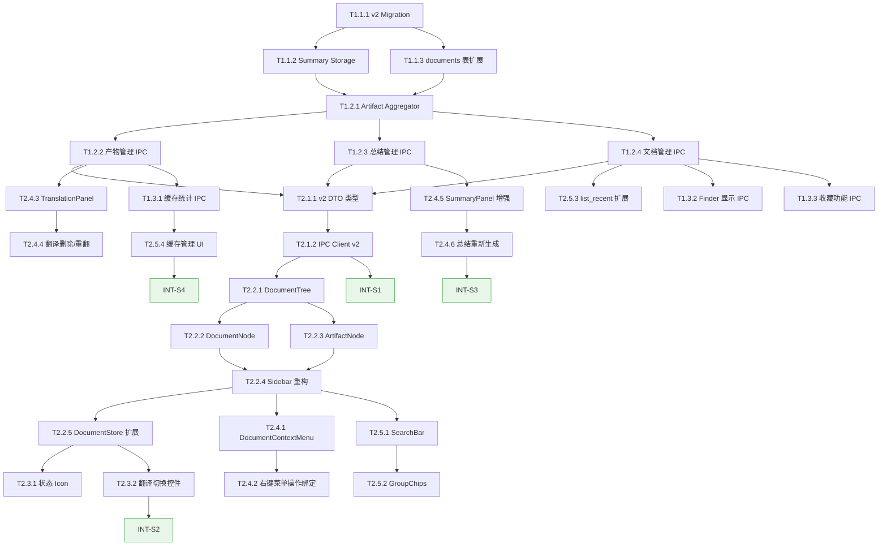

# 任务清单 (Task List) — v2 文档管理系统迭代

**版本**: 2.0
**架构源**: `genesis/v2/02_ARCHITECTURE_OVERVIEW.md`
**生成日期**: 2026-03-16
**任务总数**: 33 + 4 INT 验证任务

---

## 📊 Sprint 路线图

| Sprint | 代号 | 核心任务 | 退出标准 | 预估 |
|--------|------|---------|---------|------|
| S1 | 数据基石 | 后端数据层 + 新 IPC 契约 + 前端类型 | ① migration 执行成功 ② `list_document_artifacts` 返回聚合数据 ③ 新 DTO 类型编译通过 | 2-3d |
| S2 | 树形视图 | 侧栏重写 + 状态可视化 + 翻译切换 | ① 侧栏渲染树形列表、展开/折叠流畅 ② 产物子项可点击切换 PDF ③ 工具栏分段控件工作 ④ 状态 icon 正确显示 | 3-4d |
| S3 | 产物管理 | 翻译管理 + AI 总结持久化 + 右键菜单 | ① 右键菜单弹出且操作生效 ② 翻译可删除/重新翻译 ③ AI 总结持久化存储并在树中可见 | 3-4d |
| S4 | 搜索优化 | 搜索筛选 + 缓存管理 + 收尾打磨 | ① 搜索和分组 Chips 过滤正常 ② 设置页显示缓存统计 ③ 全部 P0 验收标准通过 | 2-3d |

---

## 🔍 依赖图总览

---

## System 1: Rust Backend System

### Phase 1: Foundation — 数据迁移与存储 (S1)

- [x] **T1.1.1** [REQ-013, REQ-010]: v2 数据库 Migration 脚本
  - **描述**: 创建 v2 migration，新增 `document_summaries` 表（以 PRD §7.1 为权威 Schema）、新增 `notebooklm_artifacts` 表（含 `document_id` 外键，支持 ArtifactAggregator 聚合查询），以及 `documents` 表的 `is_favorite`/`is_deleted` 字段
  - **输入**: PRD §7 数据模型变更 + `rust-backend-system.md` §6 现有 Schema
  - **输出**: `src-tauri/migrations/v2_document_workspace.sql`（migration 文件），包含 `CREATE TABLE document_summaries` + `CREATE TABLE notebooklm_artifacts` + `ALTER TABLE documents`
  - **验收标准**:
    - Given 现有 v1 数据库
    - When 执行 v2 migration
    - Then `document_summaries` 表创建成功（`UNIQUE(document_id)` 每文档仅一份总结），`notebooklm_artifacts` 表创建成功（含 `document_id` 外键关联 `documents` 表），`documents` 表新增 `is_favorite`、`is_deleted` 字段，原有数据不丢失
  - **验证说明**: 在现有数据库上执行 migration，验证三张表结构和字段存在；检查外键约束有效；检查已有文档记录 `is_favorite=0`、`is_deleted=0`
  - **估时**: 4h
  - **依赖**: 无
  - **优先级**: P0

- [x] **T1.1.2** [REQ-013]: AI 总结存储模块 `document_summaries.rs`
  - **描述**: 实现 `document_summaries` 表的 CRUD 操作模块。**Schema 权威源**: PRD §7.1（`UNIQUE(document_id)`, 每文档仅一份总结，含 `updated_at` 字段）
  - **输入**: T1.1.1 产出的 migration 中 `document_summaries` 表 Schema（以 PRD §7.1 为权威源，`rust-backend-system.md` §6.2 已同步对齐）
  - **输出**: `src-tauri/src/storage/document_summaries.rs`，提供 `insert_summary()`, `get_summary_by_document_id()`, `delete_summary()`, `upsert_summary()` 方法
  - **验收标准**:
    - Given `document_summaries` 表存在
    - When 调用 `upsert_summary(doc_id, content_md, provider, model)`
    - Then 插入新记录或更新已有记录（基于 `UNIQUE(document_id)` 约束），同时更新 `updated_at`，返回 `SummaryRecord`
  - **验证说明**: 编写单元测试验证 CRUD 操作正确性；特别验证 `UNIQUE(document_id)` 约束下的 upsert 逻辑（同文档切换 provider 后旧总结被替换）
  - **估时**: 3h
  - **依赖**: T1.1.1
  - **优先级**: P0

- [x] **T1.1.3** [REQ-015, REQ-016]: documents 表扩展 — `is_favorite` / `is_deleted` 字段支持
  - **描述**: 在现有 `storage/documents.rs` 中增加 `is_favorite` 和 `is_deleted` 字段的读写支持，更新查询方法
  - **输入**: T1.1.1 产出的 migration + 现有 `src-tauri/src/storage/documents.rs`
  - **输出**: 更新后的 `documents.rs`，包含 `toggle_favorite(doc_id, bool)`, `soft_delete_document(doc_id)`, `list_documents_with_filters(DocumentFilter)` 方法
  - **验收标准**:
    - Given 已有文档记录
    - When 调用 `toggle_favorite(doc_id, true)`
    - Then 该文档的 `is_favorite` 字段更新为 1
    - Given 调用 `soft_delete_document(doc_id)`
    - When 查询近期文档列表
    - Then 该文档不再出现（`is_deleted=1` 被过滤）
  - **验证说明**: 单元测试验证收藏切换、软删除和过滤查询逻辑
  - **估时**: 3h
  - **依赖**: T1.1.1
  - **优先级**: P0

### Phase 2: Core — 聚合查询与 IPC 命令 (S1)

- [x] **T1.2.1** [REQ-010]: ArtifactAggregator 产物聚合查询模块
  - **描述**: 新增 `artifact_aggregator.rs`，跨 `translation_jobs`/`translation_artifacts`、`document_summaries`、`notebooklm_artifacts` 三张表聚合查询，返回统一的 `DocumentArtifactDto[]`
  - **输入**: T1.1.2 产出的 `document_summaries.rs` + 现有 `translation_artifacts` 表 + T1.1.1 产出的 `notebooklm_artifacts` 表（通过 `document_id` 外键直接关联）
  - **输出**: `src-tauri/src/artifact_aggregator.rs`，提供 `list_artifacts_for_document(doc_id) -> Vec<DocumentArtifactDto>` 方法
  - **验收标准**:
    - Given 某文档已有翻译 PDF、AI 总结和 NotebookLM 思维导图产物
    - When 调用 `list_artifacts_for_document(doc_id)`
    - Then 返回包含 `original_pdf`、`translated_pdf`、`ai_summary`、`notebooklm_mindmap` 的 `DocumentArtifactDto[]`，每项包含 `artifactId`、`kind`、`title`、`createdAt` 等字段
  - **验证说明**: 编写集成测试在测试数据库中预设各类产物数据，验证聚合结果完整性和字段映射正确性
  - **估时**: 5h
  - **依赖**: T1.1.2, T1.1.3
  - **优先级**: P0

- [x] **T1.2.2** [REQ-010, REQ-011]: 产物管理 IPC Commands
  - **描述**: 在 `ipc/document.rs` 和 `ipc/translation.rs` 中注册新的 Tauri Commands: `list_document_artifacts`, `delete_translation_cache`
  - **输入**: T1.2.1 产出的 `ArtifactAggregator` + 现有 `translation_manager` 模块
  - **输出**: 新增 `#[tauri::command] list_document_artifacts(doc_id) -> Vec<DocumentArtifactDto>`, `#[tauri::command] delete_translation_cache(doc_id) -> DeleteCacheResult`，在 `main.rs` 中注册
  - **验收标准**:
    - Given 已注册 IPC Commands
    - When 前端调用 `invoke("list_document_artifacts", { documentId })`
    - Then 返回该文档的所有产物列表
    - Given 调用 `invoke("delete_translation_cache", { documentId })`
    - Then 删除翻译 PDF 文件和数据库记录，返回 `{ deleted: true, freedBytes: N }`
  - **验证说明**: `cargo check` 编译通过；手动通过 Tauri dev 工具验证 IPC 调用和返回值
  - **估时**: 4h
  - **依赖**: T1.2.1
  - **优先级**: P0

- [x] **T1.2.3** [REQ-013]: AI 总结管理 IPC Commands
  - **描述**: 在 `ipc/ai.rs` 中注册 `get_document_summary`, `save_document_summary`, `delete_document_summary`
  - **输入**: T1.1.2 产出的 `document_summaries.rs` CRUD 方法、T1.2.1 产出的 `ArtifactAggregator`
  - **输出**: 新增 3 个 `#[tauri::command]` 方法，在 `main.rs` 中注册
  - **验收标准**:
    - Given 用户生成了 AI 总结
    - When 调用 `invoke("save_document_summary", { documentId, contentMd, provider, model })`
    - Then 总结内容持久化到 `document_summaries` 表，返回 `AISummaryDto`
    - Given 调用 `invoke("get_document_summary", { documentId })`
    - Then 返回已保存的总结或 null
  - **验证说明**: `cargo check` 编译通过；通过 Tauri dev 调用验证存取操作
  - **估时**: 3h
  - **依赖**: T1.2.1
  - **优先级**: P0

- [x] **T1.2.4** [REQ-015, REQ-016, REQ-017]: 文档管理 IPC Commands
  - **描述**: 注册 `remove_recent_document`, `toggle_document_favorite`, `reveal_in_finder`；修改 `list_recent_documents` 增加 `query`/`filter` 参数；修改 `get_document_snapshot` 增加 `hasSummary`/`isFavorite`/`artifactCount` 字段
  - **输入**: T1.1.3 产出的 documents 扩展方法 + T1.2.1 产出的 `ArtifactAggregator`
  - **输出**: 新增 3 个 `#[tauri::command]`，修改 2 个现有 Command 的参数/返回值
  - **验收标准**:
    - Given 调用 `invoke("remove_recent_document", { documentId })`
    - When 操作完成
    - Then 文档标记 `is_deleted=1`，不再出现在近期列表
    - Given 调用 `invoke("list_recent_documents", { query: "attention", filter: { hasTranslation: true } })`
    - Then 仅返回标题含 "attention" 且已翻译的文档
  - **验证说明**: `cargo check` 编译通过；验证修改后的 `DocumentSnapshot` 返回值包含新字段
  - **估时**: 5h
  - **依赖**: T1.2.1
  - **优先级**: P0

### Phase 3: Polish — 辅助功能 IPC (S4)

- [ ] **T1.3.1** [REQ-017]: 缓存统计与清理 IPC Commands
  - **描述**: 在 `ipc/settings.rs` 中注册 `get_cache_stats`, `clear_all_translation_cache`
  - **输入**: 现有 `translation_manager` 的 `artifact_index` 模块
  - **输出**: 新增 2 个 `#[tauri::command]`，`get_cache_stats` 返回 `CacheStatsDto`（总字节数/翻译字节数/总结数/文档数），`clear_all_translation_cache` 删除所有翻译缓存文件
  - **验收标准**:
    - Given 存在翻译缓存文件
    - When 调用 `invoke("get_cache_stats")`
    - Then 返回 `{ totalBytes, translationBytes, summaryCount, documentCount }` 且数值准确
    - Given 调用 `invoke("clear_all_translation_cache")`
    - Then 所有翻译 PDF 文件被删除，数据库记录清除，返回释放的字节数
  - **验证说明**: 创建测试缓存文件后调用，验证统计数值和清理结果一致
  - **估时**: 3h
  - **依赖**: T1.2.2
  - **优先级**: P2

- [ ] **T1.3.2** [REQ-015]: Finder 显示 IPC Command
  - **描述**: 实现 `reveal_in_finder` Command，调用 macOS `open -R <filePath>` 在 Finder 中高亮显示文件
  - **输入**: 文件路径字符串
  - **输出**: `#[tauri::command] reveal_in_finder(file_path)` — 打开 Finder 并选中目标文件
  - **验收标准**:
    - Given 合法的文件路径
    - When 调用 `invoke("reveal_in_finder", { filePath })`
    - Then Finder 打开并高亮对应文件
  - **验证说明**: 手动验证 Finder 窗口弹出并选中文件
  - **估时**: 1h
  - **依赖**: T1.2.4
  - **优先级**: P1

- [ ] **T1.3.3** [REQ-015, REQ-016]: 收藏功能 IPC Command
  - **描述**: 实现 `toggle_document_favorite` Command，调用 `documents.rs` 的 `toggle_favorite()` 方法
  - **输入**: T1.1.3 产出的 `toggle_favorite()` 方法
  - **输出**: `#[tauri::command] toggle_document_favorite(doc_id, favorite)` → `{ updated: boolean }`
  - **验收标准**:
    - Given 已有文档
    - When 调用 `invoke("toggle_document_favorite", { documentId, favorite: true })`
    - Then `documents.is_favorite` 更新为 1，后续 `list_recent_documents({ filter: { isFavorite: true } })` 包含该文档
  - **验证说明**: 验证收藏切换后查询结果正确
  - **估时**: 2h
  - **依赖**: T1.2.4
  - **优先级**: P1

---

## System 2: Frontend System

### Phase 1: Foundation — 类型与 IPC 客户端 (S1)

- [ ] **T2.1.1** [REQ-010]: v2 DTO 类型定义
  - **描述**: 在 `src/shared/types.ts` 中新增 v2 类型：`DocumentArtifactDto`, `AISummaryDto`, `DocumentFilter`, `CacheStatsDto`, `ArtifactKind` 枚举
  - **输入**: PRD §6.3 DTO 类型定义 + T1.2.2~T1.2.4 产出的 IPC Command 签名
  - **输出**: 更新后的 `src/shared/types.ts`，包含所有 v2 新增类型定义，同时更新 `DocumentSnapshot` 增加 `hasSummary`, `isFavorite`, `artifactCount` 字段
  - **验收标准**:
    - Given 新增类型已定义
    - When TypeScript 编译
    - Then 零类型错误
  - **验证说明**: `npx tsc --noEmit` 通过；检查类型定义与后端 Command 签名对齐
  - **估时**: 2h
  - **依赖**: T1.2.2, T1.2.3, T1.2.4
  - **优先级**: P0

- [ ] **T2.1.2** [REQ-010]: IPC Client v2 方法
  - **描述**: 在 `src/lib/ipc-client.ts` 中新增 v2 IPC 调用方法：`listDocumentArtifacts()`, `deleteTranslationCache()`, `getDocumentSummary()`, `saveDocumentSummary()`, `deleteDocumentSummary()`, `removeRecentDocument()`, `revealInFinder()`, `toggleDocumentFavorite()`, `getCacheStats()`, `clearAllTranslationCache()`
  - **输入**: T2.1.1 产出的类型定义
  - **输出**: 更新后的 `src/lib/ipc-client.ts`，10 个新增方法 + 2 个修改方法参数签名
  - **验收标准**:
    - Given IPC 方法已实现
    - When TypeScript 编译
    - Then 所有方法签名与后端 Command 对齐，零类型错误
  - **验证说明**: `npx tsc --noEmit` 通过；验证方法名称与后端 Command 名称一致
  - **估时**: 3h
  - **依赖**: T2.1.1
  - **优先级**: P0

### Phase 2: Core — 树形视图组件 (S2)

- [ ] **T2.2.1** [REQ-010]: DocumentTree 主组件 — 虚拟化树形列表
  - **描述**: 实现 `src/components/sidebar/DocumentTree.tsx`，使用 `@tanstack/react-virtual` 的虚拟化 + ADR-003 的扁平化策略，将文档列表渲染为可展开/折叠的树形视图
  - **输入**: T2.1.2 产出的 `listDocumentArtifacts()` IPC 方法 + ADR-003 的 `FlatNode` 扁平化设计
  - **输出**: `src/components/sidebar/DocumentTree.tsx` — 接收 `DocumentSnapshot[]` 和展开状态，渲染虚拟化的文档+产物列表
  - **验收标准**:
    - Given 文档列表超过 20 条
    - When 滚动
    - Then 虚拟化渲染生效，DOM 节点数不超过可视区域的 2 倍
    - Given 点击展开箭头
    - When 展开完成
    - Then 显示产物子项（原件/翻译/总结/NotebookLM）
  - **验证说明**: 检查组件渲染正确性；DevTools 确认虚拟化生效（DOM 节点数受控）；展开/折叠动画流畅
  - **估时**: 6h
  - **依赖**: T2.1.2
  - **优先级**: P0

- [ ] **T2.2.2** [REQ-010, REQ-014]: DocumentNode 一级节点组件
  - **描述**: 实现 `src/components/sidebar/DocumentNode.tsx`，渲染文献一级节点：标题、作者、来源标签（本地/Zotero）、状态 icon 聚合、展开/折叠箭头
  - **输入**: T2.2.1 产出的 `DocumentTree` 组件框架 + `DocumentSnapshot` 类型
  - **输出**: `src/components/sidebar/DocumentNode.tsx` — 显示文献标题、元信息、状态 icon (🌐📝🧠)
  - **验收标准**:
    - Given 文献已翻译且有总结
    - When 查看折叠状态的节点
    - Then 标题右侧显示 🌐📝 icon
    - Given 多个状态 icon 超过 3 个
    - When 查看
    - Then 显示前 3 个 + "+N"
  - **验证说明**: 检查各种状态组合（无产物/仅翻译/全有）下节点渲染正确
  - **估时**: 4h
  - **依赖**: T2.2.1
  - **优先级**: P0

- [ ] **T2.2.3** [REQ-010]: ArtifactNode 二级节点组件
  - **描述**: 实现 `src/components/sidebar/ArtifactNode.tsx`，渲染产物二级节点：icon + 产物名称 + 元信息（provider/日期/大小）
  - **输入**: T2.2.1 产出的 `DocumentTree` 组件框架 + `DocumentArtifactDto` 类型
  - **输出**: `src/components/sidebar/ArtifactNode.tsx` — 按 `kind` 渲染不同 icon（📄🌐📝🧠），点击触发对应操作（切换 PDF/显示总结）
  - **验收标准**:
    - Given 点击 "🌐 翻译 PDF" 子项
    - When 点击完成
    - Then PDF 阅读区切换显示翻译 PDF
    - Given 点击 "📝 AI 总结" 子项
    - When 点击完成
    - Then 右侧面板切换显示已保存的 AI 总结
  - **验证说明**: 检查各类产物子项的点击行为和渲染样式
  - **估时**: 4h
  - **依赖**: T2.2.1
  - **优先级**: P0

- [ ] **T2.2.4** [REQ-010]: Sidebar 容器组件重构
  - **描述**: 重构 `src/components/sidebar/Sidebar.tsx`，移除 v1 双 Tab 设计（删除 `ZoteroList.tsx`），整合 `DocumentTree` 为统一的文献列表容器
  - **输入**: T2.2.2 产出的 `DocumentNode` + T2.2.3 产出的 `ArtifactNode` + 现有 `Sidebar.tsx`
  - **输出**: 重构后的 `src/components/sidebar/Sidebar.tsx` — 容器布局（搜索框 + Chips + DocumentTree + 底栏操作），`ZoteroList.tsx` 标记为废弃/删除
  - **验收标准**:
    - Given 重构完成
    - When 打开侧栏
    - Then 显示统一树形列表（本地+Zotero 文献混合），无双 Tab
    - Then 底部保留 "打开本地 PDF" 按钮和设置入口
  - **验证说明**: 视觉对比 PRD §5.1 的侧栏设计稿；确认 ZoteroList.tsx 已移除
  - **估时**: 4h
  - **依赖**: T2.2.2, T2.2.3
  - **优先级**: P0

- [ ] **T2.2.5** [REQ-010]: DocumentStore 扩展 — 产物列表与展开状态
  - **描述**: 在 `src/stores/useDocumentStore.ts` 中新增：`artifactsByDocId: Record<string, DocumentArtifactDto[]>`, `expandedDocIds: Set<string>`, `toggleExpand(docId)`, `loadArtifacts(docId)`, `searchQuery`, `activeFilter`
  - **输入**: T2.2.4 产出的 Sidebar 重构 + T2.1.2 产出的 IPC Client 方法
  - **输出**: 扩展后的 `useDocumentStore.ts`，管理展开状态、产物缓存、搜索和筛选状态
  - **验收标准**:
    - Given 用户展开文献
    - When `toggleExpand(docId)` 被调用
    - Then 文献 ID 加入 `expandedDocIds`，触发 `loadArtifacts(docId)` 加载产物列表
    - Given 产物已加载
    - When 再次折叠并展开
    - Then 使用缓存数据，不重复请求
  - **验证说明**: 编写 Zustand store 单元测试验证状态变更逻辑
  - **估时**: 4h
  - **依赖**: T2.2.4
  - **优先级**: P0

### Phase 3: Enhancement — 状态可视化与翻译切换 (S2)

- [ ] **T2.3.1** [REQ-014]: 文档状态 Icon 组件
  - **描述**: 实现状态 icon 聚合渲染逻辑：🌐（已翻译）📝（有总结）🧠（有 NotebookLM 产物）⟳（翻译中动画），嵌入到 `DocumentNode` 中
  - **输入**: T2.2.5 产出的 DocumentStore（`artifactsByDocId` 缓存）+ `DocumentSnapshot` 的 `cachedTranslation`、`hasSummary`、`artifactCount` 字段
  - **输出**: 状态 icon 渲染逻辑集成到 `DocumentNode.tsx`，包含翻译中的旋转动画
  - **验收标准**:
    - Given 文献正在翻译中
    - When 查看侧栏
    - Then 显示旋转加载 icon
    - Given 文献有多种产物
    - When 折叠状态查看
    - Then icon 并列显示，不超过 3 个
  - **验证说明**: 检查图标在各种状态组合下正确显示；翻译进行中的动画效果
  - **估时**: 3h
  - **依赖**: T2.2.5
  - **优先级**: P0

- [ ] **T2.3.2** [REQ-012]: 翻译 PDF 切换分段控件
  - **描述**: 在 `src/components/pdf-viewer/TranslationSwitch.tsx` 中增加工具栏分段控件 `[原文 | 译文]`，有翻译时显示，点击切换 PDF 源；保留 Option 键快捷方式兼容
  - **输入**: T2.2.5 产出的 DocumentStore（选中文档的翻译状态）+ 现有 `TranslationSwitch.tsx`
  - **输出**: 增强后的 `TranslationSwitch.tsx` — 工具栏显示分段控件（SegmentedControl），选中状态高亮，与侧栏点击互联同步
  - **验收标准**:
    - Given 当前文档已有翻译
    - When 查看 PDF 工具栏
    - Then 出现 `[原文 ◉ 译文]` 分段控件，当前选中状态高亮
    - Given 在侧栏点击 "翻译 PDF" 子项
    - When 切换完成
    - Then 工具栏控件自动同步为 "译文" 选中
    - Given 文档没有翻译
    - When 查看工具栏
    - Then 切换控件不显示
  - **验证说明**: 视觉检查控件样式与交互；验证 Option 键快捷方式仍然工作
  - **估时**: 4h
  - **依赖**: T2.2.5
  - **优先级**: P0

### Phase 4: 产物管理功能 (S3)

- [ ] **T2.4.1** [REQ-015]: DocumentContextMenu 右键菜单组件
  - **描述**: 实现 `src/components/sidebar/DocumentContextMenu.tsx`，根据节点类型（一级/二级）和节点状态动态生成菜单项
  - **输入**: T2.2.4 产出的 Sidebar 组件 + PRD §5.3 右键菜单设计
  - **输出**: `DocumentContextMenu.tsx` — 使用 Radix UI ContextMenu，一级节点菜单（翻译全文/生成AI总结/Finder显示/移除/收藏）+ 二级节点菜单（查看详情/重操作/删除）
  - **验收标准**:
    - Given 右键点击文献一级节点
    - When 菜单弹出
    - Then 包含 `翻译全文`/`生成AI总结`/`在Finder中显示`/`从历史移除`/`收藏`
    - Given 右键点击翻译产物二级节点
    - When 菜单弹出
    - Then 包含 `查看翻译详情`/`重新翻译`/`删除翻译`
    - Given 操作条件不满足（如未翻译时"重新翻译"）
    - When 查看菜单项
    - Then 不可用项灰显
  - **验证说明**: 验证各类节点的右键菜单内容和灰显逻辑
  - **估时**: 5h
  - **依赖**: T2.2.4
  - **优先级**: P1

- [ ] **T2.4.2** [REQ-015]: 右键菜单操作逻辑绑定
  - **描述**: 为菜单项绑定实际操作：调用 `requestTranslation()`、`generateSummary()`、`revealInFinder()`、`removeRecentDocument()`、`toggleDocumentFavorite()` 等 IPC 方法，并在操作完成后刷新侧栏状态
  - **输入**: T2.4.1 产出的 `DocumentContextMenu` + T2.1.2 产出的 IPC Client 方法
  - **输出**: 完整绑定的右键菜单操作 + 确认对话框（删除/移除操作需二次确认）
  - **验收标准**:
    - Given 右键文献 → 点击 "翻译全文"
    - When 翻译请求发出
    - Then 侧栏该文献显示翻译进度
    - Given 右键文献 → 点击 "从历史移除"
    - When 弹出确认框并确认
    - Then 文献从列表中消失
  - **验证说明**: 手动执行各菜单项操作，验证端到端效果
  - **估时**: 4h
  - **依赖**: T2.4.1
  - **优先级**: P1

- [ ] **T2.4.3** [REQ-011]: TranslationPanel 翻译管理面板
  - **描述**: 新增 `src/components/pdf-viewer/TranslationPanel.tsx`，显示翻译详情（provider/model/翻译时间/文件大小）+ 重新翻译/删除翻译操作按钮
  - **输入**: T1.2.2 产出的 `deleteTranslationCache()` + `listDocumentArtifacts()` IPC 方法 + `TranslationJobDto` 类型
  - **输出**: `TranslationPanel.tsx` — 信息卡片 + "重新翻译"按钮（可选更换 provider/model）+ "删除翻译"按钮（二次确认）
  - **验收标准**:
    - Given 选择 "查看翻译详情"
    - When 面板显示
    - Then 正确展示 provider 名称、模型版本、翻译时间、文件大小
    - Given 选择 "重新翻译"
    - When 弹出对话框
    - Then 可选更换 provider/model，确认后发起 `forceRefresh: true` 翻译请求
    - Given 选择 "删除翻译"
    - When 确认删除
    - Then 翻译 PDF 和数据库记录被删除，侧栏状态更新
  - **验证说明**: 检查面板信息展示正确性；验证删除操作后文件确实被移除
  - **估时**: 5h
  - **依赖**: T1.2.2
  - **优先级**: P0

- [ ] **T2.4.4** [REQ-011]: 翻译删除与重新翻译流程集成
  - **描述**: 将 `TranslationPanel` 的操作与 `DocumentStore` 和侧栏状态联动：删除翻译后自动移除产物子项、更新状态 icon；重新翻译时显示进度
  - **输入**: T2.4.3 产出的 `TranslationPanel` + T2.2.5 产出的 `DocumentStore`
  - **输出**: 完整的翻译产物生命周期管理流程，状态自动同步
  - **验收标准**:
    - Given 删除翻译
    - When 操作完成
    - Then 侧栏翻译子项消失，状态 icon 🌐 移除，工具栏切换控件隐藏
    - Given 重新翻译进行中
    - When 查看侧栏
    - Then 显示 "⟳ 翻译中..." 子项，可取消
  - **验证说明**: 端到端验证删除→状态更新→重翻→进度显示的完整流程
  - **估时**: 3h
  - **依赖**: T2.4.3
  - **优先级**: P0

- [ ] **T2.4.5** [REQ-013]: SummaryPanel 增强 — 持久化加载
  - **描述**: 增强 `src/components/summary/SummaryPanel.tsx`，优先加载已保存的总结（调用 `getDocumentSummary()`）；总结生成完成后自动调用 `saveDocumentSummary()` 持久化
  - **输入**: T1.2.3 产出的 `getDocumentSummary()`/`saveDocumentSummary()` IPC 方法 + 现有 `SummaryPanel.tsx` 的流式渲染逻辑
  - **输出**: 增强后的 `SummaryPanel.tsx` — 打开文档时检查已保存总结并直接渲染 Markdown；新生成的总结自动持久化
  - **验收标准**:
    - Given 用户对某文档已生成过 AI 总结
    - When 重新打开该文档并点击 "📝 AI 总结" 子项
    - Then 直接渲染已保存的总结内容，无需重新生成
    - Given 新生成的总结完成
    - When `ai://stream-finished` 事件触发
    - Then 自动调用 `saveDocumentSummary()` 持久化
  - **验证说明**: 验证已保存总结的加载和新总结的自动保存；关闭重开后总结仍在
  - **估时**: 4h
  - **依赖**: T1.2.3
  - **优先级**: P0

- [ ] **T2.4.6** [REQ-013]: 总结重新生成与右键集成
  - **描述**: 在 AI 总结子项的右键菜单中绑定 "重新生成" 操作：弹出确认框（提示消耗 API 额度），确认后调用 `generateSummary()` 重新生成并替换旧总结
  - **输入**: T2.4.5 产出的 `SummaryPanel` + T2.4.1 产出的 `DocumentContextMenu`
  - **输出**: 完整的总结重新生成流程 + "导出为 Markdown" 操作（将总结内容写入文件并通过系统对话框保存）
  - **验收标准**:
    - Given 右键 AI 总结子项 → "重新生成"
    - When 确认后总结重新生成完成
    - Then 旧总结被新总结替换，`updatedAt` 更新
    - Given 右键 AI 总结子项 → "导出为 Markdown"
    - When 弹出保存对话框
    - Then 总结内容写入 `.md` 文件
  - **验证说明**: 验证重新生成后旧总结被替换；导出的 Markdown 文件内容完整
  - **估时**: 3h
  - **依赖**: T2.4.5
  - **优先级**: P0

### Phase 5: 搜索与缓存管理 (S4)

- [ ] **T2.5.1** [REQ-016]: SearchBar 搜索组件
  - **描述**: 实现 `src/components/sidebar/SearchBar.tsx`，带 300ms 防抖的搜索输入框，搜索文献标题和文件名
  - **输入**: T2.2.4 产出的 Sidebar 布局 + T2.2.5 产出的 DocumentStore（`searchQuery` 状态）
  - **输出**: `SearchBar.tsx` — 带 placeholder "🔍 搜索文献..."、300ms 防抖、清空按钮，更新 DocumentStore 的 `searchQuery`
  - **验收标准**:
    - Given 用户在搜索框输入关键词
    - When 防抖 300ms 后
    - Then 文献列表仅显示标题或文件名匹配的条目
  - **验证说明**: 验证防抖行为和过滤效果；快速连续输入时不应卡顿
  - **估时**: 3h
  - **依赖**: T2.2.4
  - **优先级**: P1

- [ ] **T2.5.2** [REQ-016]: GroupChips 分组筛选组件
  - **描述**: 实现 `src/components/sidebar/GroupChips.tsx`，水平排列的 Chips：`全部` / `已翻译` / `有总结` / `收藏`，点击切换过滤条件
  - **输入**: T2.5.1 产出的 SearchBar + T2.2.5 产出的 DocumentStore（`activeFilter` 状态）
  - **输出**: `GroupChips.tsx` — Chip 组件带选中高亮，更新 DocumentStore 的 `activeFilter`
  - **验收标准**:
    - Given 点击 "已翻译" Chip
    - When 过滤生效
    - Then 仅显示有翻译产物的文献
    - Given 搜索和分组筛选叠加使用
    - When 同时启用搜索词和筛选条件
    - Then 两者 AND 组合过滤
  - **验证说明**: 验证各 Chip 的过滤效果和组合过滤逻辑
  - **估时**: 3h
  - **依赖**: T2.5.1
  - **优先级**: P1

- [ ] **T2.5.3** [REQ-016]: list_recent_documents 前端调用适配
  - **描述**: 修改前端对 `list_recent_documents` 的调用，传入 `query` 和 `filter` 参数（与 SearchBar + GroupChips 联动）
  - **输入**: T2.1.2 产出的修改后 IPC 方法 + T2.5.2 产出的 GroupChips
  - **输出**: 更新后的文档列表加载逻辑，支持搜索和筛选参数
  - **验收标准**:
    - Given 用户搜索 "attention" 并选中 "已翻译" Chip
    - When 列表刷新
    - Then 后端返回已过滤的文档列表
  - **验证说明**: 验证前后端参数传递正确；确认后端过滤生效
  - **估时**: 2h
  - **依赖**: T1.2.4, T2.5.2
  - **优先级**: P1

- [ ] **T2.5.4** [REQ-017]: 缓存管理 UI（设置页）
  - **描述**: 在设置页新增 "存储管理" 区域：显示翻译缓存总大小、AI 总结存储大小、文档数量；提供 "清理所有翻译缓存" 按钮（二次确认）
  - **输入**: T1.3.1 产出的 `getCacheStats()` / `clearAllTranslationCache()` IPC 方法
  - **输出**: 设置页存储管理区域 UI + 清理操作逻辑
  - **验收标准**:
    - Given 打开设置页
    - When 查看存储管理区域
    - Then 正确显示翻译缓存大小（格式化为 MB/GB）、总结数量
    - Given 点击 "清理所有翻译缓存"
    - When 确认清理
    - Then 所有翻译缓存被删除，显示释放空间大小
  - **验证说明**: 验证统计数值准确；清理后数值归零
  - **估时**: 3h
  - **依赖**: T1.3.1
  - **优先级**: P2

---

## 🎯 集成验证任务

- [ ] **INT-S1** [MILESTONE]: S1 集成验证 — 数据基石
  - **描述**: 验证 S1 退出标准，确认数据层和 IPC 契约全部就绪
  - **输入**: S1 所有任务的产出（T1.1.1~T1.2.4, T2.1.1~T2.1.2）
  - **输出**: 集成验证报告（通过/失败 + Bug 清单）
  - **验收标准**:
    - Given S1 所有任务已完成
    - When 执行以下检查：① `cargo check` 编译通过 ② 新 migration 在干净数据库执行成功 ③ `list_document_artifacts` IPC 调用返回正确聚合数据 ④ 前端 `npx tsc --noEmit` 通过
    - Then 全部通过 → S1 完成; 有失败 → 记录 Bug 并触发修复
  - **验证说明**: 逐条执行退出标准，截图/日志确认
  - **估时**: 3h
  - **依赖**: T2.1.2

- [ ] **INT-S2** [MILESTONE]: S2 集成验证 — 树形视图
  - **描述**: 验证 S2 退出标准，确认侧栏树形视图完整可用
  - **输入**: S2 所有任务的产出（T2.2.1~T2.3.2）
  - **输出**: 集成验证报告（通过/失败 + Bug 清单）
  - **验收标准**:
    - Given S2 所有任务已完成
    - When 执行以下检查：① 侧栏渲染统一树形列表（无双 Tab）② 展开文献显示产物子项 ③ 点击产物切换 PDF/显示总结 ④ 翻译切换控件工作 ⑤ 状态 icon 正确显示 ⑥ 虚拟化列表滚动流畅
    - Then 全部通过 → S2 完成; 有失败 → 记录 Bug 并触发修复
  - **验证说明**: 手动操作验证所有交互行为，录屏确认
  - **估时**: 3h
  - **依赖**: T2.3.2

- [ ] **INT-S3** [MILESTONE]: S3 集成验证 — 产物管理
  - **描述**: 验证 S3 退出标准，确认产物全生命周期管理可用
  - **输入**: S3 所有任务的产出（T2.4.1~T2.4.6）
  - **输出**: 集成验证报告（通过/失败 + Bug 清单）
  - **验收标准**:
    - Given S3 所有任务已完成
    - When 执行以下检查：① 右键文献/产物弹出正确菜单 ② 翻译详情面板信息正确 ③ 删除翻译后状态同步 ④ AI 总结持久化存储 ⑤ 重新生成总结流程正常 ⑥ 灰显逻辑正确
    - Then 全部通过 → S3 完成; 有失败 → 记录 Bug 并触发修复
  - **验证说明**: 端到端测试每个管理操作，截图/录屏确认
  - **估时**: 3h
  - **依赖**: T2.4.6

- [ ] **INT-S4** [MILESTONE]: S4 集成验证 — 搜索优化
  - **描述**: 验证 S4 退出标准，确认搜索筛选和缓存管理功能完整
  - **输入**: S4 所有任务的产出（T2.5.1~T2.5.4, T1.3.1~T1.3.3）
  - **输出**: 集成验证报告（通过/失败 + Bug 清单）+ 全部 P0 需求验收确认
  - **验收标准**:
    - Given S4 所有任务已完成
    - When 执行以下检查：① 搜索防抖工作 ② 分组 Chips 过滤正确 ③ 搜索+筛选叠加生效 ④ 设置页缓存统计准确 ⑤ 清理缓存操作成功 ⑥ 全部 P0 需求（REQ-010~014）验收标准回归通过
    - Then 全部通过 → v2 完成; 有失败 → 记录 Bug 并触发修复
  - **验证说明**: 逐条回归 P0 验收标准，最终录屏确认
  - **估时**: 4h
  - **依赖**: T2.5.4

---

## 🎯 User Story Overlay

### US-010: 文献即目录 — 侧栏树形结构 (P0)
**涉及任务**: T1.2.1 → T1.2.2 → T2.1.1 → T2.1.2 → T2.2.1 → T2.2.2 → T2.2.3 → T2.2.4 → T2.2.5
**关键路径**: T1.1.1 → T1.2.1 → T2.1.1 → T2.1.2 → T2.2.1 → T2.2.4
**独立可测**: ✅ S2 结束即可演示
**覆盖状态**: ✅ 完整

### US-011: 翻译产物生命周期管理 (P0)
**涉及任务**: T1.2.2 → T2.4.3 → T2.4.4
**关键路径**: T1.2.1 → T1.2.2 → T2.4.3 → T2.4.4
**独立可测**: ✅ S3 结束即可演示
**覆盖状态**: ✅ 完整

### US-012: 翻译 PDF 切换增强 (P0)
**涉及任务**: T2.3.2
**关键路径**: T2.2.5 → T2.3.2
**独立可测**: ✅ S2 结束即可演示
**覆盖状态**: ✅ 完整

### US-013: AI 总结持久化管理 (P0)
**涉及任务**: T1.1.1 → T1.1.2 → T1.2.1 → T1.2.3 → T2.4.5 → T2.4.6
**关键路径**: T1.1.1 → T1.1.2 → T1.2.3 → T2.4.5 → T2.4.6
**独立可测**: ✅ S3 结束即可演示
**覆盖状态**: ✅ 完整

### US-014: 侧栏文档状态可视化 (P0)
**涉及任务**: T2.2.2 → T2.3.1
**关键路径**: T2.2.5 → T2.3.1
**独立可测**: ✅ S2 结束即可演示
**覆盖状态**: ✅ 完整

### US-015: 右键上下文菜单 (P1)
**涉及任务**: T2.4.1 → T2.4.2 + T1.3.2 + T1.3.3
**关键路径**: T2.2.4 → T2.4.1 → T2.4.2
**独立可测**: ✅ S3 结束即可演示
**覆盖状态**: ✅ 完整

### US-016: 侧栏搜索与分组筛选 (P1)
**涉及任务**: T2.5.1 → T2.5.2 → T2.5.3 + T1.3.3
**关键路径**: T2.2.4 → T2.5.1 → T2.5.2 → T2.5.3
**独立可测**: ✅ S4 结束即可演示
**覆盖状态**: ✅ 完整

### US-017: 翻译缓存空间管理 (P2)
**涉及任务**: T1.3.1 → T2.5.4
**关键路径**: T1.2.2 → T1.3.1 → T2.5.4
**独立可测**: ✅ S4 结束即可演示
**覆盖状态**: ✅ 完整

---

## 📊 统计摘要

| 类别 | 数量 |
|------|:----:|
| 总任务数 | 33 |
| P0 任务 | 21 |
| P1 任务 | 8 |
| P2 任务 | 4 |
| 集成验证任务 | 4 |
| Sprint 数 | 4 |
| 预估总工时 | ~110h |
