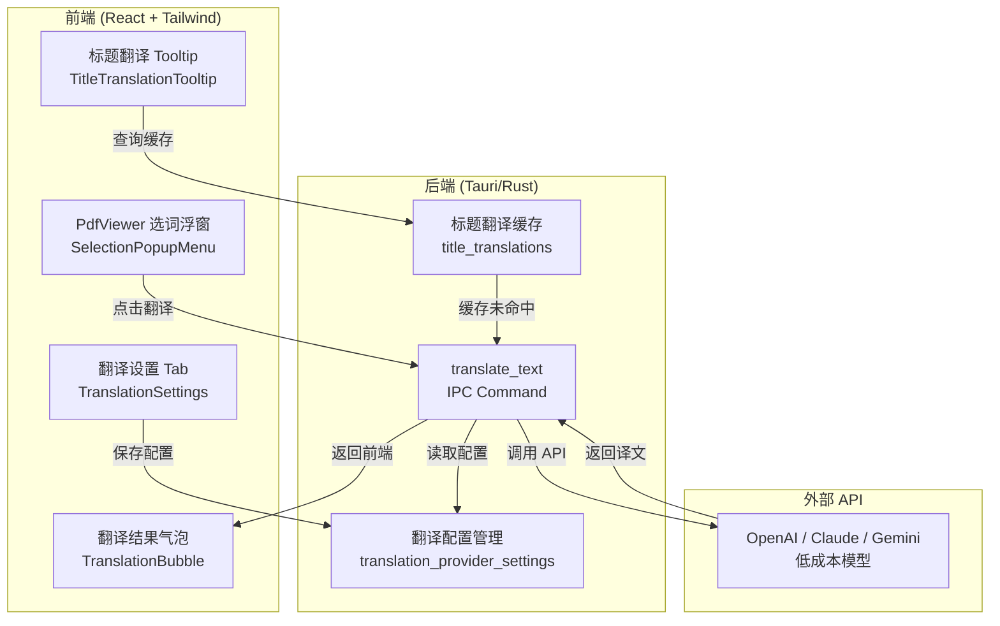

# 架构概览 — 轻量级翻译功能 (v3)

> Genesis v3 | 2026-03-18

## 1. 系统总览

本功能是对现有 Rastro 架构的**增量扩展**，不引入新系统，仅在已有系统内新增模块。

### 影响的系统

| 系统 | 变更类型 | 说明 |
|------|----------|------|
| `frontend-system` | 新增组件 | 选词浮窗菜单、翻译结果气泡、标题 Tooltip、翻译设置 Tab |
| `rust-backend-system` | 新增 IPC | 翻译请求 command、标题翻译缓存管理、翻译配置管理 |
| `storage-system` | 新增表 | `title_translations`、`translation_provider_settings` |

### 架构图



## 2. 前端组件结构

### 新增组件

```text
src/components/
├── pdf-viewer/
│   ├── SelectionPopupMenu.tsx   [NEW] 毛玻璃选词菜单（替代旧单按钮）
│   └── TranslationBubble.tsx    [NEW] 翻译结果气泡
├── sidebar/
│   └── TitleTranslationTooltip.tsx  [NEW] 标题翻译 tooltip
└── settings/
    └── TranslationSettings.tsx  [NEW] 翻译 API 配置 Tab
```

### 修改组件

```text
src/components/
├── pdf-viewer/
│   └── PdfViewer.tsx          [MODIFY] 替换 selectionPopup 单按钮为 SelectionPopupMenu
├── sidebar/
│   └── ZoteroList.tsx         [MODIFY] 条目 hover 时显示 TitleTranslationTooltip
└── settings/
    └── SettingsPanel.tsx      [MODIFY] 新增「翻译」Tab
```

## 3. 后端 IPC 增量

### 新增 Commands

| Command | 参数 | 返回 | 说明 |
|---------|------|------|------|
| `translate_text` | `{ text: string }` | `{ translated: string }` | 使用翻译 Provider 翻译文本片段 |
| `get_title_translation` | `{ title: string }` | `{ translated?: string }` | 查询标题翻译缓存 |
| `batch_translate_titles` | `{ titles: string[] }` | `{ results: Record<string, string> }` | 批量翻译标题（限流串行） |
| `save_translation_provider_key` | `{ provider, apiKey }` | `TranslationProviderConfigDto` | 保存翻译 API Key |
| `list_translation_provider_configs` | — | `TranslationProviderConfigDto[]` | 列出翻译 Provider 配置 |
| `set_active_translation_provider` | `{ provider, model }` | `TranslationProviderConfigDto` | 设置活跃翻译 Provider |
| `test_translation_connection` | `{ provider }` | `ProviderConnectivityDto` | 测试翻译 API 连接 |

### 新增文件

```text
src-tauri/src/
├── ipc/
│   └── translation_settings.rs  [NEW] 翻译配置 IPC commands
├── storage/
│   └── title_translations.rs    [NEW] 标题翻译缓存 CRUD
│   └── translation_provider_settings.rs  [NEW] 翻译 Provider 配置 CRUD
```

## 4. 数据流

### 划词翻译流程

```
用户选中文字 → updateSelectionPopup() → 显示 SelectionPopupMenu
→ 用户点击「翻译」 → ipcClient.translateText({ text })
→ 后端读取 translation_provider_settings → 调用外部 API
→ 返回翻译结果 → 显示 TranslationBubble
```

### 标题翻译流程

```
Zotero 同步新文献 → 后端 artifact_aggregator 检测新条目
→ 检查 title_translations 缓存 → 未命中
→ 队列化调用 translate_text → 缓存结果到 title_translations
→ 前端 hover 时查询缓存 → 显示 TitleTranslationTooltip
```

### 启动时缓存补全流程

```
应用启动 → 后端初始化完成
→ 检查翻译 API 是否已配置 → 未配置则跳过
→ 查询所有已入库文献标题 LEFT JOIN title_translations
→ 过滤出状态为英文且无缓存的条目
→ spawn 后台任务，串行限速 (1 req/s) 调用 translate_text
→ 结果逐条写入 title_translations
```

## 5. 技术决策

### ADR-301: 翻译配置与主 AI 配置隔离

**决策**: 使用独立的 `translation_provider_settings` 表和独立的 Keychain 前缀（`translation_`），而非复用/扩展现有 `provider_settings`。

**理由**:
- 用户明确要求"垃圾模型就行"，配置目标与主 AI 功能完全不同
- 避免配置耦合导致相互影响
- Keychain 隔离确保删除翻译 Key 不会影响主 AI Key

**权衡**: 代码有一定冗余（翻译配置 IPC 与主配置结构相似），但换来的隔离性和安全性更值得。

### ADR-302: 标题翻译时机

**决策**: 在 Zotero 同步完成后，由后端异步触发标题翻译（非实时 hover 时翻译）。

**理由**:
- 避免 hover 时用户等待 API 响应
- 缓存优先，首次加载后所有 hover 都是即时的
- 串行限速（1 req/s）避免打满低成本 API 配额
