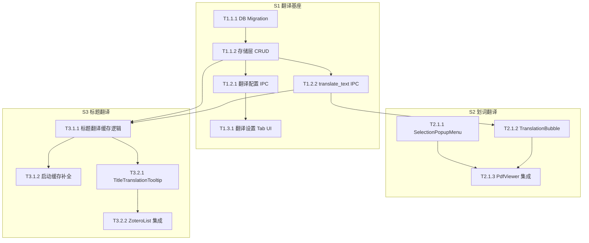

# 05_TASKS.md — 轻量级翻译功能 (Genesis v3)

> Blueprint | 2026-03-18 | 基于 `genesis/v3/01_PRD.md` + `genesis/v3/02_ARCHITECTURE_OVERVIEW.md`

---

## 📊 Sprint 路线图

| Sprint | 代号 | 核心任务 | 退出标准 | 预估 |
|--------|------|---------|---------|------|
| S1 | 翻译基座 | 存储层 + 后端 IPC + 翻译 API 配置 UI | 翻译 API 可配置、可测试连接、`translate_text` IPC 可调用返回翻译结果 | 6-8h |
| S2 | 划词翻译 | 选词浮窗重设计 + 翻译气泡 + 调用串联 | 在 PDF 中选中文字→弹出毛玻璃菜单→点击翻译→显示翻译结果 | 4-6h |
| S3 | 标题翻译 | 标题翻译缓存 + hover tooltip + 启动补全 | Zotero 同步后英文标题自动翻译、hover 显示中文译名、启动补全无遗漏 | 4-6h |

---

## 🔗 Mermaid 依赖图

---

## 📋 WBS 任务清单

---

### 🏗️ S1 — 翻译基座

#### T1: 存储层

---

- [x] **T1.1.1** [REQ-305]: 新增翻译相关 DB Migration
  - **描述**: 创建 SQLite migration 文件，新增 `translation_provider_settings` 表和 `title_translations` 表
  - **输入**: PRD §4 数据模型增量（`title_translations` 表结构 + `translation_provider_settings` 表结构）
  - **输出**: `src-tauri/migrations/YYYYMMDD_HHMMSS_add_translation_tables.sql` migration 文件
  - **验收标准**:
    - Given migration 文件已创建
    - When 应用启动执行 migration
    - Then `translation_provider_settings` 和 `title_translations` 两张表成功创建，字段类型与 PRD §4 一致
  - **验证说明**: 启动应用后通过 SQLite CLI 或后端日志确认两张表存在且 schema 正确
  - **估时**: 1h
  - **依赖**: 无

---

- [x] **T1.1.2** [REQ-305, REQ-303]: 实现存储层 CRUD 模块
  - **描述**: 新增 `src-tauri/src/storage/translation_provider_settings.rs` 和 `src-tauri/src/storage/title_translations.rs`，实现对两张表的 CRUD 操作
  - **输入**: T1.1.1 产出的 migration 创建的表 schema
  - **输出**:
    - `src-tauri/src/storage/translation_provider_settings.rs`: `list_configs()`, `upsert_config()`, `get_active_config()`, `set_active()`
    - `src-tauri/src/storage/title_translations.rs`: `get_by_hash()`, `insert()`, `list_uncached_titles(titles: Vec<String>)`, `batch_get(hashes: Vec<String>)`
  - **验收标准**:
    - Given 两个存储模块已实现
    - When 调用 CRUD 方法
    - Then 数据正确读写 SQLite，`list_uncached_titles` 正确返回未缓存的标题列表
  - **验证说明**: 编译通过；单元测试或手动调用确认 CRUD 逻辑正确
  - **估时**: 2h
  - **依赖**: T1.1.1

---

#### T2: 后端 IPC

---

- [x] **T1.2.1** [REQ-305]: 翻译配置管理 IPC Commands
  - **描述**: 新增 `src-tauri/src/ipc/translation_settings.rs`，实现翻译 Provider 配置的 IPC commands：`list_translation_provider_configs`、`save_translation_provider_key`（含 Keychain `translation_` 前缀存储）、`set_active_translation_provider`、`test_translation_connection`
  - **输入**: T1.1.2 产出的 `translation_provider_settings.rs` 存储层方法；现有 `src-tauri/src/keychain/` Keychain 模块
  - **输出**: `src-tauri/src/ipc/translation_settings.rs` 包含 4 个 `#[tauri::command]` 函数，注册到 `main.rs` 的 invoke_handler
  - **验收标准**:
    - Given IPC commands 已注册
    - When 前端调用 `invoke("list_translation_provider_configs")`
    - Then 返回 `TranslationProviderConfigDto[]` 数组；API Key 通过 Keychain `translation_{provider}` 前缀隔离存储
  - **验证说明**: 编译通过、`cargo check` 无错误；通过前端 DevTools Console 手动 invoke 验证返回格式正确
  - **估时**: 2h
  - **依赖**: T1.1.2

---

- [x] **T1.2.2** [REQ-301, REQ-303]: translate_text IPC Command
  - **描述**: 新增 `translate_text` IPC command，读取活跃翻译 Provider 配置，调用外部 AI API 翻译文本。复用 `src-tauri/src/ai_integration/` 现有 HTTP 请求逻辑，但使用独立的翻译 Provider 配置
  - **输入**: T1.1.2 产出的 `translation_provider_settings.rs` 的 `get_active_config()` 方法；现有 `ai_integration` 模块的 HTTP 请求逻辑
  - **输出**: `translate_text` IPC command（参数: `{ text: String }`，返回: `{ translated: String }`），集成到 `translation_settings.rs` 或独立文件
  - **验收标准**:
    - Given 翻译 API 已配置
    - When 前端调用 `invoke("translate_text", { text: "Hello world" })`
    - Then 返回 `{ translated: "你好世界" }` 或类似中文翻译；API 未配置时返回明确的错误信息
  - **验证说明**: 配置好翻译 API Key 后，通过 DevTools Console 手动 invoke 验证翻译结果正确
  - **估时**: 2h
  - **依赖**: T1.1.2

---

#### T3: 翻译设置 UI

---

- [x] **T1.3.1** [REQ-305]: 翻译设置 Tab 前端组件
  - **描述**: 新增 `src/components/settings/TranslationSettings.tsx` 组件，UI 参考现有 `ProviderCard.tsx`/`ModelSettings.tsx` 风格。在 `SettingsPanel.tsx` 中新增「翻译」Tab（图标: `Languages` from lucide-react）。包含：Provider 选择、API Key 输入（脱敏）、Base URL（可选）、模型名、测试连接按钮
  - **输入**: T1.2.1 产出的翻译配置 IPC commands（`list_translation_provider_configs`、`save_translation_provider_key`、`set_active_translation_provider`、`test_translation_connection`）
  - **输出**:
    - `src/components/settings/TranslationSettings.tsx` [NEW]
    - `src/components/settings/SettingsPanel.tsx` [MODIFY] — 新增「翻译」Tab
  - **验收标准**:
    - Given 用户打开设置页面
    - When 点击「翻译」Tab
    - Then 显示 Provider 配置界面，可输入 API Key、选择模型、测试连接；保存后 Keychain 存储生效
  - **验证说明**: 在应用中打开设置→翻译 Tab，输入 API Key、选择 Provider/Model、点击测试连接，确认 UI 交互正常且配置持久化
  - **估时**: 2h
  - **依赖**: T1.2.1

---

- [x] **INT-S1** [MILESTONE]: S1 集成验证 — 翻译基座
  - **描述**: 验证 S1 退出标准：翻译 API 可配置、可测试连接、`translate_text` IPC 可调用返回翻译结果
  - **输入**: S1 所有任务的产出（migration、存储层、IPC commands、翻译设置 UI）
  - **输出**: 集成验证报告（通过/失败 + Bug 清单）
  - **验收标准**:
    - Given S1 所有任务已完成
    - When 执行以下检查：1) 设置→翻译 Tab 配置 API Key 2) 点击测试连接成功 3) DevTools Console 调用 `translate_text` 返回翻译结果 4) 翻译配置与主 AI 配置独立互不影响
    - Then 全部通过 → S1 完成
  - **验证说明**: 按退出标准逐条执行，确认每项通过
  - **估时**: 1h
  - **依赖**: T1.1.1, T1.1.2, T1.2.1, T1.2.2, T1.3.1

---

### ✏️ S2 — 划词翻译

#### T1: 前端组件

---

- [x] **T2.1.1** [REQ-302]: SelectionPopupMenu 毛玻璃浮窗组件
  - **描述**: 新增 `src/components/pdf-viewer/SelectionPopupMenu.tsx`，替代现有 `PdfViewer.tsx` 中的单按钮浮窗（L1147-1165 的 `quote-popup-btn`）。毛玻璃样式参考 `NotePopup.tsx`（`backdrop-blur-2xl backdrop-saturate-150` + `rgba(255,251,245,0.38)` 背景 + `border-white/30` 边框）。包含两个按钮：「引用到对话」和「翻译」。使用 framer-motion 入场动画（`opacity: 0→1, scale: 0.9→1, y: -4→0`, 150ms）
  - **输入**: 现有 `PdfViewer.tsx` 的 `selectionPopupPosition` 状态和 `selectedText` 数据；`NotePopup.tsx` 的毛玻璃样式参考
  - **输出**: `src/components/pdf-viewer/SelectionPopupMenu.tsx` [NEW] — 接收 `position`、`selectedText`、`onQuote`、`onTranslate` props
  - **验收标准**:
    - Given 用户在 PDF 中选中文字
    - When 浮窗弹出
    - Then 显示毛玻璃风格菜单，含「引用到对话」和「翻译」两个选项；动画流畅不卡顿
  - **验证说明**: 在 PDF 阅读器中选中文字，确认浮窗毛玻璃效果、两个按钮可见、动画流畅；在 PDF 底部边缘选中文字确认浮窗自动向上弹出
  - **估时**: 2h
  - **依赖**: 无（纯前端组件）

---

- [x] **T2.1.2** [REQ-301]: TranslationBubble 翻译结果气泡组件
  - **描述**: 新增 `src/components/pdf-viewer/TranslationBubble.tsx`，在选词浮窗下方/上方显示翻译结果。同样使用毛玻璃风格。包含 loading 态（spinner）、翻译结果文本展示、错误态（"请先配置翻译 API" / "翻译失败"）。超长文本（>2000 字符）截断并提示"已截断"
  - **输入**: `translate_text` IPC command 的返回结果；`SelectionPopupMenu` 的位置信息
  - **输出**: `src/components/pdf-viewer/TranslationBubble.tsx` [NEW] — 接收 `text`、`position`、`onClose` props，内部调用 `invoke("translate_text")`
  - **验收标准**:
    - Given 用户点击「翻译」按钮
    - When API 调用成功
    - Then 先显示 loading spinner，完成后显示中文翻译文本；失败时显示友好错误提示
  - **验证说明**: 点击翻译按钮后观察 loading→翻译结果的过渡；断开 API Key 后点击翻译确认显示错误提示
  - **估时**: 2h
  - **依赖**: T1.2.2

---

- [x] **T2.1.3** [REQ-301, REQ-302]: PdfViewer 集成
  - **描述**: 修改 `src/components/pdf-viewer/PdfViewer.tsx`，将现有 `quote-popup-btn` 单按钮逻辑替换为 `SelectionPopupMenu` 组件。保留原有「引用到对话」功能的 `handleCitationClick` 逻辑，新增翻译按钮的 `handleTranslateClick` 逻辑，控制 `TranslationBubble` 的显示/隐藏
  - **输入**: T2.1.1 产出的 `SelectionPopupMenu` 组件；T2.1.2 产出的 `TranslationBubble` 组件；现有 `PdfViewer.tsx` 的 selection 状态管理逻辑
  - **输出**: `src/components/pdf-viewer/PdfViewer.tsx` [MODIFY] — 替换 L1147-1165 的浮窗渲染逻辑，引入 `SelectionPopupMenu` 和 `TranslationBubble`
  - **验收标准**:
    - Given 用户在 PDF 中选中文字
    - When 弹出菜单后点击「引用到对话」
    - Then 功能与之前的单按钮完全一致（回归无损）
    - When 点击「翻译」
    - Then 展示 TranslationBubble 显示翻译结果
  - **验证说明**: 选中文字→点击引用到对话→确认聊天栏收到引用（回归测试）；选中文字→点击翻译→确认翻译气泡正确显示
  - **估时**: 1.5h
  - **依赖**: T2.1.1, T2.1.2

---

- [x] **INT-S2** [MILESTONE]: S2 集成验证 — 划词翻译
  - **描述**: 验证 S2 退出标准：在 PDF 中选中文字→弹出毛玻璃菜单→点击翻译→显示翻译结果
  - **输入**: S2 所有任务的产出
  - **输出**: 集成验证报告（通过/失败 + Bug 清单）
  - **验收标准**:
    - Given S2 所有任务已完成
    - When 执行以下检查：1) 选中文字弹出毛玻璃菜单 2) 菜单含两个选项 3) 引用到对话功能正常 4) 翻译功能返回正确中文 5) loading 态显示 6) 错误态友好提示 7) 超长文本截断
    - Then 全部通过 → S2 完成
  - **验证说明**: 按退出标准逐条执行，截图确认
  - **估时**: 1h
  - **依赖**: T2.1.1, T2.1.2, T2.1.3

---

### 📚 S3 — 标题翻译

#### T1: 后端标题翻译逻辑

---

- [x] **T3.1.1** [REQ-303]: 标题翻译缓存逻辑
  - **描述**: 在后端实现标题翻译核心逻辑：接收标题列表 → 检查 `title_translations` 缓存 → 对缺失项调用 `translate_text` → 缓存翻译结果。包含英文检测逻辑（非英文标题跳过）。新增 `get_title_translation` 和 `batch_translate_titles` IPC commands
  - **输入**: T1.1.2 产出的 `title_translations.rs` 存储层方法；T1.2.2 产出的 `translate_text` 翻译能力
  - **输出**: `src-tauri/src/ipc/translation_settings.rs` [MODIFY] — 新增 `get_title_translation` 和 `batch_translate_titles` commands；或独立文件 `src-tauri/src/ipc/title_translation.rs` [NEW]
  - **验收标准**:
    - Given 传入一组英文标题
    - When 调用 `batch_translate_titles`
    - Then 缓存命中的直接返回，未命中的调用 API 翻译并缓存；非英文标题跳过；串行限速 1 req/s
  - **验证说明**: 通过 DevTools Console invoke `batch_translate_titles` 传入混合中英标题，确认英文标题被翻译并缓存、中文标题被跳过、重复调用直接返回缓存
  - **估时**: 2h
  - **依赖**: T1.1.2, T1.2.2

---

- [x] **T3.1.2** [REQ-306]: 启动时缓存补全任务
  - **描述**: 在应用启动流程中（`main.rs` 的 `setup` hook 或 app ready 事件后），检查翻译 API 是否已配置 → 查询所有已入库文献标题 LEFT JOIN `title_translations` → 过滤出英文且无缓存的条目 → spawn 后台异步任务串行限速执行翻译。不阻塞主线程和 UI
  - **输入**: T3.1.1 产出的标题翻译缓存逻辑（`batch_translate_titles` 或内部方法）；Zotero 文献存储（现有 `storage/` 中的文献列表查询方法）
  - **输出**: 启动流程修改（`main.rs` 或 `lib.rs`）[MODIFY]，spawn 后台 `tokio::task` 执行缓存补全
  - **验收标准**:
    - Given 应用启动且翻译 API 已配置
    - When 存在未缓存的英文标题
    - Then 后台任务自动翻译并缓存，日志中可见补全进度（如 "翻译标题缓存补全: 5/20 完成"）
    - When 所有标题已缓存
    - Then 后台任务检测到无缺失，跳过执行（零 API 调用）
  - **验证说明**: 清空 `title_translations` 表后重启应用，观察后端日志确认补全任务执行；再次重启确认跳过
  - **估时**: 2h
  - **依赖**: T3.1.1

---

#### T2: 前端 Tooltip

---

- [x] **T3.2.1** [REQ-303]: TitleTranslationTooltip 组件
  - **描述**: 新增 `src/components/sidebar/TitleTranslationTooltip.tsx`，毛玻璃风格 tooltip 组件。通过 framer-motion `AnimatePresence` 实现淡入淡出。接收翻译文本 prop，定位跟随 hover 的条目
  - **输入**: T3.1.1 产出的 `get_title_translation` IPC command；`NotePopup.tsx` 的毛玻璃样式参考
  - **输出**: `src/components/sidebar/TitleTranslationTooltip.tsx` [NEW] — 接收 `translatedTitle`、`anchorElement` props
  - **验收标准**:
    - Given tooltip 渲染
    - When framer-motion 动画完成
    - Then 使用毛玻璃样式（`backdrop-blur-2xl`、半透明背景、精致边框），淡入淡出流畅
  - **验证说明**: hover 条目后确认 tooltip 出现、毛玻璃效果正确、快速滑动多个条目不残留
  - **估时**: 1.5h
  - **依赖**: T3.1.1

---

- [x] **T3.2.2** [REQ-303, REQ-304]: ZoteroList 集成
  - **描述**: 修改 `src/components/sidebar/ZoteroList.tsx`，为每个文献条目添加 hover 事件（≥300ms debounce），查询 `get_title_translation` 缓存，有翻译结果时显示 `TitleTranslationTooltip`
  - **输入**: T3.2.1 产出的 `TitleTranslationTooltip` 组件；T3.1.1 产出的 `get_title_translation` IPC command；现有 `ZoteroList.tsx` 的列表渲染逻辑
  - **输出**: `src/components/sidebar/ZoteroList.tsx` [MODIFY] — 增加 hover 状态管理和 tooltip 渲染
  - **验收标准**:
    - Given 鼠标 hover 一个已翻译的文献条目 ≥300ms
    - When 缓存命中
    - Then 显示毛玻璃 tooltip 展示中文译名；鼠标移开后 tooltip 消失
  - **验证说明**: hover 多个条目确认 tooltip 正确跟随、不闪烁、debounce 生效（快速滑动不触发）
  - **估时**: 1.5h
  - **依赖**: T3.2.1

---

- [x] **INT-S3** [MILESTONE]: S3 集成验证 — 标题翻译
  - **描述**: 验证 S3 退出标准：Zotero 同步后英文标题自动翻译、hover 显示中文译名、启动补全无遗漏
  - **输入**: S3 所有任务的产出
  - **输出**: 集成验证报告（通过/失败 + Bug 清单）
  - **验收标准**:
    - Given S3 所有任务已完成
    - When 执行以下检查：1) hover 文献条目显示中文 tooltip 2) tooltip 毛玻璃效果正确 3) 快速滑动不残留 4) 中文标题条目 hover 无 tooltip 5) 清空缓存后重启→补全执行 6) 翻译 API 未配置时启动不报错
    - Then 全部通过 → S3 完成
  - **验证说明**: 按退出标准逐条执行，截图/日志确认
  - **估时**: 1h
  - **依赖**: T3.1.1, T3.1.2, T3.2.1, T3.2.2

---

## 🎯 User Story Overlay

### REQ-301: 划词翻译（P0）

**涉及任务**: T1.1.1 → T1.1.2 → T1.2.2 → T2.1.1 → T2.1.2 → T2.1.3
**关键路径**: T1.2.2 → T2.1.2 → T2.1.3
**独立可测**: ✅ S2 结束即可演示
**覆盖状态**: ✅ 完整

### REQ-302: 选项浮窗毛玻璃重设计（P0）

**涉及任务**: T2.1.1 → T2.1.3
**关键路径**: T2.1.1 → T2.1.3
**独立可测**: ✅ S2 结束即可演示
**覆盖状态**: ✅ 完整

### REQ-303: 文献标题中文翻译（P0）

**涉及任务**: T1.1.1 → T1.1.2 → T1.2.2 → T3.1.1 → T3.2.1 → T3.2.2
**关键路径**: T3.1.1 → T3.2.1 → T3.2.2
**独立可测**: ✅ S3 结束即可演示
**覆盖状态**: ✅ 完整

### REQ-304: 标题 Tooltip 毛玻璃风格（P1）

**涉及任务**: T3.2.1 → T3.2.2
**关键路径**: T3.2.1 → T3.2.2
**独立可测**: ✅ S3 结束即可验证
**覆盖状态**: ✅ 完整

### REQ-305: 翻译 API 独立配置（P0）

**涉及任务**: T1.1.1 → T1.1.2 → T1.2.1 → T1.3.1
**关键路径**: T1.1.1 → T1.1.2 → T1.2.1 → T1.3.1
**独立可测**: ✅ S1 结束即可演示
**覆盖状态**: ✅ 完整

### REQ-306: 启动时标题翻译缓存补全（P0）

**涉及任务**: T1.1.1 → T1.1.2 → T1.2.2 → T3.1.1 → T3.1.2
**关键路径**: T3.1.1 → T3.1.2
**独立可测**: ✅ S3 结束即可验证（清空缓存后重启应用）
**覆盖状态**: ✅ 完整
