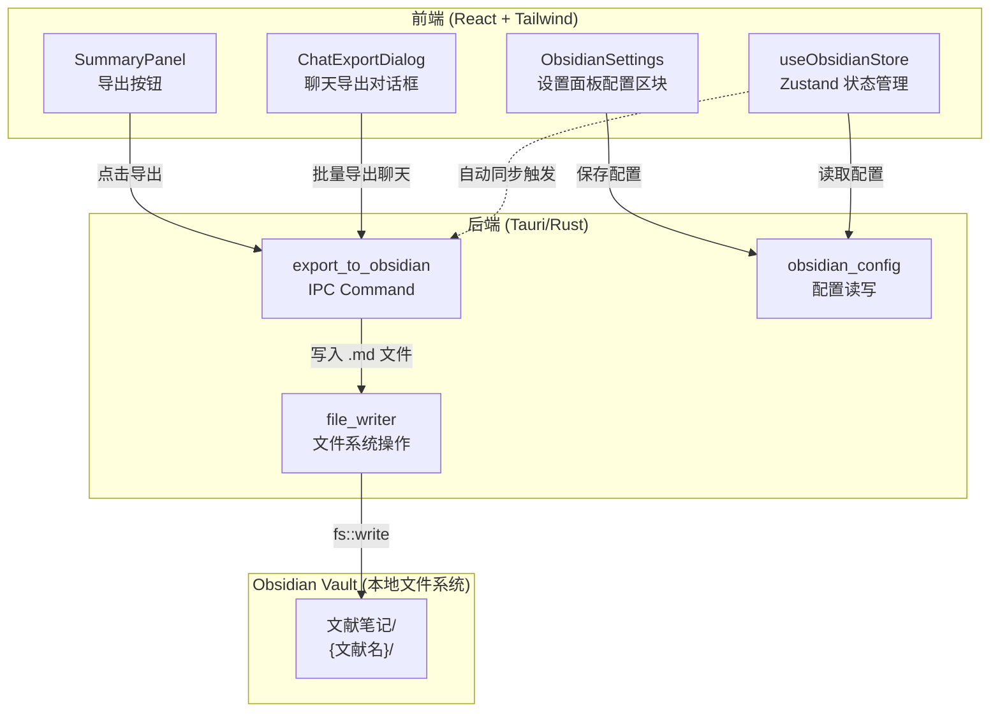

# 架构概览 — Obsidian 笔记同步 (v4)

> Genesis v4 | 2026-03-20

## 1. 系统总览

本功能是对现有 Rastro 架构的**增量扩展**，不引入新系统，仅在已有系统内新增模块。核心思路：通过 Tauri 后端的文件系统 API 将 Markdown 内容写入用户配置的 Obsidian Vault 目录。

### 影响的系统

| 系统 | 变更类型 | 说明 |
|------|----------|------|
| `frontend-system` | 新增组件 + 修改组件 | 设置面板 Obsidian 配置区块、导出按钮、聊天记录选择导出对话框 |
| `rust-backend-system` | 新增 IPC | Obsidian 配置管理、导出文件写入 |
| `storage-system` | 新增表 | `obsidian_config`、`export_records` |

### 架构图



## 2. 前端组件结构

### 新增组件

```text
src/components/
├── settings/
│   └── ObsidianSettings.tsx    [NEW] Obsidian 配置区块（Vault 路径 + 自动同步开关）
├── summary/
│   └── SummaryPanel.tsx        [MODIFY] 增加导出按钮
└── chat-panel/
    └── ChatExportDialog.tsx    [NEW] 聊天记录选择导出对话框

src/stores/
└── useObsidianStore.ts         [NEW] Obsidian 相关状态管理

src/lib/
└── obsidian-export.ts          [NEW] 导出逻辑工具函数（front matter 生成、文件名 sanitize）
```

### 修改组件

```text
src/components/
├── summary/
│   └── SummaryPanel.tsx        [MODIFY] 头部增加导出到 Obsidian 按钮
├── settings/
│   └── SettingsPanel.tsx       [MODIFY] 新增 Obsidian Tab 或在存储管理中增加 Obsidian 配置区块
└── stores/
    └── useSummaryStore.ts      [MODIFY] finishStream 中增加自动同步调用
```

## 3. 后端 IPC 增量

### 新增 Commands

| Command | 参数 | 返回 | 说明 |
|---------|------|------|------|
| `get_obsidian_config` | — | `ObsidianConfigDto` | 获取当前 Obsidian 配置 |
| `save_obsidian_config` | `{ vaultPath, autoSync }` | `ObsidianConfigDto` | 保存 Obsidian 配置 |
| `validate_obsidian_vault` | `{ vaultPath: string }` | `{ valid: bool, message: string }` | 校验 Vault 路径有效性 |
| `export_summary_to_obsidian` | `{ documentId, title, contentMd, summaryType? }` | `{ success: bool, filePath: string }` | 导出总结到 Obsidian |
| `export_chats_to_obsidian` | `{ documentId, title, sessionIds: string[] }` | `{ success: bool, exportedCount: number, filePaths: string[] }` | 批量导出聊天记录 |

### 新增文件

```text
src-tauri/src/
├── ipc/
│   └── obsidian.rs             [NEW] Obsidian IPC commands
├── storage/
│   └── obsidian_config.rs      [NEW] Obsidian 配置 CRUD
```

## 4. 数据流

### 手动导出总结流程

```
用户点击"导出到 Obsidian" → 前端调用 ipcClient.exportSummaryToObsidian()
→ 后端读取 obsidian_config → 校验 Vault 路径
→ sanitize 文献标题为文件夹名 → 确保 文献笔记/{文献名}/ 目录存在
→ 生成 front matter + summaryContent → 写入 总结.md
→ 返回成功/失败 → 前端显示 toast 反馈
```

### 选择性导出聊天记录流程

```
用户打开导出对话框 → ipcClient.listChatSessions(documentId)
→ 显示会话列表（带 checkbox）→ 用户多选 → 点击导出
→ ipcClient.exportChatsToObsidian({ documentId, title, sessionIds })
→ 后端逐个获取 chat messages → 格式化为 Markdown
→ 每个会话写入独立 .md 文件 → 返回结果
```

### 自动同步流程

```
AI 总结 finishStream → 检查 obsidian_config.autoSync === true
→ 检查 vaultPath 有效性 → 调用 exportSummaryToObsidian
→ 成功：console.log 静默记录
→ 失败：console.warn 静默警告，不打断用户
```

## 5. 导出文件格式

### 总结文件 (总结.md)

```markdown
---
title: "{文献标题}"
type: summary
summary_type: default
source: rastro
exported_at: 2026-03-20T10:30:00+08:00
document_id: "{documentId}"
---

{AI 生成的总结 Markdown 内容}
```

### 聊天记录文件 (对话-{日期时间}.md)

```markdown
---
title: "{文献标题} - 对话记录"
type: chat
source: rastro
session_id: "{sessionId}"
exported_at: 2026-03-20T14:15:00+08:00
document_id: "{documentId}"
---

## 👤 用户
{用户消息}

---

## 🤖 AI
{助手回复}

---

## 👤 用户
{用户消息2}

...
```

## 6. 技术决策

### ADR-401: 前端触发 vs 后端触发导出

**决策**: 导出操作由**前端发起 IPC 调用**，后端负责文件系统操作。

**理由**:
- 前端持有 summaryContent（Zustand store），传给后端即可
- 后端通过 Tauri 的 fs API 有完整的文件系统权限
- 自动同步也从前端 finishStream 回调中触发，保持一致的调用路径

**权衡**: 自动同步在前端触发意味着应用未打开时不会同步；但这符合预期——只有应用运行时才需要同步。

### ADR-402: 冲突策略 — 覆盖优先

**决策**: 自动同步和手动导出均**直接覆盖**同名文件。

**理由**:
- Obsidian 作为笔记工具，文件变更可通过 Obsidian Git 插件或 iCloud 等外部机制备份
- 复杂的合并策略会极大增加实现成本和用户认知负担
- 用户在 Obsidian 中编辑的内容属于"下游修改"，设计上不鼓励反向修改源头

### ADR-403: 文件名 Sanitize 策略

**决策**: 文献标题用于文件夹名时，替换 `/\:*?"<>|` 为 `_`，截断为 80 字符，trim 首尾空格。

**理由**:
- 覆盖 macOS / Windows / Linux 三平台的文件名限制
- 80 字符足以保持可读性，同时避免路径过长
